---
## Author
author:
  name: Просина Ксения Максимовна
  degrees: DSc
  orcid: 0000-0002-0877-5863
  email: kulyabov-ds@rudn.ru
  affiliation:
    - name: Российский университет дружбы народов
      country: Российская Федерация
      postal-code: 117198
      city: Москва
      address: ул. Миклухо-Маклая, д. 6
## Title
title: Администрирование сетевых подсистем
subtitle: Лабораторная работа №5.
license: CC BY
date: today
date-format: "YYYY-MM-DD" # Example: 2025-09-06
---

# Информация

## Докладчик

:::::::::::::: {.columns align=center}
::: {.column width="58%"}

  * Просина Ксения Максимовна
  * Студент 3 курса
  * факультет физико-математических и естественных наук
  * Российский университет дружбы народов им. П. Лумумбы
  * [1132231938@rudn.ru](1132231938@rudn.ru)

:::
::: {.column width="30%"}


:::
::::::::::::::

## Цель работы

Приобрести практические навыки по расширенному конфигурированию HTTPсервера Apache в части безопасности и возможности использования PHP.

## Задание

1. Сгенерировать криптографический ключ и самоподписанный сертификат безопасности для возможности перехода веб-сервера от работы через протокол HTTP к работе через протокол HTTPS
2. Настроить веб-сервер для работы с PHP.
3. Написать (или скорректировать) скрипт для Vagrant, фиксирующий действия по расширенной настройке HTTP-сервера во внутреннем окружении виртуальной машины server.

## Выполнение лабораторной работы

Загрузили операционную систему и перешла в рабочий каталог с проектом, после чего запустила виртуалку

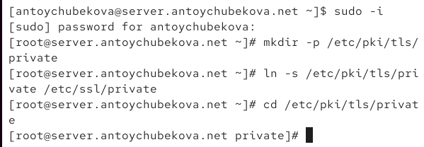

## Выполнение лабораторной работы

После входа в режим суперпользователя, я создала каталог private

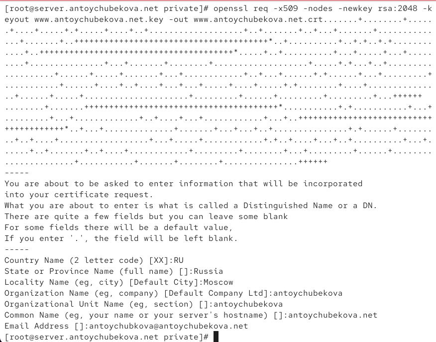

## Выполнение лабораторной работы

Выполнив команду для создания ключа, консоль вывела следующий текст: 

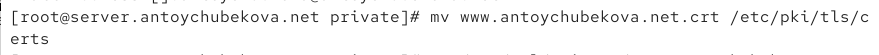

## Выполнение лабораторной работы

Следующим шагом я заполнила сертификат согласно лабораторной работе, не забыв указать свой логин

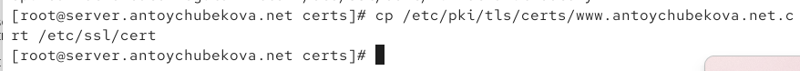

## Выполнение лабораторной работы

Спустя довольно продолжительное время мне все же удалось скопировать файл kmprosina.net.crt в certs, проблема возникла, потому что в описании лабораторной работы указана папка cert, а не нужная, в множественном числе

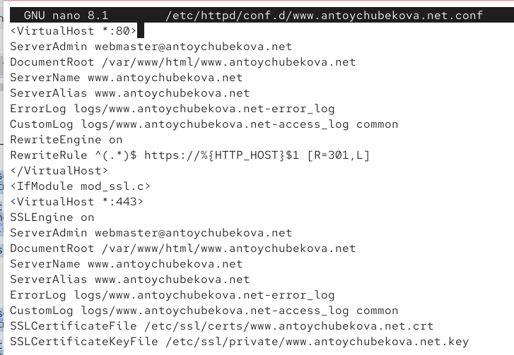

## Выполнение лабораторной работы

Следующим шагом была замена файла /etc/httpd/conf.d/www.kmprosina.net.conf на следующее содержимое:

'''
<VirtualHost *:80>
ServerAdmin webmaster@kmprosina.net
DocumentRoot /var/www/html/www.kmprosina.net
ServerName www.kmprosina.net
ServerAlias www.kmprosina.net
ErrorLog logs/www.kmprosina.net-error_log
CustomLog logs/www.kmprosina.net-access_log common
RewriteEngine on
RewriteRule ^(.*)$ https://%{HTTP_HOST}$1 [R=301,L]
</VirtualHost>
<IfModule mod_ssl.c>
<VirtualHost *:443>
...
</VirtualHost>
</IfModule>
'''

## Выполнение лабораторной работы

**Пояснение к конфигурационному файлу:**

- Виртуальный хост на порту 80 перенаправляет все запросы на HTTPS (код 301).
- Виртуальный хост на порту 443 использует SSL/TLS, указывает пути к сертификату и ключу.
- Оба хоста обслуживают один и тот же сайт, но через разные протоколы.

## Выполнение лабораторной работы

Разрешена работа с HTTPS в настройках межсетевого экрана:

```bash
firewall-cmd --add-service=https --permanent
firewall-cmd --reload
```

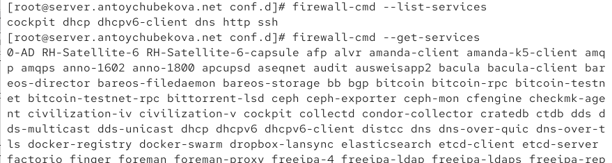

## Выполнение лабораторной работы

Веб-сервер перезапущен:

```bash
systemctl restart httpd
```

## Выполнение лабораторной работы

После этого при обращении к `www.kmprosina.net` происходит автоматическое перенаправление на HTTPS.

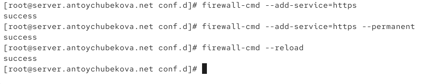

## Выполнение лабораторной работы

 Установлен пакет PHP:

```bash
dnf -y install php
```
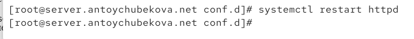

## Выполнение лабораторной работы

В каталоге `/var/www/html/www.kmprosina.net` создан файл `index.php`:

```php
<?php
phpinfo();
?>
```

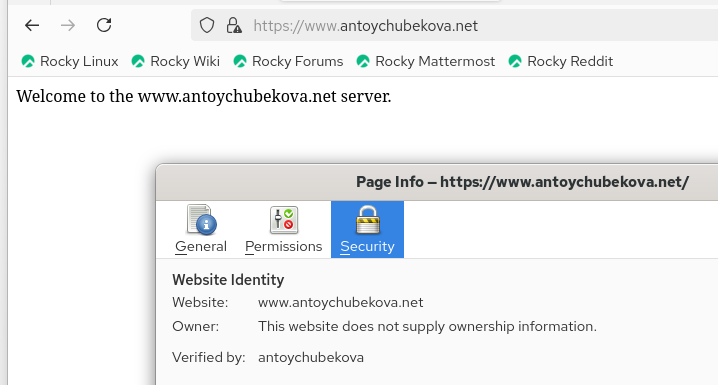

## Выполнение лабораторной работы

Скорректированы права доступа и контексты SELinux:

```bash
chown -R apache:apache /var/www
restorecon -vR /etc
restorecon -vR /var/www
```

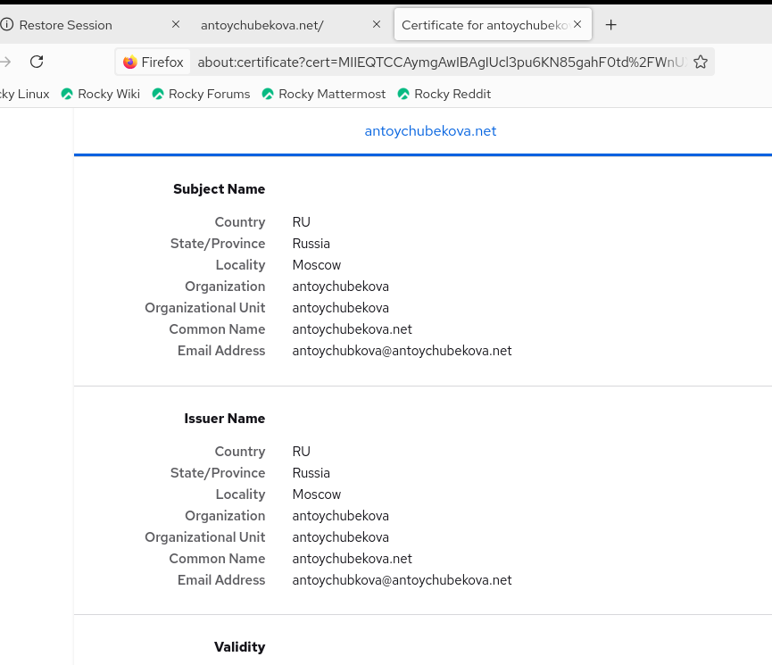

## Выполнение лабораторной работы

Веб-сервер перезапущен:

```bash
systemctl restart httpd
```

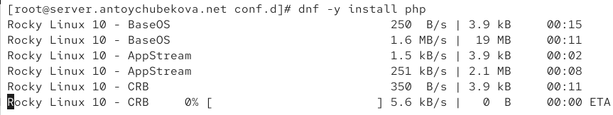

## Выполнение лабораторной работы

После этого в браузере отображается страница с информацией о версии PHP.

## Выполнение лабораторной работы

Скопированы конфигурационные файлы и SSL-сертификаты в каталог проекта:

```bash
cp -R /etc/httpd/conf.d/* /vagrant/provision/server/http/etc/httpd/conf.d
cp -R /var/www/html/* /vagrant/provision/server/http/var/www/html
cp -R /etc/pki/tls/private/www.kmprosina.net.key /vagrant/provision/server/http/etc/pki/tls/private
cp -R /etc/pki/tls/certs/www.kmprosina.net.crt /vagrant/provision/server/http/etc/pki/tls/certs
```

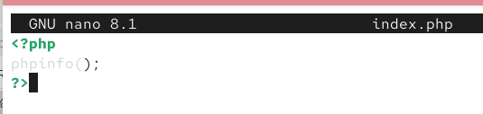

## Выполнение лабораторной работы

В скрипт `/vagrant/provision/server/http.sh` добавлены команды для установки PHP и настройки firewall для HTTPS.

## Выводы

В ходе выполнения лабораторной работы №5 были приобретены практические навыки по расширенной настройке HTTP-сервера Apache. Были выполнены следующие задачи:

- Настроен переход с HTTP на HTTPS с использованием самоподписанного сертификата.
- Настроена поддержка PHP на веб-сервере.
- Подготовлен скрипт для автоматизации настройки внутреннего окружения виртуальной машины.

## Ответы на контрольные вопросы

1. **В чём отличие HTTP от HTTPS?**  
   HTTP передаёт данные в открытом виде, а HTTPS использует шифрование (SSL/TLS) для защиты передаваемой информации.

2. **Каким образом обеспечивается безопасность контента веб-сервера при работе через HTTPS?**  
   Безопасность обеспечивается за счёт шифрования данных, аутентификации сервера и обеспечения целостности передаваемой информации с использованием сертификатов.

3. **Что такое сертификационный центр? Приведите пример.**  
   Сертификационный центр (CA) — организация, выпускающая цифровые сертификаты. Пример: Let's Encrypt, Comodo, DigiCert.
   
## Список литературы

1. Apache HTTP Server Version 2.4 Documentation. — URL: http://httpd.apache.org/docs/current/ (дата обр. 13.09.2021).
