---
## Author
author:
  name: Тойчубекова Асель Нурлановна
  degrees: DSc
  orcid: 0000-0002-0877-5863
  email: kulyabov-ds@rudn.ru
  affiliation:
    - name: Российский университет дружбы народов
      country: Российская Федерация
      postal-code: 117198
      city: Москва
      address: ул. Миклухо-Маклая, д. 6
## Title
title: Администрирование сетевых подсистем
subtitle: Лабораторная работа №6.
license: CC BY
date: today
date-format: "YYYY-MM-DD" # Example: 2025-09-06
---

# Информация

## Докладчик

:::::::::::::: {.columns align=center}
::: {.column width="58%"}

  * Тойчубекова Асель Нурлановна
  * Студент 3 курса
  * факультет физико-математических и естественных наук
  * Российский университет дружбы народов им. П. Лумумбы
  * [1032235033@rudn.ru](1032235033@rudn.ru)

:::
::: {.column width="30%"}

:::
::::::::::::::

# Цель работы

## Цель работы

Целью данной лабораторной работы является приобретение практических навыков по установке и конфигурированию системы управления базами данных на примере программного обеспечения MariaDB.

# Задание

## Задание

1. Установите необходимые для работы MariaDB пакеты.
2. Настройте в качестве кодировки символов по умолчанию utf8 в базах данных.
3. В базе данных MariaDB создайте тестовую базу addressbook, содержащую таблицу city с полями name и city, т.е., например, для некоторого сотрудника указан город, в котором он работает.

## Задание

4. Создайте резервную копию базы данных addressbook и восстановите из неё данные.
5. Напишите скрипт для Vagrant, фиксирующий действия по установке и настройке базы данных MariaDB во внутреннем окружении виртуальной машины server. Соответствующим образом следует внести изменения в Vagrantfile.

# Выполнение лабораторной работы

## Установка MariaDB

Для начала лабораторной работы включаем вм server и входим под нашим пользователем. Открываем терминал и переходим в режим суперпользователя. Далее установим необходимые для работы с базами данных пакеты.

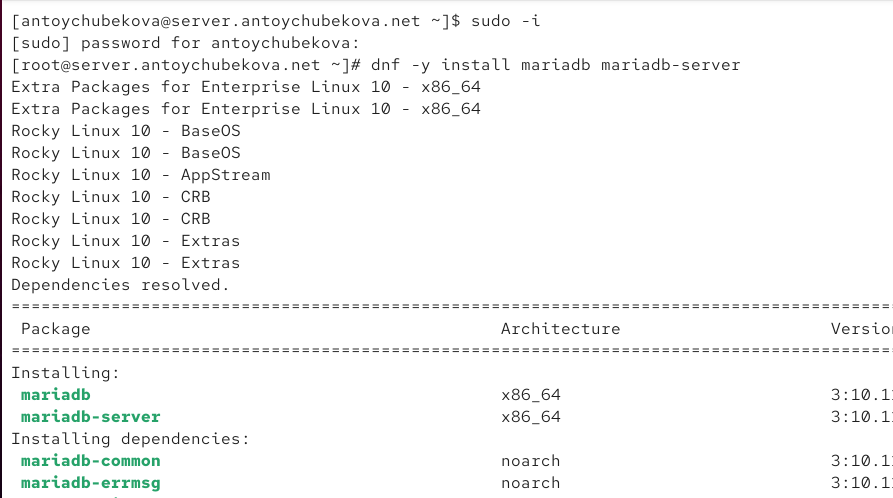{width=40%}

## Установка MariaDB

Зайдем в каталог /etc/my.cnf.d  и просмотрим содержание каждого конфигурационного файла.

Файл auth_gssapi.cnf — это конфигурационный файл плагина auth_gssapi для MariaDB.
Он используется, когда включена поддержка аутентификации через Kerberos / GSSAPI (Generic Security Services Application Program Interface).

## Установка MariaDB

Configuration for MariaDB GSSAPI authentication plugin

[mariadb]

Указывает, что нужно загрузить плагин GSSAPI

plugin_load_add = auth_gssapi.so

 
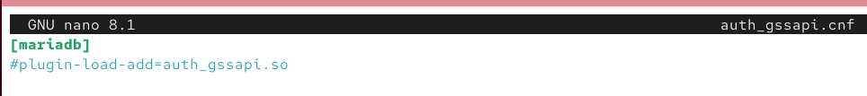{width=40%}

## Установка MariaDB

Файл client.cnf управляет настройками подключения к серверу базы данных (MariaDB/MySQL) — например, логином, паролем, хостом и портом. Ты можешь вписать сюда параметры подключения, чтобы не вводить их вручную каждый раз:

[client] -для клиентов mariadb и mysql
user = root
password = mypassword
host = localhost
port = 3306
socket = /run/mysqld/mysqld.sock

[client-mariadb] - только для клиентов mariadb

MariaDB-specific options (MySQL не читает)

ssl-cert = /etc/mysql/client-cert.pem

ssl-key  = /etc/mysql/client-key.pem

## Установка MariaDB

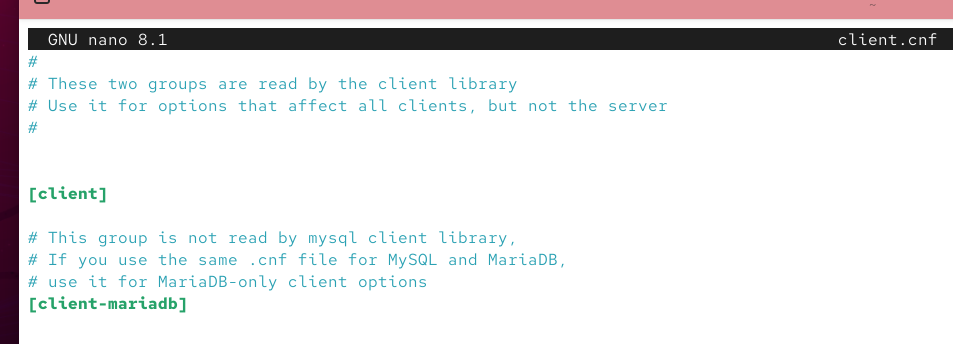{width=40%}

## Установка MariaDB

Файл mariadb-server.cnf  — это конфигурационный файл сервера MariaDB, то есть часть настроек, которые читает сам сервер mysqld при запуске. В отличие от client.cnf, который настраивает подключение клиента, этот файл управляет внутренней работой сервера базы данных — где хранить данные, куда писать логи, под каким пользователем работать и т. д.

## Установка MariaDB

[server] - Это секция общих параметров, читаемая всеми серверными компонентами MariaDB (включая встроенные и standalone демоны).

[mysqld] - Секция только для основного демона mysqld — именно он запускается как служба MariaDB.
Все параметры внутри [mysqld] применяются только к нему.

[galera] - Это секция для Galera Cluster — технологии синхронной репликации между несколькими MariaDB-серверами.

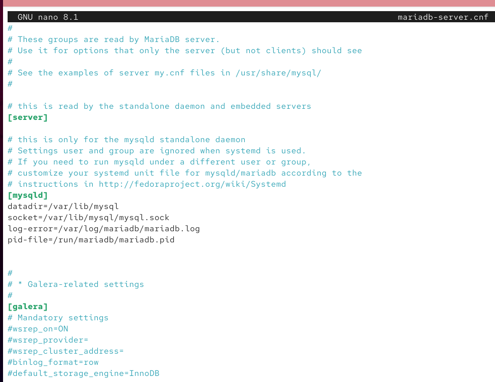{width=40%}

## Установка MariaDB

Файл mysql-clients.cnf  — это файл конфигурации клиентских инструментов MariaDB, таких как:

mysql — интерактивная консоль для запросов к БД

mysqldump — создание резервных копий

mysqladmin — администрирование сервера

mysqlcheck — проверка и оптимизация таблиц

mysqlimport — импорт данных

## Установка MariaDB

mysqlshow — просмотр баз и таблиц

mysqlslap — тестирование производительности

mysqlbinlog — работа с бинарными журналами

mysql_upgrade — обновление системных таблиц при апгрейде

## Установка MariaDB

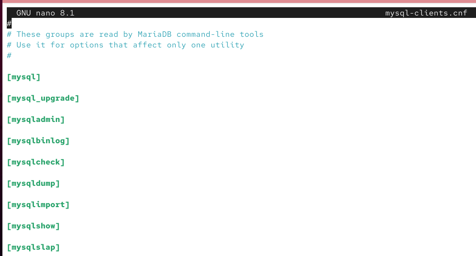{width=40%}

## Установка MariaDB

Файл provider_bzip2.cnf  — это конфигурационный файл плагина provider_bzip2, который добавляет поддержку сжатия данных с помощью алгоритма BZIP2 в MariaDB.

Этот плагин используется для:

резервных копий (mysqldump),

репликации (сжатие данных при передаче),

сжатых таблиц (при архивации),

и иногда — для внутреннего сжатия двоичных логов.

## Установка MariaDB

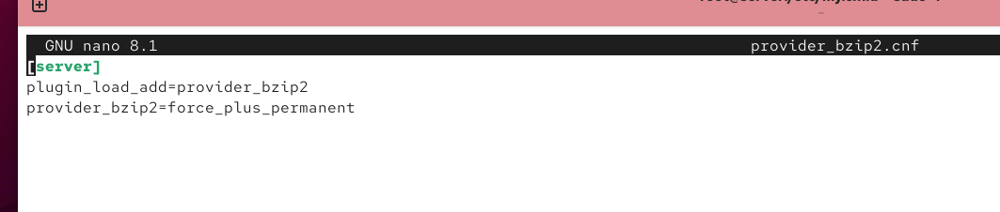{width=40%}

## Установка MariaDB

Файл provider_lz4.cnf — это конфигурационный файл плагина provider_lz4 для MariaDB.
Плагин добавляет поддержку сжатия данных с помощью алгоритма LZ4, который отличается высокой скоростью компрессии и распаковки (чем быстрее BZIP2, но с меньшим коэффициентом сжатия).

## Установка MariaDB

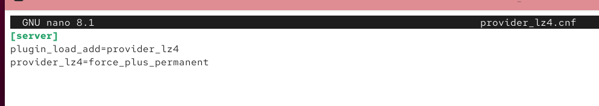{width=40%}

## Установка MariaDB

Файл provider_lzo.cnf  — это конфигурационный файл плагина provider_lzo для MariaDB.
Плагин добавляет поддержку сжатия данных с помощью алгоритма LZO, который характеризуется очень быстрой компрессией и распаковкой, чуть хуже по коэффициенту сжатия, чем BZIP2, но быстрее, чем он.

## Установка MariaDB

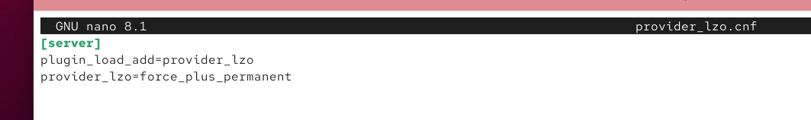{width=40%}

## Установка MariaDB

Файл provider_snappy.cnf — это конфигурационный файл плагина provider_snappy для MariaDB.
Плагин добавляет поддержку сжатия данных с помощью алгоритма Snappy, который разработан Google и оптимизирован для очень высокой скорости сжатия и распаковки (чуть хуже по коэффициенту сжатия, чем BZIP2, но намного быстрее).

## Установка MariaDB

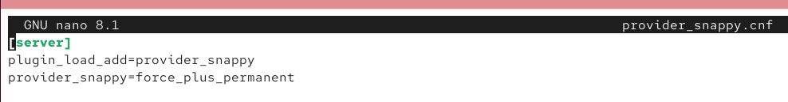{width=40%}

## Установка MariaDB

Файл spider.cnf  — это конфигурационный файл для плагина ha_spider, который используется для шардирования баз данных в MariaDB.

Плагин Spider позволяет:

создавать распределённые таблицы, которые физически находятся на разных серверах,

выполнять запросы к таблицам на удалённых серверах,

объединять данные с нескольких серверов в одну логическую таблицу.

## Установка MariaDB

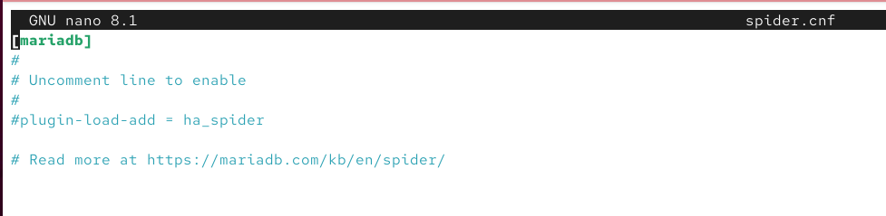{width=40%}

## Установка MariaDB

Далее просмотрим файл /etc/my.cnf. 

Файл my.cnf используется как центральный конфигурационный файл, который читается:

- как клиентами (mysql, mysqldump и т. д.),

- так и сервером MariaDB/MySQL (mysqld).

Он задаёт общие параметры, применяемые ко всем компонентам базы данных, и подключает остальные .cnf-файлы из директорий.

## Установка MariaDB

[client-server]	Секция общих настроек для клиентов и сервера.

! includedir /etc/my.cnf.d	Подключает все файлы .cnf из директории /etc/my.cnf.d/.

То есть все отдельные конфигурации (client.cnf, mariadb-server.cnf, provider_*.cnf и т.д.) будут считаны автоматически.

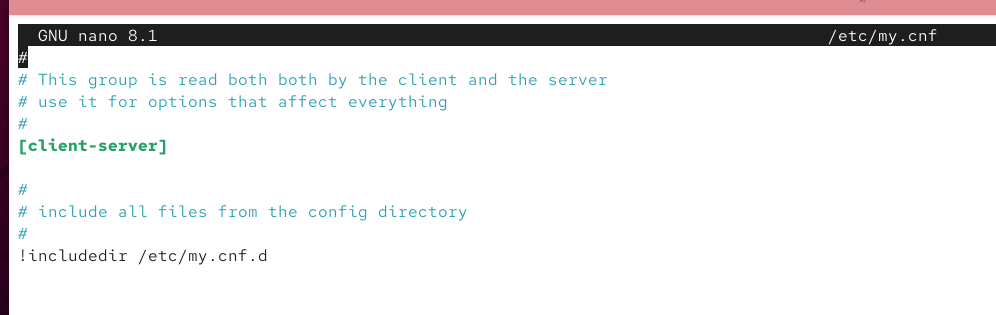{width=40%}

## Установка MariaDB

Запустим и включим программное обеспечение mariadb.

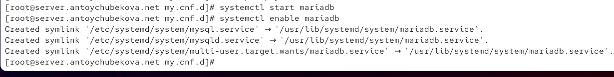{width=40%}

## Установка MariaDB

Убедимся, что mariadb прослушивает порт 3306. Для этого введем команду ss -tulpen | grep mariadb. Мы видим, что все корректно отрабатывается и mariadb прослушивает порт 3306.

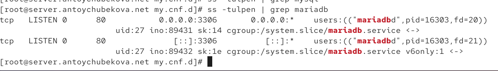{width=40%}

## Установка MariaDB

Запустим скрипт конфигурации безопасности mariadb, используя: mysql_secure_installation. Далее установим пароль для пользователя root базы данных, отключим удаленный корневой доступ и удалим тестовую базу данных и любых анонимных пользователей. 

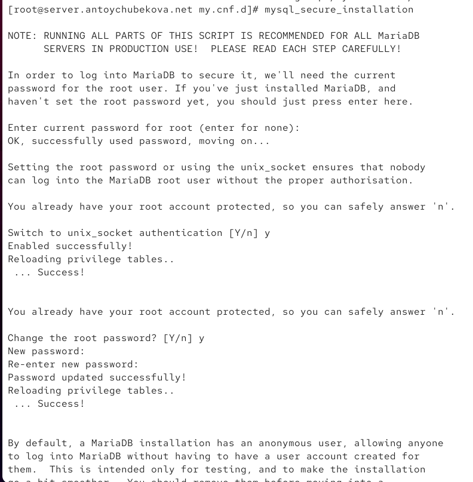{width=40%}

## Установка MariaDB

Войдем в базу данных с правами администратора базы данных, когда потребуют пароль введем пароль, который мы ранее установили. Далее просмотрим список команд MySQL.  Мы видим, что вывелся список команд, которые мы можем использовать при работе с базами данных. 

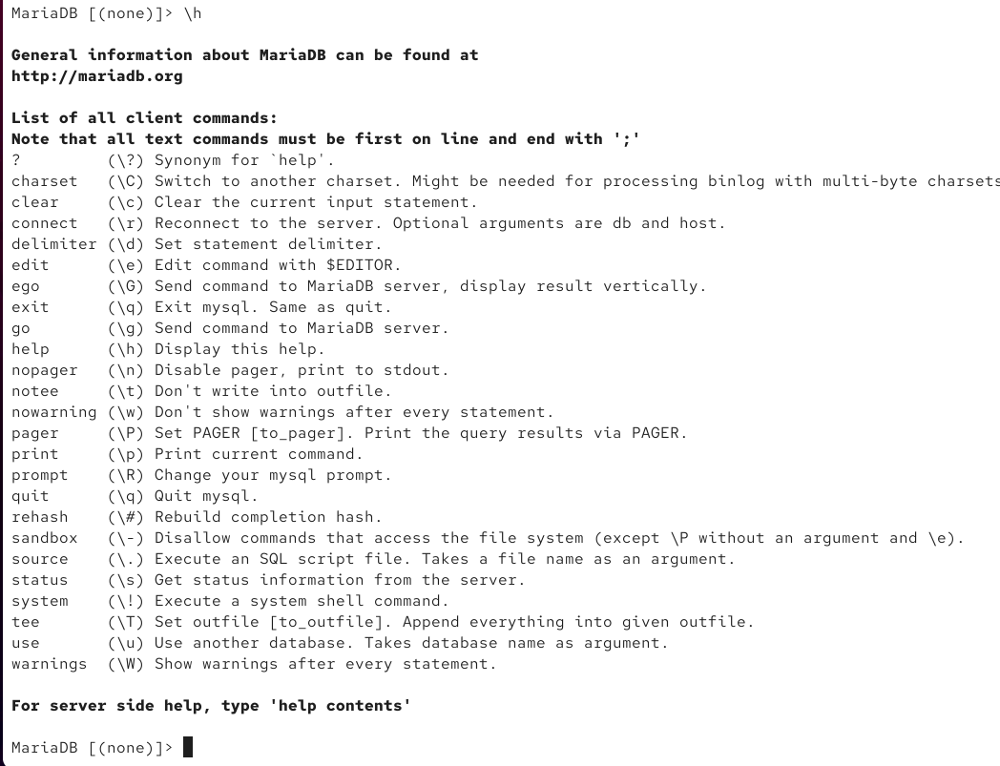{width=40%}

## Установка MariaDB

Из приглашения интерактивной оболочки MariaDB для отображения доступных в настоящее время баз данных введем MySQL-запрос, который покажет какие базы данных есть в системе. Мы видим, что в системе есть базы данных:

- information_schema- это служебная база данных, в которой хранятся метаданные — то есть информация о других базах, таблицах, столбцах, индексах и т.д.

- mysql-это основная системная база, где хранятся учётные записи пользователей, пароли, права доступа и настройки сервера.

- performance_schema - это база, которая собирает статистику о производительности MariaDB:
время выполнения запросов, использование памяти, блокировки и т.д.

- sys - это удобная надстройка над performance_schema: в ней собраны представления (views), которые показывают показатели производительности в более понятном виде (для администраторов).

## Установка MariaDB

Затем выйдем из интерфейса интерактивной оболочки mariadb.

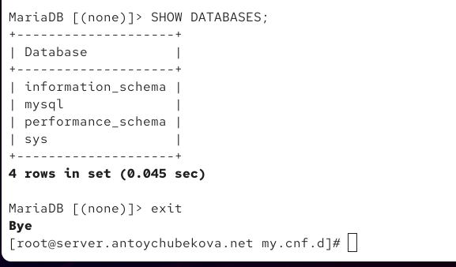{width=40%}

## Конфигурация кодировки символов

Далее вновь войдя в бд с правами администратора отобразим статус marisdb. Статус показывает техническую информацию о текущем подключении и сервере. 

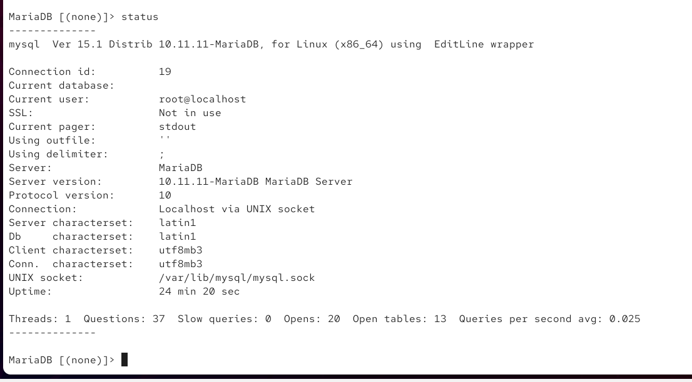{width=40%}

## Конфигурация кодировки символов

Общая информация о клиенте:

- mysql Ver 15.1 Distrib 10.11.11-MariaDB, for Linux (x86_64) using EditLine wrapper
- Это версия клиентской программы mysql, с помощью которой ты подключилась к серверу MariaDB.

- Distrib 10.11.11-MariaDB — версия установленного сервера MariaDB.

- x86_64 — архитектура системы (64-битная).

- EditLine wrapper — используется библиотека для редактирования строк в консоли (например, стрелочки работают благодаря ей).

## Конфигурация кодировки символов

Подключение и пользователь:

- Connection id: 19 — уникальный номер твоего подключения к серверу (сессии).

- Current database: — пусто, значит, ты не выбрала базу данных (ещё не сделала USE имя_базы).

- Current user: root@localhost — ты вошла как пользователь root, подключившись с этого же компьютера (localhost).

## Конфигурация кодировки символов

Безопасность:

- SSL: Not in use — соединение не зашифровано (без SSL)-это нормально, если ты работаешь локально на сервере.

Настройки ввода-вывода:

- Current pager: stdout — вывод идёт прямо в терминал.

- Using outfile: — ты не сохраняешь результаты в файл.

- Using delimiter: — используется стандартный разделитель ; для команд.

## Конфигурация кодировки символов

О сервере:

- Server: MariaDB — тип СУБД (система управления базами данных).

- Server version: 10.11.11-MariaDB MariaDB Server — версия сервера.

- Protocol version: 10 — версия сетевого протокола, через который клиент общается с сервером.

- Connection: Localhost via UNIX socket — ты подключилась через UNIX-сокет, а не через TCP/IP (т.е. напрямую внутри системы, быстрее и безопаснее).

- UNIX socket: /var/lib/mysql/mysql.sock — путь к сокету.

## Конфигурация кодировки символов

Кодировки:

- Server characterset: latin1 — сервер по умолчанию использует латинскую кодировку.

- Db characterset: latin1 — текущая база (если выбрана) тоже использует latin1.

- Client characterset: utf8mb3 — твой клиент (терминал) использует UTF-8.

- Conn. characterset: utf8mb3 — соединение между клиентом и сервером — UTF-8.

## Конфигурация кодировки символов

Время работы и активность:

- Uptime: 24 min 20 sec — сервер работает уже 24 минуты 20 секунд.

- Threads: 1 — сейчас активен один поток (только ты подключена).

- Questions: 37 — всего выполнено 37 SQL-запросов с момента запуска.

- Slow queries: 0 — медленных запросов нет (всё выполняется быстро).

- Opens: 20 — сервер открыл 20 таблиц.

- Open tables: 13 — сейчас 13 таблиц открыто в кэше.

- Queries per second avg: 0.025 — в среднем выполняется 0.025 запроса в секунду (примерно 1 запрос каждые 40 секунд).

## Конфигурация кодировки символов

В каталоге /etc/my.cnf.d создадим файл utf8.cnf и откроем его для редактирования и укажем в нем соответствующую конфигурацию. 

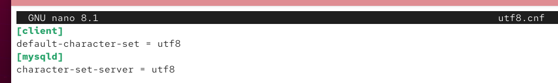{width=40%}

## Конфигурация кодировки символов

Перезапустим MariaDB. 

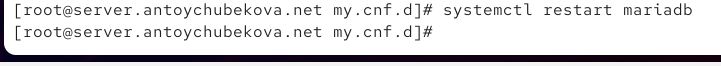{width=40%}

## Конфигурация кодировки символов

Войдем в базу данных с правами администратора и посмотрим статус MariaDB. Мы видим, что  в статусе изменились параметры, связанные с кодировкой.

## Конфигурация кодировки символов

Строки: 

Server characterset: latin1

Db     characterset: latin1

Client characterset: latin1

Conn.  characterset: latin1

## Конфигурация кодировки символов

Изменились  на:

Server characterset: utf8

Db     characterset: utf8

Client characterset: utf8

Conn.  characterset: utf8

## Создание базы данных

Войдя в базу данных с правами администратора, используя SQL-запрос создадим бд с именем addressbook. Далее перейдем в бд addressbook и отобразим в ней таблицы. Мы видим, что ничего не вывелось, так как наша таблица еще пустая. 

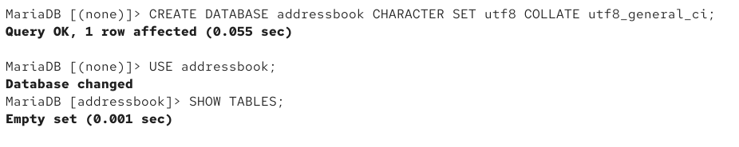{width=40%}

## Создание базы данных

Создадим таблицу city с полями name и city. Заполните несколько строк таблицы некоторыми данными по аналогии в соответтвии с синтаксисом MySQL. 

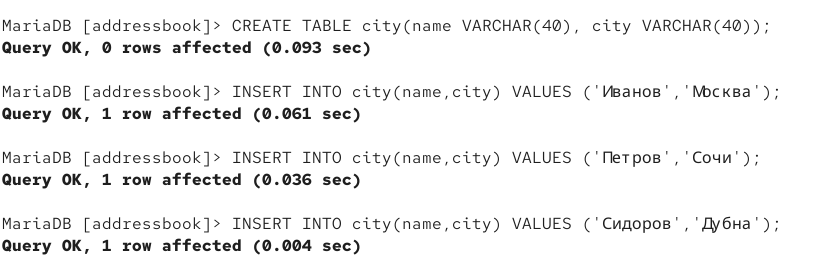{width=40%}

## Создание базы данных

Теперь выведем всю таблицу city, используя команду SELECT * FROM city; 

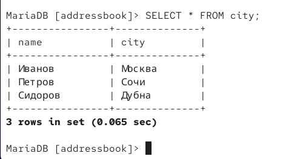{width=40%}

## Создание базы данных

Создадим пользователя для работы с базой данных addressbook и зададим для него пароль.  Далее предоставим права доступа созданному пользователю user на действия с базой данных addressbook (просмотр, добавление, обновление, удаление данных). 

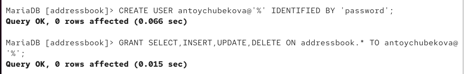{width=40%}

## Создание базы данных

Обновим привилегии (права доступа) базы данных addressbook. Посмотрим общую информацию о таблице city базы данных addressbook. Мы видим, что выведена информация о строках и столбцах бд.Затем выйдете из окружения MariaDB.

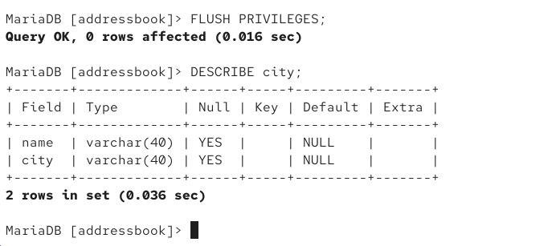{width=40%}

## Создание базы данных

Вновь просмотрим список баз данных. Мы видим, что в этот список добавилась бд, которую мы создали, addressbook. 

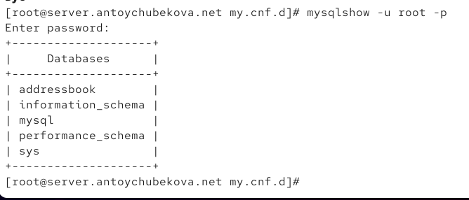{width=40%}

## Создание базы данных

Просмотрим список таблиц базы данных addressbook. Мы видим нашу таблицу city, которую мы создали. 

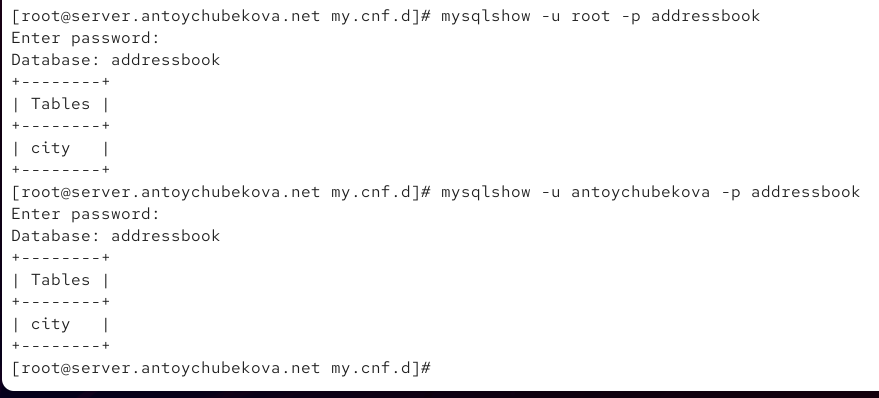{width=40%}

## Резервные копии

На виртуальной машине server создадим каталог для резервных копий. Сделаем резервную копию базы данных addressbook. 

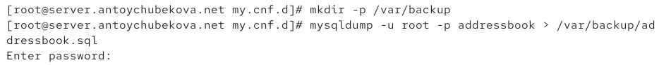{width=40%}

## Резервные копии

Сделаем сжатую резервную копию базы данных addressbook. Затем сделаем сжатую резервную копию базы данных addressbook с указанием даты создания копии.

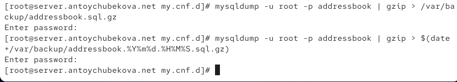{width=40%}

## Резервные копии

Восстановим базу данных addressbook из резервной копии. Далее восстановим базу данных addressbook из сжатой резервной копии. 

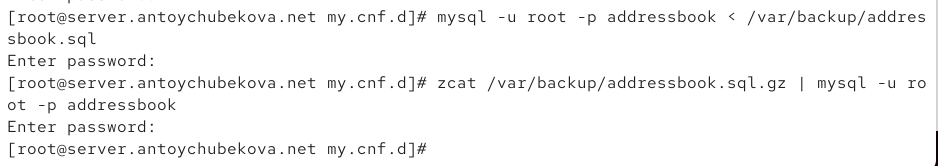{width=40%}

## Внесение изменений в настройки внутреннего окружения виртуальной машины

На виртуальной машине server перейдем в каталог для внесения изменений в настройки внутреннего окружения /vagrant/provision/server/, создадим в нём каталог mysql, в который поместим в соответствующие подкаталоги конфигурационные файлы MariaDB и резервную копию базы данных addressbook. 

## Внесение изменений в настройки внутреннего окружения виртуальной машины

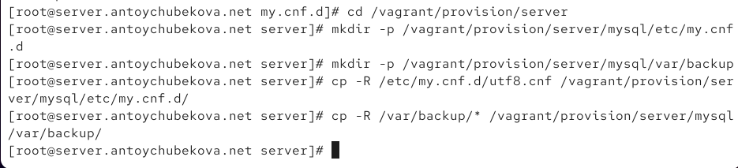{width=40%}

## Внесение изменений в настройки внутреннего окружения виртуальной машины

В каталоге /vagrant/provision/server создадим исполняемый файл mysql.sh. 

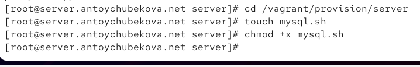{width=40%}

## Внесение изменений в настройки внутреннего окружения виртуальной машины

Открыв его на редактирование, пропишем скрипт, по сути, повторяющий произведённые вами действия по установке и настройке сервера баз данных.

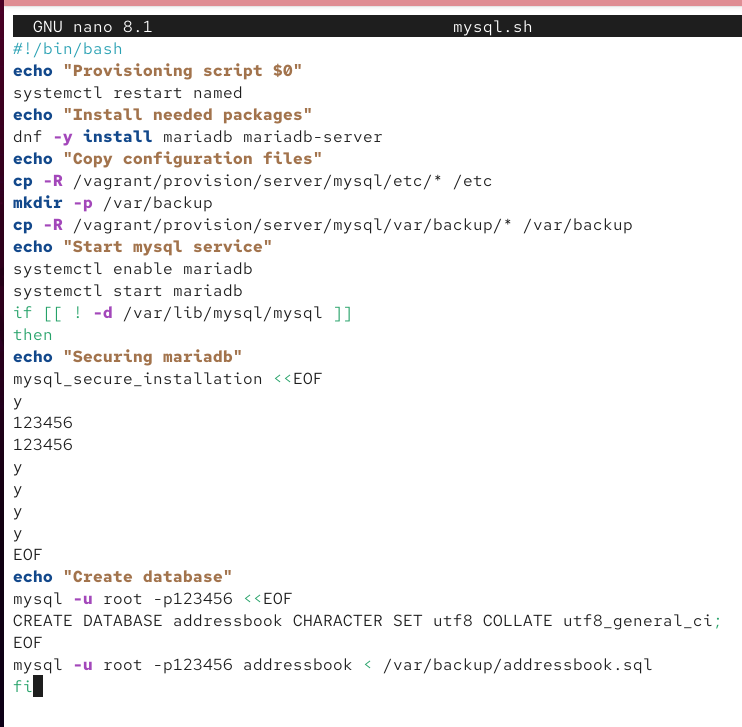{width=40%}

## Внесение изменений в настройки внутреннего окружения виртуальной машины

Для отработки созданного скрипта во время загрузки виртуальных машин в конфигурационном файле Vagrantfile необходимо добавить в конфигурации сервера соответствующую запись.

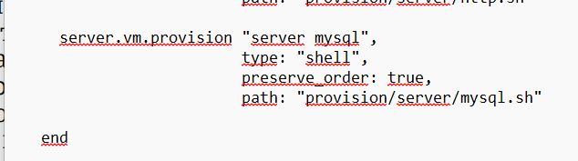{width=40%}

# Выводы

## Выводы

В ходе выполнения лабораторной работы №6 я приобрела практические навыки по установке и конфигурированию системы управления базами данных на примере программного обеспечения MariaDB.
