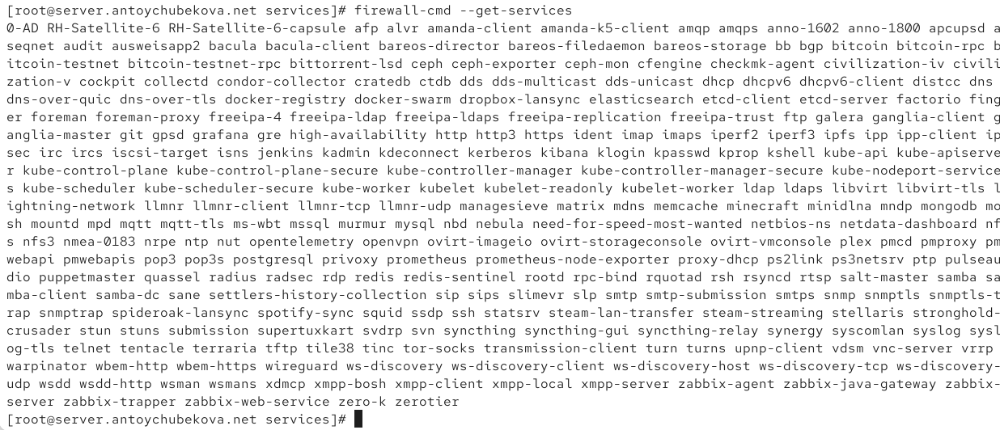
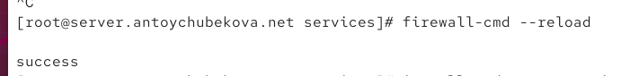
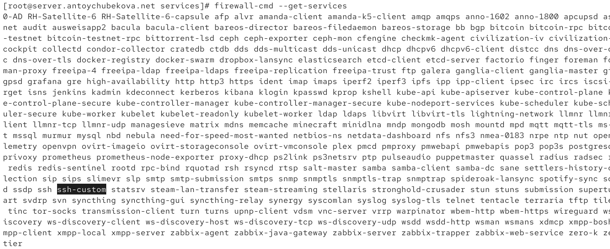
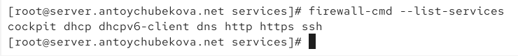
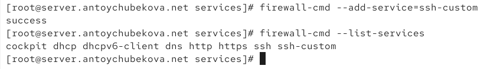
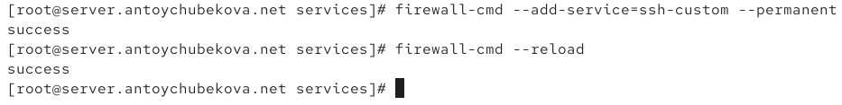
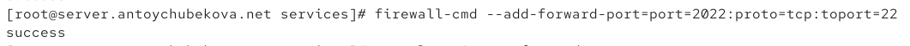
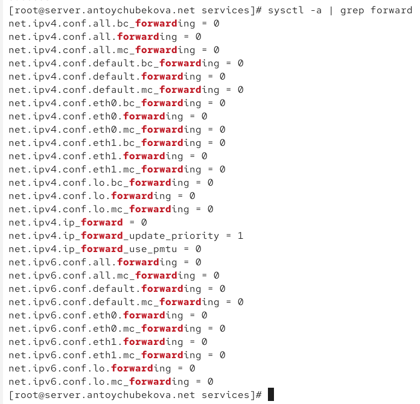
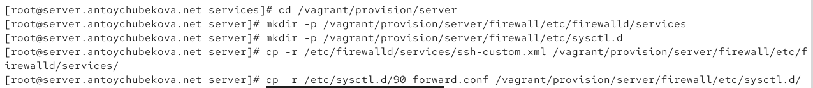
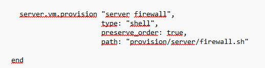

---
## Author
author:
  name: Тойчубекова Асель Нурлановна
  degrees: DSc
  orcid: 0000-0002-0877-7063
  email: kulyabov-ds@rudn.ru
  affiliation:
    - name: Российский университет дружбы народов
      country: Российская Федерация
      postal-code: 117198
      city: Москва
      address: ул. Миклухо-Маклая, д. 6

## Title
title: "Администрирование сетевых подсистем"
subtitle: "Лабораторная работа №7."
license: "CC BY"
---

# Цель работы

Получить навыки настройки межсетевого экрана в Linux в части переадресации портов и настройки Masquerading.

# Теоретическое введение

В Rocky Linux 9 управление межсетевым экраном осуществляется с помощью FirewallD — системы, работающей поверх встроенного в ядро Linux механизма Netfilter. FirewallD обеспечивает динамическое управление правилами доступа через командную утилиту firewall-cmd или графический интерфейс firewall-config.

В основе FirewallD лежит понятие сетевых зон, каждая из которых определяет уровень доверия к подключённой сети и набор разрешённых соединений. Например:

- public — зона по умолчанию, минимальный уровень доверия;

- home, work, internal — для доверенных сетей;

- external — для внешних сетей с включённым NAT (маскарадингом);

- trusted — все соединения разрешены;

- block и drop — блокируют входящие подключения.

FirewallD позволяет управлять службами (services), каждая из которых описывается XML-файлом с указанием портов и протоколов. Правила можно применять временно или сохранять постоянно с помощью опции --permanent.

Для настройки сетевых преобразований используется механизм NAT (Network Address Translation), который изменяет IP-адреса транзитных пакетов. Наиболее распространён его вариант — маскарадинг, при котором устройства локальной сети выходят в Интернет через один внешний IP-адрес.

Существуют следующие типы NAT:

- Static NAT (SNAT) — статическое преобразование адресов по принципу 1:1;

- Dynamic NAT (DNAT) — динамическое преобразование по принципу 1:N;

- NAT Overload (PAT, Masquerading) — преобразование по принципу N:1 с использованием номеров портов.

Кроме того, FirewallD поддерживает Port Forwarding — переадресацию портов, позволяющую перенаправлять трафик из внешней сети на определённые компьютеры внутри локальной сети.

Таким образом, FirewallD является удобным инструментом для настройки сетевой безопасности, управления доступом и организации обмена данными между внутренними и внешними сетями.

# Задание

1. Настройте межсетевой экран виртуальной машины server для доступа к серверу по протоколу SSH не через 22-й порт, а через порт 2022 (см. разделы 7.4.1 и 7.4.2).
2. Настройте Port Forwarding на виртуальной машине server (см. разделы 7.4.3).
3. Настройте маскарадинг на виртуальной машине server для организации доступа клиента к сети Интернет (см. раздел 7.4.3).
4. Напишите скрипт для Vagrant, фиксирующий действия по расширенной настройке межсетевого экрана. Соответствующим образом внесите изменения в Vagrantfile 

# Выполнение лабораторной работы

## Создание пользовательской службы firewalld

Для начала лабораторной работы №7 запустим вм server. Затем войдем по нашим пользователем и откроем терминал. Далее перейдем в режим суперпользователя. 

На основе существующего файла описания службы ssh создадим файл с собственным описанием. С помощью команды cat просмотрим содержимое файла службы. ([рис. @fig-001])

{#fig-001 width=70%}

В этом файле описана пользовательская служба (service) для FirewallD, которая называется ssh-custom.

Это XML-описание определяет, какие сетевые порты и протоколы должен пропускать межсетевой экран для работы конкретной службы — в данном случае для SSH (Secure Shell).

- <?xml version="1.0" encoding="utf-8"?>

- <service> — стандартное объявление XML-файла и начало описания службы.

- <short>SSH</short> — краткое имя службы, которое будет отображаться в списке служб.

- <description>Secure Shell (SSH) is a protocol for logging into and executing commands on remote machines. It provides secure encrypted communications...</description> — текстовое описание: объясняет, что SSH — это протокол для удалённого входа на сервер и выполнения команд с использованием зашифрованного соединения.

- <port protocol="tcp" port="22"/> — основная часть: указывает, что для работы службы необходимо разрешить входящие подключения по протоколу TCP на порт 22, то есть стандартный порт SSH.Этот файл сообщает FirewallD, что служба ssh-custom разрешает трафик на TCP-порт 22 — именно через него происходит подключение по SSH.

Откроем файл описания службы на редактирование и заменим порт 22 на новый порт 2022. В этом же файле скорректируем описание службы для демонстрации, укажем, что это модифицированный файл службы. ([рис. @fig-002])

{#fig-002 width=70%}

Просмотрим список доступных FirewallD служб. Мы видим, что новая служба еще не отображается в списке. ([рис. @fig-003])

{#fig-003 width=70%}

Перезагрузим правила межсетевого экрана с сохранением информации о состоянии  ([рис. @fig-004]) и вновь выведем на экран список служб ([рис. @fig-005]), а также список активных служб ([рис. @fig-006]). Мы видим, что в списке доступных FirewallD служб добавилась наша новая служба, но она не активирована. 

{#fig-004 width=70%}

{#fig-005 width=70%}

{#fig-006 width=70%}

Добавим новую службу в FirewallD и выведем на экран список активных служб. Мы видим, что теперь наша новая служба активирована. ([рис. @fig-007])

{#fig-007 width=70%}

Служба успешно добавлена в FirewallD, теперь перегрузим правила межсетевого
экрана с сохранением информации о состоянии. ([рис. @fig-008])

{#fig-008 width=70%}

## Перенаправление портов

Организуем на сервере переадресацию с порта 2022 на порт 22. Мы видим, что все корректно отработалась. ([рис. @fig-009])

{#fig-009 width=70%}

На клиенте попробуем получить доступ по SSH к серверу через порт 2022. Мы видим, что у нас получилось доступ по ssh к серверу через порт 2022. ([рис. @fig-010])

{#fig-010 width=70%}

## Настройка Port Forwarding и Masquerading

На сервере посмотрим, активирована ли в ядре системы возможность перенаправления IPv4-пакетов.Мы видим, что возможность перенаправления IPv4-пакетов не активирована. ([рис. @fig-011])

{#fig-011 width=70%}

Включим перенаправление IPv4-пакетов на сервере. ([рис. @fig-012])

{#fig-012 width=70%}

Включим маскарадинг на сервере. ([рис. @fig-013])

{#fig-013 width=70%}

На клиенте проверим доступность выхода в интернет. Для этого введем команду ping -c 3 8.8.8.8. Мы видим, что есть доступ выхода в интернет. ([рис. @fig-014])

{#fig-014 width=70%}

## Внесение изменений в настройки внутреннего окружения виртуальной машины

На виртуальной машине server перейдем в каталог для внесения изменений в настройки внутреннего окружения /vagrant/provision/server/, создадим в нём каталог firewall, в который поместим в соответствующие подкаталоги конфигурационные файлы FirewallD. ([рис. @fig-015])

{#fig-015 width=70%}

В  каталоге /vagrant/provision/server создадим файл firewall.sh. ([рис. @fig-016])

{#fig-016 width=70%}

Открыв его на редактирование, пропишем в нём соответствующий скрипт, по сути, повторяющий произведённые нами действия по созданию и настройке пользовательских служб firewalld. ([рис. @fig-017])

{#fig-017 width=70%}

Для отработки созданного скрипта во время загрузки виртуальной машины server в конфигурационном файле Vagrantfile добавим в разделе конфигурации для сервера. ([рис. @fig-018])

{#fig-018 width=70%}

# Выводы

В ходе выполнения лабораторной работы №7 были приобретены практические навыки настройки межсетевого экрана в Linux в части переадресации портов и настройки Masquerading.

# Список литературы{.unnumbered}

1. NAT: вопросы и ответы. — URL: https://www.cisco.com/cisco/web/support/RU/9/92/92029_nat-faq.html (дата обращения: 13.09.2021).
2. Динамический брандмауэр с использованием FirewallD. — URL: https://fedoraproject.org/wiki/FirewallD/ru (дата обращения: 13.09.2021).
3. Одом У. Официальное руководство Cisco по подготовке к сертификационным экзаменам CCENT/CCNA ICND1 100-101. — М.: Вильямс, 2017. — 912 с. — (Cisco Press Core Series).
4. Часто задаваемые вопросы по технологии NAT / Сайт поддержки продуктов и технологий компании Cisco. — URL: https://www.cisco.com/c/ru_ru/support/docs/ip/network-address-translation-nat/26704-nat-faq-00.html (дата обращения: 13.09.2021).
