---
## Author
author:
  name: Тойчубекова Асель Нурлановна
  degrees: DSc
  orcid: 0000-0002-0877-7063
  email: kulyabov-ds@rudn.ru
  affiliation:
    - name: Российский университет дружбы народов
      country: Российская Федерация
      postal-code: 117198
      city: Москва
      address: ул. Миклухо-Маклая, д. 6
## Title
title: Администрирование сетевых подсистем
subtitle: Лабораторная работа №8
license: CC BY
date: today
date-format: "YYYY-MM-DD" # Example: 2025-09-06
---

# Информация

## Докладчик

:::::::::::::: {.columns align=center}
::: {.column width="70%"}

  * Тойчубекова Асель Нурлановна
  * Студент 3 курса
  * Факультет физико-математических и естественных наук 
  * Российский университет дружбы народов им. П. Лумумбы
  * [1032235033@rudn.ru](1032235033@rudn.ru)

:::
::: {.column width="30%"}

:::
::::::::::::::

# Цель работы

## Цель работы

Целью данной лабораторной работы является приобретение практических навыков по установке и конфигурированию SMTP-сервера.

# Задание

## Задание

1. Установите на виртуальной машине server SMTP-сервер postfix.
2. Сделайте первоначальную настройку postfix при помощи утилиты postconf, задав
отправку писем не на локальный хост, а на сервер в домене.
3. Проверьте отправку почты с сервера и клиента.
4. Сконфигурируйте Postfix для работы в домене. Проверьте отправку почты с сервера
и клиента.
5. Напишите скрипт для Vagrant, фиксирующий действия по установке и настройке
Postfix во внутреннем окружении виртуальной машины server. Соответствующим
образом внесите изменения в Vagrantfile.

# Теоретическое введение

## Теоретическое введение

Postfix — это агент передачи почты (Mail Transfer Agent, MTA), используемый для приёма, доставки и пересылки электронной почты. Он обеспечивает работу с локальной почтой, почтой пользователей сети и письмами, отправляемыми локальными службами сервера (например, сообщения для пользователя root).

Postfix обрабатывает письма для доменов, указанных в настройках, и может работать с ними в трёх режимах:

- Конечный домен — сервер является окончательной точкой доставки почты для домена;

- Домен пересылки — письма перенаправляются на другой сервер;

- Виртуальный домен — доставка в локальные почтовые ящики пользователей.

## Теоретическое введение

В основе локальной доставки Postfix лежит система учёта пользователей операционной системы, тогда как механизм виртуальных доменов позволяет работать с отдельными почтовыми ящиками внутри сервера. По умолчанию Postfix настроен для локальной доставки.

Основные настройки Postfix хранятся в каталоге /etc/postfix, а основной конфигурационный файл — main.cf. Каждая запись имеет формат:

параметр = значение1 значение2 ...

## Теоретическое введение

Значения параметров можно использовать для задания других параметров с помощью символа $. Основные параметры Postfix:

- myhostname — имя узла с Postfix;

- mydomain — домен, в котором расположен сервер;

- myorigin — домен, с которого отправляется локальная почта;

- mydestination — узлы и домены, для которых сервер является конечной точкой доставки;

- inet_interfaces — сетевые интерфейсы, на которых принимается почта;

- inet_protocols — протоколы, с которыми работает сервер;

- mynetworks — доверенные внутренние сети.

## Теоретическое введение

Для настройки и изменения параметров Postfix используется утилита postconf, которая позволяет редактировать файл main.cf, просматривать текущие и стандартные значения параметров, а также включать подробное журналирование.

Для работы с электронной почтой в командной строке Linux используется консольный клиент mail/mailx (в CentOS 9/Rocky 9 входит пакет s-nail). Этот инструмент позволяет отправлять и получать письма, просматривать заголовки сообщений и управлять письмами с помощью команд:

- n — перейти к следующему письму;

- d — удалить письмо;

- dq — удалить письмо и выйти;

- h n — показать заголовок письма с номером n.

# Выполнение лабораторной работы

## Установка Postfix

Для начала лабораторной работы запустим вм server, войдем под нашим пользователем, откроем терминал и перейдем в режим суперпользователя. Далее установим необходимые для работы пакеты.

{width=50%} 

## Установка Postfix

{width=50%} 

## Установка Postfix

Сконфигурируем межсетевой экран, разрешив работать службе протокола SMTP. 

{width=50%} 

## Установка Postfix

Затем восстановим контекст безопасности в SELinux.

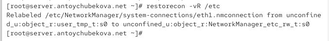{width=50%} 

## Установка Postfix

Запустим Postfix.

{width=50%} 

## Изменение параметров Postfix с помощью postconf

Изменим параметров Postfix с помощью postconf. Для начала посмотрим список текущих настроек Postfix. 

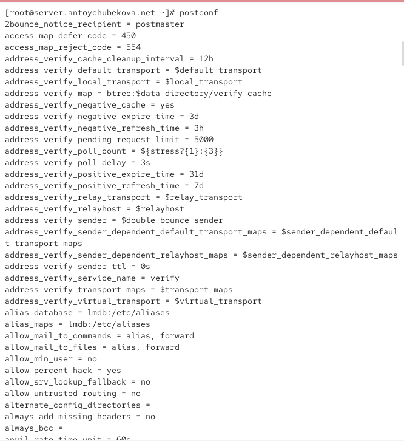{width=50%} 

## Изменение параметров Postfix с помощью postconf

Посмотрим текущее значение параметра myorigin, домена, с которого отправляется локальная почта. Мы видим, что он имеет значения параметра myhostname.

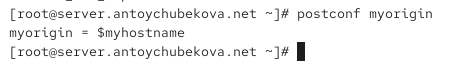{width=50%} 

## Изменение параметров Postfix с помощью postconf

Посмотрим текущее значение параметра mydomain, домена, в котором расположен сервер. Мы видим, что он имеет значения antoychubekova.net. ([рис. @fig-008] ).

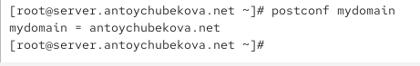{#fig-008 width=70%}

## Изменение параметров Postfix с помощью postconf

Заменим значение параметра myorigin на значение параметра mydomain. Для этого используем команду postconf c утилитой -e для редактирования и утилитой -h для получения значения параметра.  Заново проверив значение параметра myorigin, мы видим, что он равен antoychubekova.net.

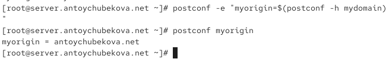{width=50%} 

## Изменение параметров Postfix с помощью postconf

Проверим корректность содержания конфигурационного файла main.cf. Мы видим, что на экран не вывелось никаких ошибок, значит конфигурационный файл работает корректно. Затем перезагрузим конфигурационные файлы Postfix. 

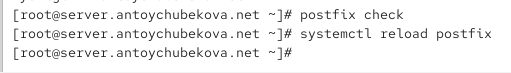{width=50%} 

## Изменение параметров Postfix с помощью postconf

Просмотрим все параметры с значением, отличным от значения по умолчанию, в этом нас поможет команда postconf с утилитой -n. 

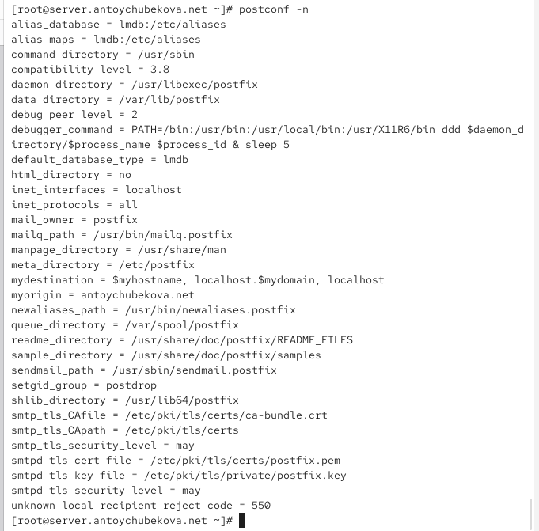{width=50%} 

## Изменение параметров Postfix с помощью postconf

Зададим жёстко значение домена, то есть присвоим значения на прямую, а не через другой параметр. 

{width=50%} 

## Изменение параметров Postfix с помощью postconf

Выведим на экран протоколы, с которыми работает сервер. Мы видим, что она имеет значение all. Отключим IPv6 в списке разрешённых в работе Postfix протоколов и оставим только IPv4, явно указав ее. 

{width=50%} 

## Изменение параметров Postfix с помощью postconf

Перезагрузим конфигурацию Postfix. 

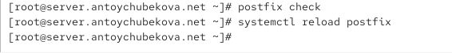{width=50%} 

## Проверка работы Postfix

На сервере под учётной записью пользователя отправим себе письмо, используя утилиту mail, командой: 

echo .| mail -s test1 antoychubekova@server.antoychubekova.net.

{width=50%} 

## Проверка работы Postfix

На втором терминале запустим мониторинг работы почтовой службы и посмотрим, что произошло с нашим сообщением. 

В мониторинге мы видим следующие строки:

Oct 22 08:18:04 server postfix/pickup[15724]: 64072410AC4E: uid=0 from <root> - отправка письма от root. Появилась новая почта (сообщение с ID 64072410AC4E), отправленная пользователем root (uid=0).

Oct 22 08:18:04 server postfix/cleanup[15936]: 64D72410AC4E: message-id=<20251022081804.64072410AC4E@server.antoychubekova.net> - подготовка письма. Postfix добавил служебный заголовок Message-ID и подготовил письмо к доставке.

## Проверка работы Postfix

Oct 22 08:18:04 server postfix/qmgr[15725]: 64072410AC4E: from=<root@antoychubekova.net>, size=370, nrcpt=1 (queue active)- добавление в очередь. Письмо попало в очередь отправки (queue active). Оно идёт от root@antoychubekova.net к одному получателю.

Oct 22 08:18:04 server postfix/local[15938]: 64D72410AC4E: to=<antoychubekova@server.antoychubekova.net>, relay=local, delay=0.19, delays=0.11/0.05/0/0.02, dsn=2.0.0, status=sent (delivered to mailbox) - доставка письма. Это означает, что письмо успешно доставлено в локальный почтовый ящик пользователя antoychubekova на этом же сервере. status=sent (delivered to mailbox) — всё прошло успешно.

Oct 22 08:18:04 server postfix/qmgr[15725]: 64072410AC4E: removed - очередь очищена. Письмо удалено из очереди, так как оно уже доставлено. Очередь теперь чистая.

## Проверка работы Postfix

{width=50%} 

## Проверка работы Postfix

Дополнительно посмотрим содержание каталога /var/spool/mail. Мы видим, что там появился файл нашего пользователя с отправленным письмом. 

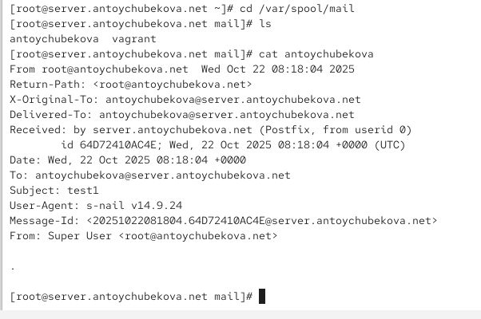{width=50%} 

## Проверка работы Postfix

На виртуальной машине client войдем под нашим пользователем и откроем терминал. Перейдем в режим суперпользователя. Далее установим необходимые для работы пакеты. 

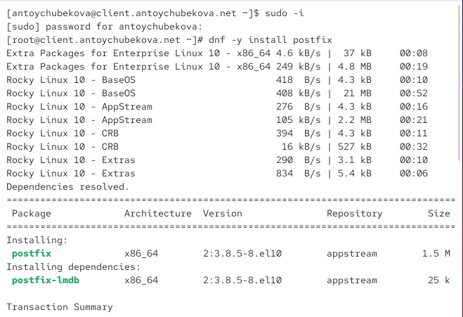{width=50%} 

## Проверка работы Postfix

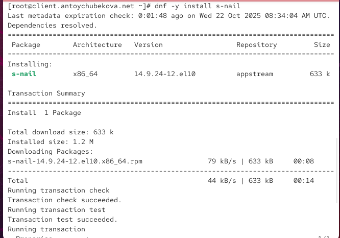{width=50%} 

## Проверка работы Postfix

Отключим IPv6 в списке разрешённых в работе Postfix протоколов и оставим только IPv4. 

{width=50%} 

## Проверка работы Postfix

На клиенте запустим Postfix. 

{width=50%} 

## Проверка работы Postfix

На клиенте под учётной записью пользователя аналогичным образом отправим
себе второе письмо, используя утилиту mail. Мы видим, что результат мониторинга почтовой службы никак не изменился с прошлого раза, значит письмо не отправилось. И содержание каталога /var/spool/mail файла antoychubekova ничего не изменилось.

## Проверка работы Postfix

{width=50%} 

## Проверка работы Postfix

{width=50%} 

## Проверка работы Postfix

{width=50%} 

## Проверка работы Postfix

На сервере в конфигурации Postfix посмотрите значения параметров сетевых интерфейсов inet_interfaces и сетевых адресов mynetworks. Мы видим, что там указан localhost, то есть соединение можно прослушивать только с локального узла.

{width=50%} 

## Проверка работы Postfix

Разрешим Postfix прослушивать соединения не только с локального узла, но и с других интерфейсов сети. И добавим адрес внутренней сети, разрешив таким образом пересылку сообщений между узлами сети. 

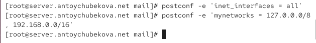{width=50%} 

## Проверка работы Postfix

Перезагрузим конфигурацию Postfix и перезапустим Postfix. 

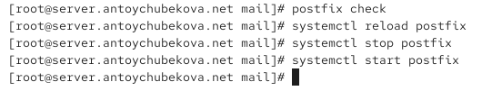{width=50%} 

## Проверка работы Postfix

Повторим отправку сообщения с клиента. Посмотрев на мониторинг работы почтовой службы, мы видим, что письмо успешно отправилось. 

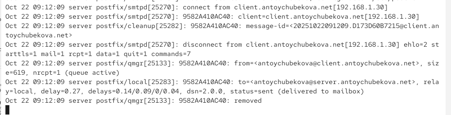{width=50%} 

## Проверка работы Postfix

{width=50%} 

## Конфигурация Postfix для домена

С клиента отправим письмо на свой доменный адрес: echo .| mail -s test2 user@user.net. 

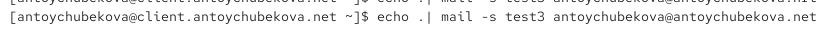{width=50%} 

## Конфигурация Postfix для домена

Запустим мониторинг работы почтовой службы. Мы видим, что ничего не произошло, письмо не доставилось. 

{width=50%} 

## Конфигурация Postfix для домена

Посмотрим, какие сообщения ожидают в очереди на отправление. Мы видим, что очередь пустая, а также уведомление, что у клиента новое сообщение. При отправке письма на адрес antoychubekova@antoychubekova.net почтовый сервер Postfix пытался определить конечный узел доставки. Так как домен antoychubekova.net ещё не настроен (нет MX-записей в DNS), сервер не смог найти внешний SMTP-сервер для доставки.В результате Postfix доставил письмо локально, в почтовый ящик пользователя на этом же сервере (/var/mail/<логин>).

## Конфигурация Postfix для домена

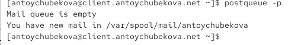{width=50%} 

## Конфигурация Postfix для домена

Для настройки возможности отправки сообщений не на конкретный узел сети, а на доменный адрес пропишем MX-запись с указанием имени почтового сервера mail.antoychubekova.net в файле прямой DNS-зоны. 

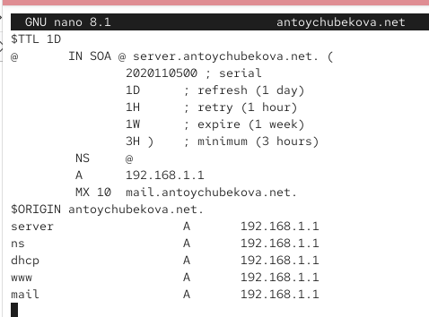{width=50%} 

## Конфигурация Postfix для домена

И в файле обратной DNS-зоны.

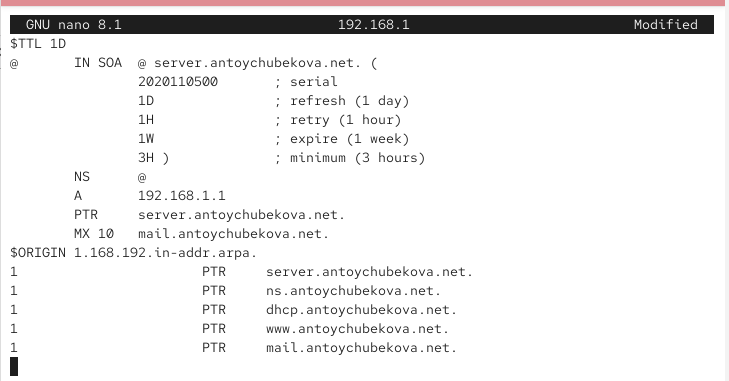{width=50%} 

## Конфигурация Postfix для домена

В конфигурации Postfix добавим домен в список элементов сети, для которых данный сервер является конечной точкой доставки почты. Затем перезагрузите конфигурацию Postfix. 

{width=50%} 

## Конфигурация Postfix для домена

Восстановим контекст безопасности в SELinux.

{width=50%} 

## Конфигурация Postfix для домена

Перезапустим DNS и попробуем отправить сообщения, находящиеся в очереди на отправление. Так как у нас очередь пустая мы повторно попробуем отправить письмо с клиента. 

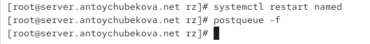{width=50%} 

## Конфигурация Postfix для домена

Проверим отправку почты с клиента на доменный адрес. Откроем файл /var/spool/mail/antoychubekova. Мы видим, что письмо успешно доставилось. 

{width=50%} 

## Внесение изменений в настройки внутреннего окружения виртуальной машины

На виртуальной машине server перейдем в каталог для внесения изменений в настройки внутреннего окружения /vagrant/provision/server/. Заменим конфигурационные файлы DNS-сервера. 

{width=50%} 

## Внесение изменений в настройки внутреннего окружения виртуальной машины

В каталоге /vagrant/provision/server создадим исполняемый файл mail.sh. 

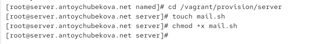{width=50%} 

## Внесение изменений в настройки внутреннего окружения виртуальной машины

Открыв его на редактирование, пропишем в нём скрипт, который настраивает работу с почтовой службой.

{width=50%}  

## Внесение изменений в настройки внутреннего окружения виртуальной машины

На виртуальной машине client перейдем в каталог для внесения изменений в настройки внутреннего окружения /vagrant/provision/client/. В каталоге /vagrant/provision/client создадим исполняемый файл mail.sh. 

{width=50%} 

## Внесение изменений в настройки внутреннего окружения виртуальной машины

Открыв его на редактирование, пропишем в нём скрипт, который настраивает работу с почтовой службой.

{width=50%} 

## Внесение изменений в настройки внутреннего окружения виртуальной машины

Для отработки созданного скрипта во время загрузки виртуальной машины server в конфигурационном файле Vagrantfile добавим в разделе конфигурации для сервера. 

{width=50%}  

## Внесение изменений в настройки внутреннего окружения виртуальной машины

Для отработки созданного скрипта во время загрузки виртуальной машины client в конфигурационном файле Vagrantfile добавим в разделе конфигурации для клиента. 

{width=50%} 

# Выводы

## Выводы

В ходе выполнения лабораторной работы №8 я приобрела практические навыки по установке и конфигурированию SMTP-сервера.

# Список литературы

## Список литературы

1. Postfix Documentation. — URL: http://www.postfix.org/documentation.html (visited on 09/13/2021).

