---
## Author
author:
  name: Тойчубекова Асель Нурлановна
  degrees: DSc
  orcid: 0000-0002-0877-7063
  email: kulyabov-ds@rudn.ru
  affiliation:
    - name: Российский университет дружбы народов
      country: Российская Федерация
      postal-code: 117198
      city: Москва
      address: ул. Миклухо-Маклая, д. 6

## Title
title: "Администрирование сетевых подсистем"
subtitle: "Лабораторная работа №9"
license: "CC BY"
---

# Цель работы

Целью лабораторной работы является приобретение практических навыков по установке и простейшему конфигурированию POP3/IMAP-сервера.

# Задание

1. Установите на виртуальной машине server Dovecot и Telnet для дальнейшей проверки корректности работы почтового сервера.
2. Настройте Dovecot.
3. Установите на виртуальной машине client программу для чтения почты Evolution и настройте её для манипуляций с почтой вашего пользователя. Проверьте корректность работы почтового сервера как с виртуальной машины server, так и с виртуальной машины client.
4. Измените скрипт для Vagrant, фиксирующий действия по установке и настройке Postfix и Dovecote во внутреннем окружении виртуальной машины server, создайте скрипт для Vagrant, фиксирующий действия по установке Evolution во внутреннем окружении виртуальной машины client. Соответствующим образом внесите изменения в Vagrantfile.

# Теоретическое введение

Dovecot — это современный и надёжный почтовый сервер (Mail Delivery Agent, MDA), обеспечивающий пользователям доступ к электронной почте по протоколам POP3 и IMAP. Он используется совместно с SMTP-сервером (например, Postfix) для получения и хранения почтовых сообщений, а также для обеспечения их безопасности с помощью протокола TLS.

Dovecot поддерживает два основных формата хранения почтовых сообщений: mbox и Maildir. В формате mbox все письма пользователя хранятся в одном общем текстовом файле. Такой подход требует применения механизмов блокировки файла, чтобы избежать повреждения данных при одновременном доступе нескольких процессов.
Формат Maildir, напротив, хранит каждое сообщение в отдельном файле с уникальным именем, что повышает надёжность и производительность системы. В этом случае блокировка и целостность обеспечиваются средствами файловой системы, а каждая папка почты представлена отдельным каталогом.

Основные файлы конфигурации Dovecot располагаются в каталоге /etc/dovecot/, включая основной конфигурационный файл dovecot.conf и дополнительные файлы настроек в подкаталоге conf.d. Сертификаты безопасности, необходимые для шифрования соединений, хранятся в каталоге /etc/pki/dovecot/.

При совместной работе SMTP-сервера и POP3/IMAP-сервера возможны два варианта организации взаимодействия:

- Оба сервера работают параллельно и имеют общий доступ к почтовым ящикам пользователей;

- SMTP-сервер передаёт функции работы с ящиками Dovecot’у, и только он управляет почтой пользователей.

# Выполнение лабораторной работы

## Установка Dovecot

Для начала лабораторной работы запустим вм server, войдем под нашим пользователем и откроем терминал. Перейдем в режим суперпользователя и установим необходимые для работы пакеты. ([рис. @fig-001]).

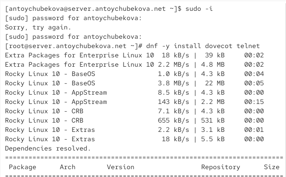{#fig-001 width=70%}

## Настройка dovecot

В конфигурационном файле /etc/dovecot/dovecot.conf пропишем список почтовых протоколов, по которым разрешено работать Dovecot:
protocols = imap pop3. ([рис. @fig-002]).

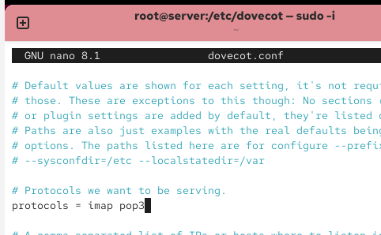{#fig-002 width=70%}

В конфигурационном файле /etc/dovecot/conf.d/10-auth.conf проверим, что указан метод аутентификации plain: auth_mechanisms = plain. ([рис. @fig-003]).

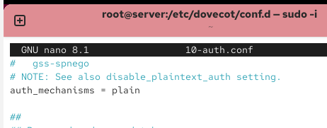{#fig-003 width=70%}

В конфигурационном файле /etc/dovecot/conf.d/auth-system.conf.ext проверим, что для поиска пользователей и их паролей используется pam и файл passwd.  ([рис. @fig-004] и [рис. @fig-005]).

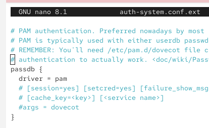{#fig-004 width=70%}

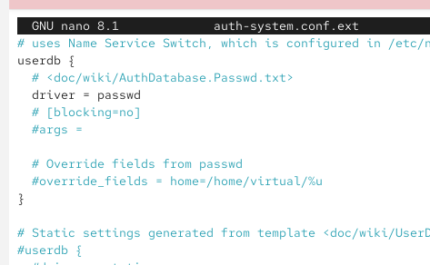{#fig-005 width=70%}

В конфигурационном файле /etc/dovecot/conf.d/10-mail.conf настроим месторасположение почтовых ящиков пользователей. ([рис. @fig-006]).

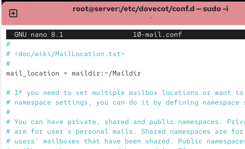{#fig-006 width=70%}

В Postfix зададим каталог для доставки почты.  ([рис. @fig-007]).

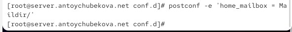{#fig-007 width=70%}

Сконфигурируем межсетевой экран, разрешив работать службам протоколов POP3 и IMAP. ([рис. @fig-008] и [рис. @fig-009]).

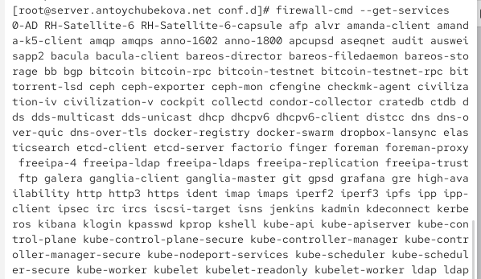{#fig-008 width=70%}

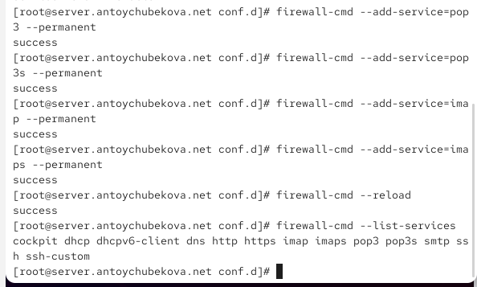{#fig-009 width=70%}

Восстановим контекст безопасности в SELinux.  ([рис. @fig-010]).

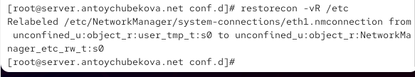{#fig-010 width=70%}

Перезапустим Postfix и запустим Dovecot. ([рис. @fig-011]).

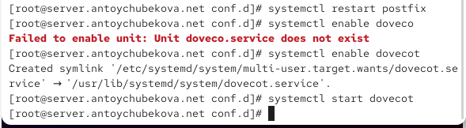{#fig-011 width=70%}

## Проверка работы Dovecot

На дополнительном терминале виртуальной машины server запустим мониторинг работы почтовой службы. ([рис. @fig-012]).

{#fig-012 width=70%}

На терминале сервера просмотрим имеющейся почты используя MAIL=~/Maildir mail. Мы видим, что почта пока пустая, никаких писем нет. ([рис. @fig-013]).

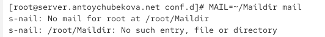{#fig-013 width=70%}

Для просмотра mailbox пользователя на сервере на терминале с правами суперпользователя используем команду: doveadm mailbox list -u antoychubekova. Мы видим, что у нашего пользователя antoychubekova есть почтовый ящик INBOX. ([рис. @fig-014]).

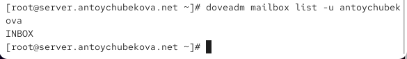{#fig-014 width=70%}

На виртуальной машине client войдем под нашим пользователем и откроем терминал. Перейдем в режим суперпользователя. Далее установим почтовый клиент. ([рис. @fig-015]).

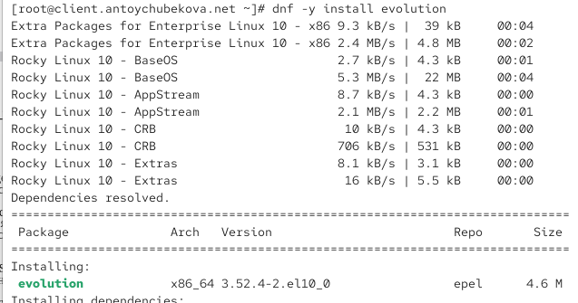{#fig-015 width=70%}

Запустим и настроим почтовый клиент Evolution. В окне настройки учётной записи почты укажем имя, адрес почты в виде antoychubekova@antoychubekova.net, введtv пароль пользователя, нажмем «Продолжить», затем нажмем «Настроить вручную». ([рис. @fig-016]).

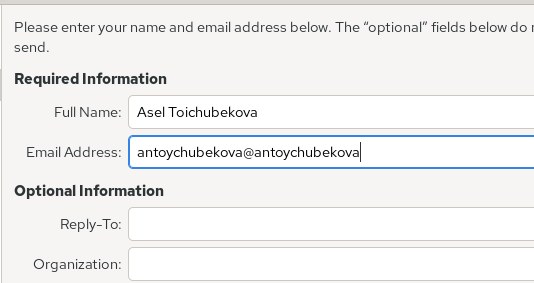{#fig-016 width=70%}

В качестве IMAP-сервера для входящих сообщений и SMTP-сервера для исходящих сообщений пропишем mail.antoychubekova.net, в качестве пользователя для входящих и исходящих сообщений укажем antoychubekova. Проверим номера портов: для IMAP — порт 143, для SMTP — порт 25. Проверим настройки SSL и метода аутентификации: для IMAP — STARTTLS, аутентификация по обычному паролю, для SMTP — без аутентификации, аутентификация — «Без аутентификации». ([рис. @fig-017] и [рис. @fig-018]).

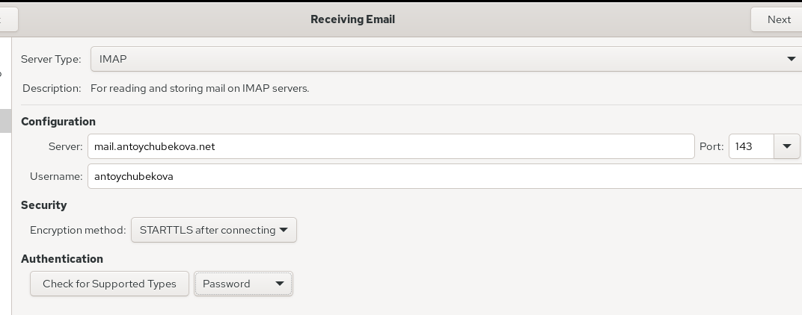{#fig-017 width=70%}

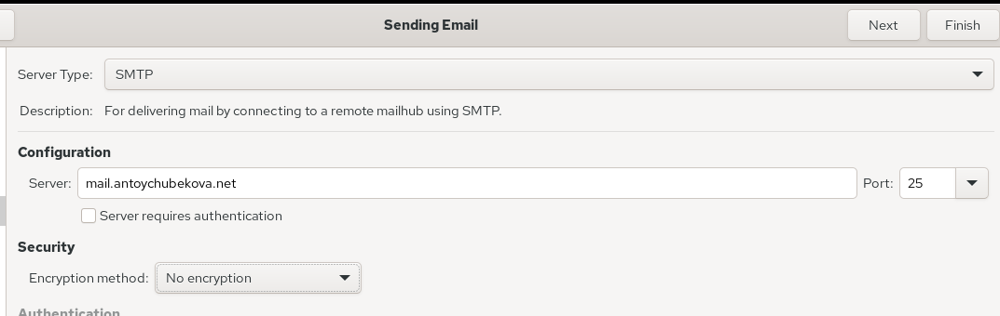{#fig-018 width=70%}

Просмотрев итоговые настройки сохраним изменения. ([рис. @fig-019]).

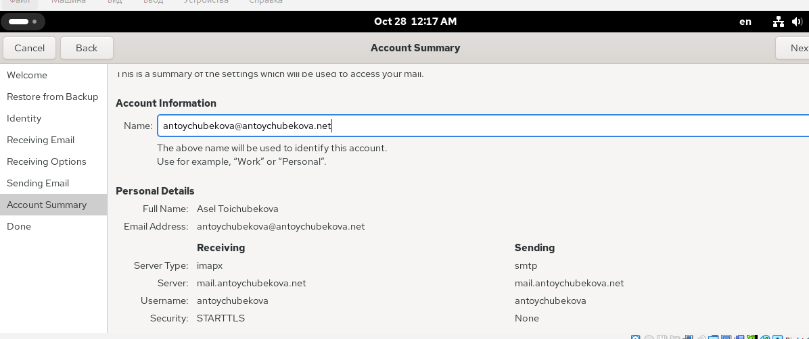{#fig-019 width=70%}

Из почтового клиента отправим себе несколько тестовых писем. ([рис. @fig-020] и [рис. @fig-021]).

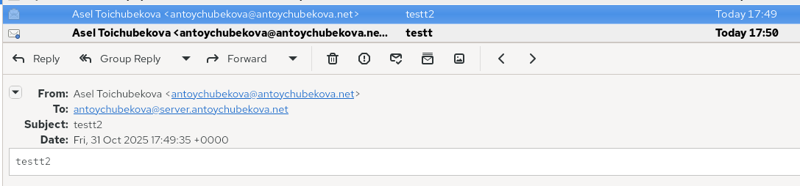{#fig-020 width=70%}

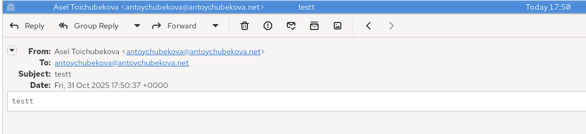{#fig-021 width=70%}

Убедимся, что они доставлены. Для этого просмотрим сообщения при мониторинге почтовой службы. Мы видим, что отображается процесс приёма и доставки писем. После соединения клиента client.antoychubekova.net сервер Postfix принимает сообщение, обрабатывает его и сохраняет в почтовом ящике пользователя (Maildir). Каждое сообщение получает уникальный идентификатор (ID) и после успешной доставки удаляется из очереди.Dovecot обеспечивает доступ пользователя к полученным письмам по протоколам POP3/IMAP. Все строки с delivered to maildir подтверждают успешную доставку сообщений. ([рис. @fig-022]).

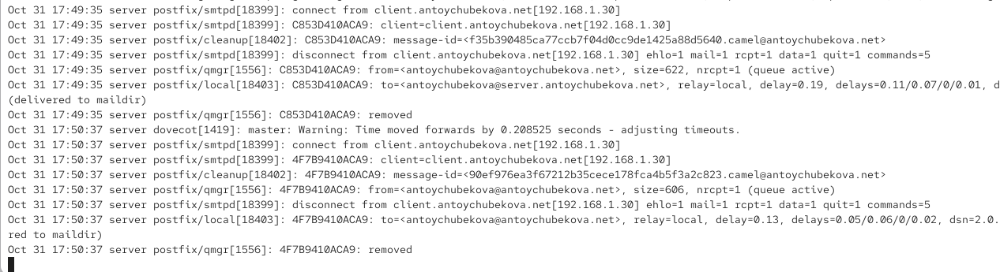{#fig-022 width=70%}

Также посмотрим сами письма в Maildir, используя mail. Мы видим, что выводятся все письма отправленные клиентом, а также их содержание. ([рис. @fig-023] и [рис. @fig-024]).

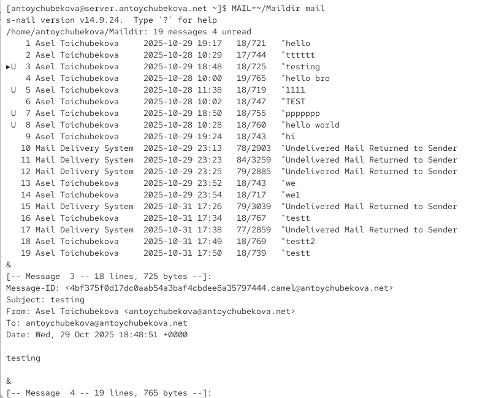{#fig-023 width=70%}

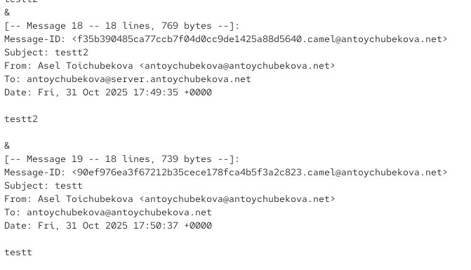{#fig-024 width=70%}

Также можем посмотреть почту через doveadm. Мы видим, что у нашего пользователя есть почтовый ящик INBOX и мы можем посмотреть его содержание. В содержании мы видим, содержание всех отправленных до писем. ([рис. @fig-025] и [рис. @fig-026]).

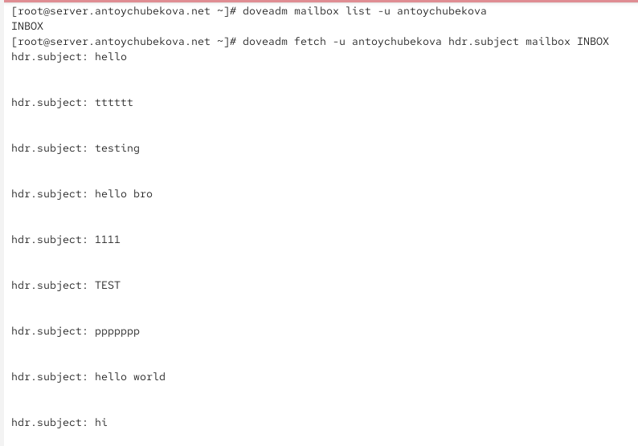{#fig-025 width=70%}

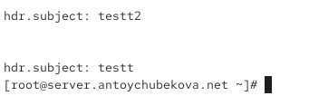{#fig-026 width=70%}

Проверим работу почтовой службы, используя на сервере протокол Telnet. Подключимся с помощью протокола Telnet к почтовому серверу по протоколу POP3 (через порт 110), введем свой логин для подключения и пароль. Мы видим, что все успешно подключилось.  ([рис. @fig-027]).

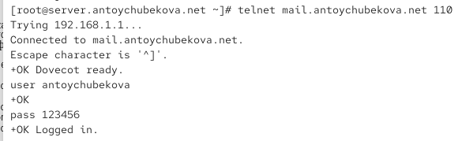{#fig-027 width=70%}

С помощью команды list получим список писем. Мы видим, что у нас 19 писем и нам вывелся размер и номер каждого письма. ([рис. @fig-028]).

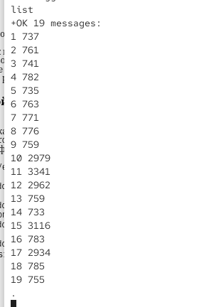{#fig-028 width=70%}

С помощью команды retr 1 получим первое письмо из списка. Мы видим, что вывелось содержание письма и информация о первом письме. ([рис. @fig-029]).

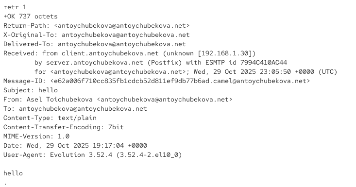{#fig-029 width=70%}

С помощью команды dele 2 удалим второе письмо из списка. Мы видим, что 2ое письмо успешно удалено, с помощью команды list удостоверимся, что второго письма нет в списке. ([рис. @fig-030]).

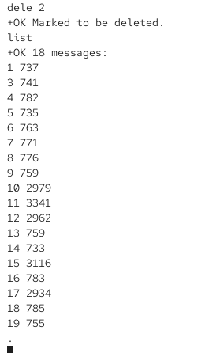{#fig-030 width=70%}

С помощью команды quit завершим сеанс работы с telnet. ([рис. @fig-031]).

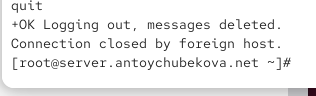{#fig-031 width=70%}

## Внесение изменений в настройки внутреннего окружения виртуальной машины

На виртуальной машине server перейдtv в каталог для внесения изменений в настройки внутреннего окружения /vagrant/provision/server/. В соответствующие подкаталоги поместим конфигурационные файлы Dovecot. ([рис. @fig-032]).

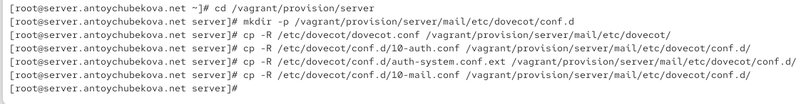{#fig-032 width=70%}

Внесем изменения в файл /vagrant/provision/server/mail.sh, добавив в него строки с установкой Dovecot и Telnet, настройкой межсетевого экрана, настройкой Postfix в части задания месторасположения почтового ящика, перезагрузкой Postfix и запуском Dovecot. ([рис. @fig-033]).

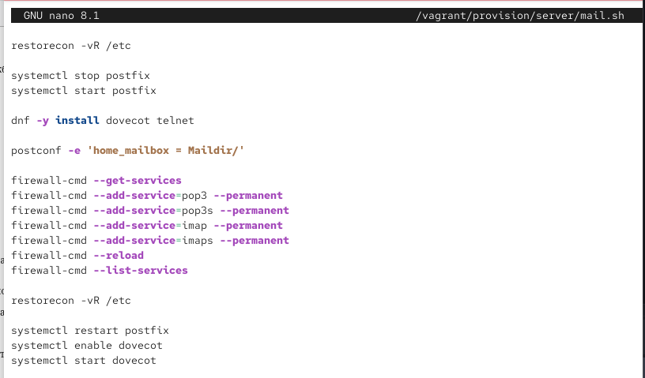{#fig-033 width=70%}

На виртуальной машине client в каталоге /vagrant/provision/client скорректируем файл mail.sh, прописав в нём установку evolution. ([рис. @fig-034]).

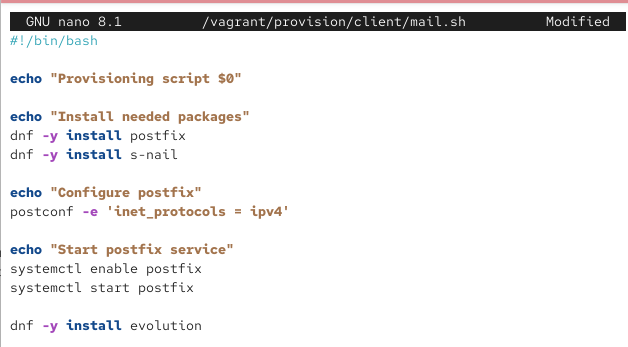{#fig-034 width=70%}

# Выводы

В ходе выполнения лабораторной работы №9 я приобрела практические навыки по установке и простейшему конфигурированию POP3/IMAP-сервера.

# Список литературы

1. Dovecot Documentation. — URL: https : / / dovecot . org / documentation (visited on
09/13/2021).
2. Postfix Documentation. — URL: http://www.postfix.org/documentation.html (visited
on 09/13/2021)
