---
## Author
author:
  name: Тойчубекова Асель Нурлановна
  degrees: DSc
  orcid: 0000-0002-0877-7063
  email: kulyabov-ds@rudn.ru
  affiliation:
    - name: Российский университет дружбы народов
      country: Российская Федерация
      postal-code: 117198
      city: Москва
      address: ул. Миклухо-Маклая, д. 6
## Title
title: Администрирование сетевых подсистем
subtitle: Лабораторная работа №10
license: CC BY
date: today
date-format: "YYYY-MM-DD" # Example: 2025-09-06
---

# Информация

## Докладчик

:::::::::::::: {.columns align=center}
::: {.column width="70%"}

  * Тойчубекова Асель Нурлановна
  * Студент 3 курса
  * факультет физико-математических и естественных наук
  * Российский университет дружбы народов им. П. Лумумбы
  * [1032235033@rudn.ru](1032235033@rudn.ru)

:::
::: {.column width="30%"}

:::
::::::::::::::

# Цель работы

## Цель работы

Целью данной лабораторной работы является приобретение практических навыков по конфигурированию SMTP-сервера в части настройки аутентификации.

# Задание

## Задание

1. Настройте Dovecot для работы с LMTP.
2. Настройте аутентификацию посредством SASL на SMTP-сервере.
3. Настройте работу SMTP-сервера поверх TLS.
4. Скорректируйте скрипт для Vagrant, фиксирующий действия расширенной настройки SMTP-сервера во внутреннем окружении виртуальной машины server.

# Теоретическое введение

## Теоретическое введение

Протокол LMTP

Local Mail Transfer Protocol (LMTP) — протокол локальной пересылки почты. По сути, LMTP используется для передачи сообщений от SMTP-сервера к локальному агенту доставки. 

Главным преимуществом применения Dovecot с LMTP является возможность выполнять фильтрацию почты на стороне сервера — непосредственно в момент помещения письма в почтовый ящик, а не на стороне клиента. Это повышает уровень безопасности и снижает нагрузку на пользовательские устройства.

## Теоретическое введение

Аутентификация посредством SASL

Simple Authentication and Security Layer (SASL) — это универсальный механизм, обеспечивающий аутентификацию, идентификацию пользователей и защиту данных в протоколах, ориентированных на установление соединений (например, IMAP, POP, SMTP, LDAP, telnet, FTP и др.).

## Теоретическое введение

SASL представляет собой промежуточный слой между приложением и используемым им протоколом, добавляя команды идентификации и аутентификации, а также определяя методы защиты (включая шифрование). Работа SASL строится на принципе обмена запросами и ответами, при этом используется набор различных механизмов, позволяющих, например:

- отделить процесс аутентификации от передачи данных;

- использовать анонимную аутентификацию;

- разрешить передачу пароля открытым текстом (если это допустимо политикой безопасности).

# Выполнение лабораторной работы

## Настройка LMTP в Dovecote

Для начала лабораторной работы запустим вм server, войдем под нашим пользователем. Откроем терминал, перейдем в режим суперпользователя и запустим мониторинг работы почтовой службы. Мы видим, что пока в мониторинге только информация о запуске postfix.

{width=50%}

## Настройка LMTP в Dovecote

Добавим в список протоколов, с которыми может работать Dovecot, протокол LMTP. Для этого в файле /etc/dovecot/dovecot.conf добавим в список протоколов lmtp. 

{width=50%}

## Настройка LMTP в Dovecote

Настроим в Dovecot сервис lmtp для связи с Postfix. Для этого в файле /etc/dovecot/conf.d/10-master.conf заменим определение сервиса lmtp на следующую запись

service lmtp {

unix_listener /var/spool/postfix/private/dovecot-lmtp {

group = postfix

user = postfix

mode = 0600
}

}

## Настройка LMTP в Dovecote

Эта запись определяет расположение файла с описанием прослушиваемого unix-сокета, а также задаёт права доступа к нему и определяет принадлежность к группе и пользователю postfix. 

{width=50%}

## Настройка LMTP в Dovecote

Переопределим в Postfix с помощью postconf передачу сообщений не на прямую, а через заданный unix-сокет.

{width=50%}

## Настройка LMTP в Dovecote

В файле /etc/dovecot/conf.d/10-auth.conf зададим формат имени пользователя для аутентификации в форме логина пользователя без указания домена. Для этого пропишем auth_username_format = %Ln 

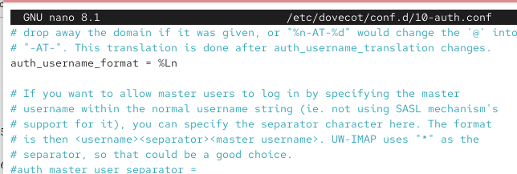{width=50%}

## Настройка LMTP в Dovecote

Перезапустим Postfix и Dovecot.

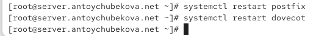{width=50%}

## Настройка LMTP в Dovecote

Из-под учётной записи своего пользователя отправим письмо с клиента. 

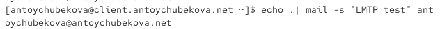{width=50%}

## Настройка LMTP в Dovecote

Посмотрим логи почтовой службы. Мы видим, что в логе описана передача письма от клиента. 

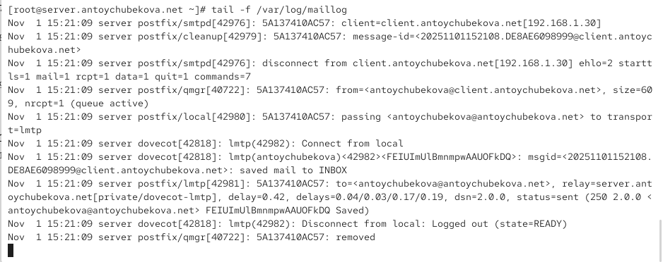{width=50%}

## Настройка LMTP в Dovecote

1. Приём письма SMTP-сервером Postfix
2. Обработка и подготовка письма к доставке
3. Клиент завершает сеанс SMTP
4. Письмо помещается в очередь
5. Передача письма в Dovecot через LMTP
6. Dovecot принимает письмо по LMTP
7. Подтверждение успешной доставки
8. Завершение сессии LMTP и очистка очереди

## Настройка LMTP в Dovecote

На сервере просмотрим почтовый ящик пользователя. Мы видим, что письмо успешно доставлено в почтовый ящик.

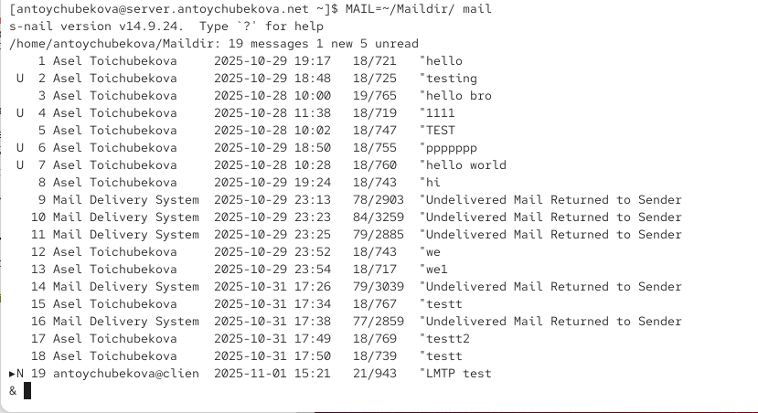{width=50%}

## Настройка SMTP-аутентификации

В файле /etc/dovecot/conf.d/10-master.conf определим службу аутентификации
пользователей:

service auth {

Определяется служба auth — это процесс, отвечающий за аутентификацию пользователей.

unix_listener /var/spool/postfix/private/auth {

Создаётся Unix-сокет (локальный файл-соединение) по пути /var/spool/postfix/private/auth.
Этот сокет нужен для связи между Postfix и Dovecot: Postfix будет обращаться к этому сокету, чтобы передавать запросы на аутентификацию (например, при приёме писем через SASL).

## Настройка SMTP-аутентификации

Устанавливаются права владельца сокета:

user = postfix — владельцем файла сокета является пользователь postfix;

group = postfix — группой-владельцем также является postfix.

mode = 0660

Определяются права доступа к сокету:

Владелец и группа могут читать и писать (rw- rw- ---),

Остальные пользователи не имеют доступа.

}

## Настройка SMTP-аутентификации

unix_listener auth-userdb {

Определяется ещё один локальный сокет auth-userdb. Он используется внутренними процессами Dovecot (например, LMTP, IMAP и POP3) для связи с базой данных пользователей (userdb) и получения информации о них (путь к почтовому ящику, UID/GID, квоты и т. д.).

mode = 0600

Задаются права доступа:

Только владелец может читать и писать (rw-------).

## Настройка SMTP-аутентификации

user = dovecot

Устанавливается владелец сокета — пользователь dovecot. Это обеспечивает, что только процессы, запущенные от имени Dovecot, смогут использовать данный интерфейс для взаимодействия.

}

} 

## Настройка SMTP-аутентификации

{width=50%}

## Настройка SMTP-аутентификации

Для Postfix зададим тип аутентификации SASL для smtpd и путь к соответствующему unix-сокету. 

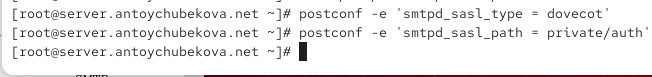{width=50%}

## Настройка SMTP-аутентификации

Настроим Postfix для приёма почты из Интернета только для обслуживаемых нашим сервером пользователей или для произвольных пользователей локальной машины (имеется в виду локальных пользователей сервера), обеспечивая тем самым запрет на использование почтового сервера в качестве SMTP relay для спам-рассылок (порядок указания опций имеет значение). 

## Настройка SMTP-аутентификации

Для этого используем опции:

- reject_unknown_recipient_domain — отклоняет письма, если домен получателя не существует или не может быть проверен через DNS.

- permit_mynetworks — разрешает отправку писем от хостов, входящих в доверенные сети (определённые параметром mynetworks).

- reject_non_fqdn_recipient — отклоняет письма, если адрес получателя не содержит полного доменного имени (FQDN).

## Настройка SMTP-аутентификации

- reject_unauth_destination — предотвращает пересылку почты на внешние домены (релей) без авторизации.

- reject_unverified_recipient — проверяет существование адреса получателя и отклоняет письма к несуществующим пользователям.

- permit — разрешает доставку писем, если все предыдущие проверки пройдены успешно.

## Настройка SMTP-аутентификации

{width=50%}

## Настройка SMTP-аутентификации

В настройках Postfix ограничим приём почты только локальным адресом SMTP-сервера сети. 

{width=50%}

## Настройка SMTP-аутентификации

Для проверки работы аутентификации временно запустим SMTP-сервер (порт 25) с возможностью аутентификации. Для этого необходимо в файле /etc/postfix/master.cf заменить строку

smtp inet n - n - - smtpd

на строку

smtp inet n - n - - smtpd

-o smtpd_sasl_auth_enable=yes

-o smtpd_recipient_restrictions=reject_non_fqdn_recipient,reject_unknown_recipient_domain,permit_sasl_authenticated,reject. 

## Настройка SMTP-аутентификации

Эта конфигурация включает SMTP-сервер с проверкой получателей и поддержкой авторизации по SASL — то есть принимать и отправлять почту могут только проверенные (вошедшие) пользователи. 

{width=50%}

## Настройка SMTP-аутентификации

Перезапустим Postfix и Dovecot.

{width=50%}

## Настройка SMTP-аутентификации

На клиенте установим telnet. 

{width=50%}

## Настройка SMTP-аутентификации

На клиенте получим строку для аутентификации. 

{width=50%}

## Настройка SMTP-аутентификации

Подключимся на клиенте к SMTP-серверу посредством telnet. Протестируем соединения, введя EHLO test.  Мы видим, что все корректно отрабатывается и команда EHLO test показывает, что сервер
server.antoychubekova.net поддерживает расширенные возможности SMTP (ESMTP): шифрование, аутентификацию, уведомления о доставке, работу с большими письмами и ускоренный обмен командами.

{width=50%}

## Настройка SMTP-аутентификации

Проверьте авторизацию, задав: AUTH PLAIN <строка для аутентификации>. Мы видим, что авторизация прошла успешно. Затем заверши сессию telnet на клиенте. 

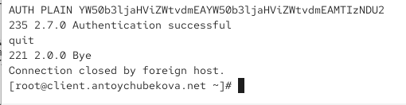{width=50%}

## Настройка SMTP over TLS

Настроим на сервере TLS, воспользовавшись временным сертификатом Dovecot. Предварительно скопируем необходимые файлы сертификата и ключа из каталога /etc/pki/dovecot в каталог /etc/pki/tls/ в соответствующие подкаталоги (чтобы не было проблем с SELinux).

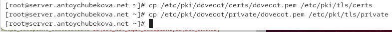{width=50%}

## Настройка SMTP over TLS

Сконфигурируем Postfix, указав пути к сертификату и ключу, а также к каталогу для хранения TLS-сессий и уровень безопасности.

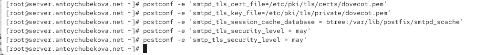{width=50%}

## Настройка SMTP over TLS

Для того чтобы запустить SMTP-сервер на 587-м порту, в файле /etc/postfix/master.cf заменим строки

smtp inet n - n - - smtpd

-o smtpd_sasl_auth_enable=yes

-o smtpd_recipient_restrictions=reject_non_fqdn_recipient,reject_unknown_recipient_domain,permit_sasl_authenticated,reject

## Настройка SMTP over TLS

на следующую запись:

smtp inet n - n - - smtpd

и добавьте следующие строки:

submission inet n - n - - smtpd

-o smtpd_tls_security_level=encrypt

-o smtpd_sasl_auth_enable=yes

-o smtpd_recipient_restrictions=reject_non_fqdn_recipient,reject_unknown_recipient_domain,permit_sasl_authenticated,reject. 

## Настройка SMTP over TLS

Эта запись создаёт безопасный SMTP-порт 587 (submission), через который пользователи, прошедшие SASL-аутентификацию, могут отправлять почту по зашифрованному каналу (TLS). Иными словами — порт 25 используется для приёма почты между серверами, а порт 587 — для отправки писем клиентами (почтовыми программами).

## Настройка SMTP over TLS

{width=50%}

## Настройка SMTP over TLS

Настроим межсетевой экран, разрешив работать службе smtp-submission.

{width=50%}

## Настройка SMTP over TLS

{width=50%}

## Настройка SMTP over TLS

Перезапустим Postfix. 

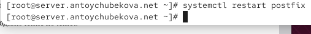{width=50%}

## Настройка SMTP over TLS

На клиенте подключимся к SMTP-серверу через 587-й порт посредством openssl. Протестируем подключение по telnet. Затем проверим аутентификацию. Мы видим некотрую информацию.

Сервер server.antoychubekova.net на порту 587 поддерживает шифрование STARTTLS. 

Используется самоподписанный сертификат RSA-3072, действительный 1 год.

Соединение успешно установлено и шифруется, но сертификат не проверен доверенным центром (что нормально для тестовой среды).
Аутентификация клиента по сертификату не запрашивается.

## Настройка SMTP over TLS

{width=50%}

## Настройка SMTP over TLS

TLS соединение успешно установлено (TLS 1.3, сильный шифр, forward secrecy через X25519).

Однако сертификат — самоподписанный (Verify return code 18) → клиенты не будут доверять ему по умолчанию. В продакшне лучше использовать сертификат, подписанный доверенным CA (или добавить самоподписанный в доверенные на клиентах).

Сервер поддерживает CHUNKING и присылает session tickets (ресумпшен).

## Настройка SMTP over TLS

{width=50%} 

## Настройка SMTP over TLS

Мы видим, что все корректно обрабатывается.

{width=50%}

## Настройка SMTP over TLS

Проверим корректность отправки почтовых сообщений с клиента посредством почтового клиента Evolution, предварительно скорректировав настройки учётной записи, а именно для SMTP-сервера укажите порт 587, STARTTLS и обычный пароль.

{width=50%}

## Настройка SMTP over TLS

Теперь попробуем отправить письмо на адрес antoychubekova@antoychubekova.net.

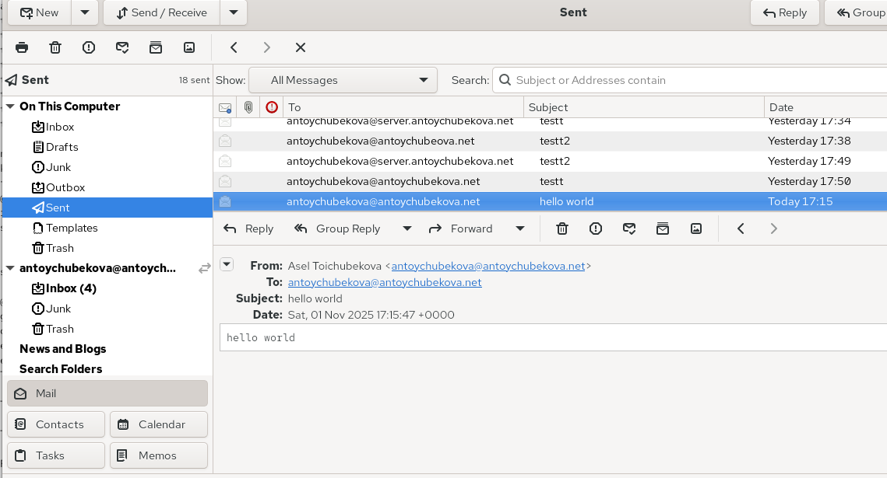{width=50%}

## Настройка SMTP over TLS

Если посмотрим на мониторинг почтовой службы и почтовый ящим, мы удостоверимся, что письмо было успешно отправлено. 

{width=50%}

## Настройка SMTP over TLS

{width=50%} 

## Внесение изменений в настройки внутреннего окружения виртуальной машины

На виртуальной машине server перейдем в каталог для внесения изменений в настройки внутреннего окружения /vagrant/provision/server/. В соответствующие подкаталоги поместим конфигурационные файлы Dovecot и Postfix.

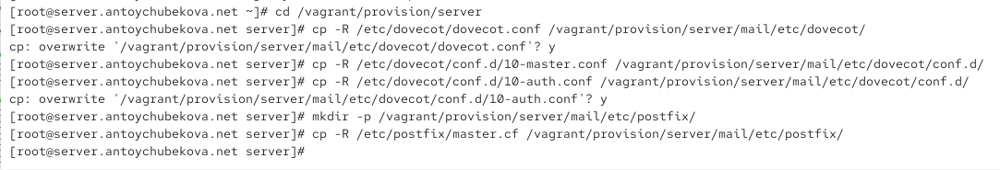{width=50%}

## Внесение изменений в настройки внутреннего окружения виртуальной машины

Внесите соответствующие изменения по расширенной конфигурации SMTP-сервера в файл /vagrant/provision/server/mail.sh.

{width=50%}

## Внесение изменений в настройки внутреннего окружения виртуальной машины

{width=50%}

## Внесение изменений в настройки внутреннего окружения виртуальной машины

Внесем изменения в файл /vagrant/provision/client/mail.sh, добавив установку telnet. 

{width=50%}

# Выводы

## Выводы

В ходе выполнения лабораторной работы № 10 я приобрела практические навыков по конфигурированию SMTP-сервера в части настройки аутентификации.

# Список литературы

## Список литературы

1. Postfix SASL Howto. — URL: http : / / www . postfix . org / SASL _ README . html (visited on
09/13/2021).
