---
## Author
author:
  name: Тойчубекова Асель Нурлановна
  degrees: DSc
  orcid: 0000-0002-0877-7063
  email: kulyabov-ds@rudn.ru
  affiliation:
    - name: Российский университет дружбы народов
      country: Российская Федерация
      postal-code: 117198
      city: Москва
      address: ул. Миклухо-Маклая, д. 6

## Title
title: "Администрирование сетевых подсистем"
subtitle: "Лабораторная работа №10"
license: "CC BY"
---

# Цель работы

Целью данной лабораторной работы является приобретение практических навыков по конфигурированию SMTP-сервера в части настройки аутентификации.

# Задание

1. Настройте Dovecot для работы с LMTP.
2. Настройте аутентификацию посредством SASL на SMTP-сервере.
3. Настройте работу SMTP-сервера поверх TLS.
4. Скорректируйте скрипт для Vagrant, фиксирующий действия расширенной настройки SMTP-сервера во внутреннем окружении виртуальной машины server.

# Теоретическое введение

Эффективная и безопасная организация почтовой системы является неотъемлемой частью современной сетевой инфраструктуры. Для обеспечения корректной доставки и обработки электронной корреспонденции используется совокупность протоколов и сервисов, выполняющих различные функции на разных этапах прохождения сообщения — от отправителя к получателю. Важную роль в этом процессе играют такие компоненты, как LMTP (Local Mail Transfer Protocol) и SASL (Simple Authentication and Security Layer), обеспечивающие, соответственно, локальную доставку писем и безопасную аутентификацию пользователей.

Протокол LMTP

Local Mail Transfer Protocol (LMTP) — протокол локальной пересылки почты. По сути, LMTP используется для передачи сообщений от SMTP-сервера к локальному агенту доставки. Например, при использовании почтового сервера Dovecot с включённым функционалом LMTP, этот сервер выступает в качестве службы приёма почтовых сообщений от SMTP-сервера и их последующей доставки пользователям локальной сети.
Главным преимуществом применения Dovecot с LMTP является возможность выполнять фильтрацию почты на стороне сервера — непосредственно в момент помещения письма в почтовый ящик, а не на стороне клиента. Это повышает уровень безопасности и снижает нагрузку на пользовательские устройства.

Аутентификация посредством SASL

Simple Authentication and Security Layer (SASL) — это универсальный механизм, обеспечивающий аутентификацию, идентификацию пользователей и защиту данных в протоколах, ориентированных на установление соединений (например, IMAP, POP, SMTP, LDAP, telnet, FTP и др.).
SASL представляет собой промежуточный слой между приложением и используемым им протоколом, добавляя команды идентификации и аутентификации, а также определяя методы защиты (включая шифрование). Работа SASL строится на принципе обмена запросами и ответами, при этом используется набор различных механизмов, позволяющих, например:

- отделить процесс аутентификации от передачи данных;

- использовать анонимную аутентификацию;

- разрешить передачу пароля открытым текстом (если это допустимо политикой безопасности).

Подробнее спецификация SASL описана в RFC 4422, а реализация его взаимодействия с почтовыми системами, например Postfix, рассматривается в специализированных источниках.

# Выполнение лабораторной работы

## Настройка LMTP в Dovecote

Для начала лабораторной работы запустим вм server, войдем под нашим пользователем. Откроем терминал, перейдем в режим суперпользователя и запустим мониторинг работы почтовой службы. Мы видим, что пока в мониторинге только информация о запуске postfix. ([рис. @fig-001]).

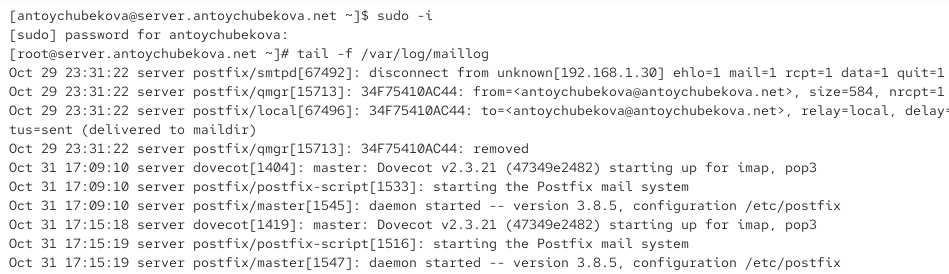{#fig-001 width=70%}

Добавим в список протоколов, с которыми может работать Dovecot, протокол LMTP. Для этого в файле /etc/dovecot/dovecot.conf добавим в список протоколов lmtp. ([рис. @fig-002]).

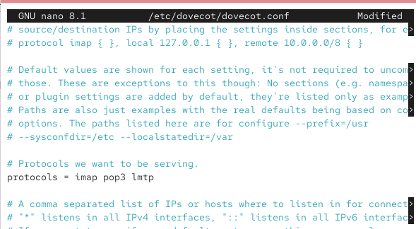{#fig-002 width=70%}

Настроим в Dovecot сервис lmtp для связи с Postfix. Для этого в файле /etc/dovecot/conf.d/10-master.conf заменим определение сервиса lmtp на следующую запись

service lmtp {

unix_listener /var/spool/postfix/private/dovecot-lmtp {

group = postfix

user = postfix

mode = 0600
}

}

Эта запись определяет расположение файла с описанием прослушиваемого unix-сокета, а также задаёт права доступа к нему и определяет принадлежность к группе и пользователю postfix. ([рис. @fig-003]).

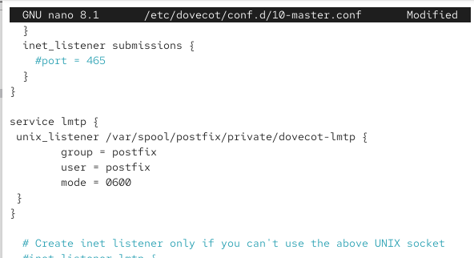{#fig-003 width=70%}

Переопределим в Postfix с помощью postconf передачу сообщений не на прямую, а через заданный unix-сокет. ([рис. @fig-004]).

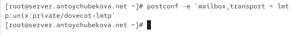{#fig-004 width=70%}

В файле /etc/dovecot/conf.d/10-auth.conf зададим формат имени пользователя для аутентификации в форме логина пользователя без указания домена. Для этого пропишем auth_username_format = %Ln ([рис. @fig-005]).

{#fig-005 width=70%}

Перезапустим Postfix и Dovecot. ([рис. @fig-006]).

{#fig-006 width=70%}

Из-под учётной записи своего пользователя отправим письмо с клиента. ([рис. @fig-007]).

{#fig-007 width=70%}

Посмотрим логи почтовой службы. Мы видим, что в логе описана передача письма от клиента. ([рис. @fig-008]).

{#fig-008 width=70%}

1. Приём письма SMTP-сервером Postfix

Nov 1 15:21:09 server postfix/smtpd[42976]: 5A137410AC57: client=client.antoychubekova.net [192.168.1.30]

Это означает, что Postfix (служба smtpd) принял подключение от клиента (IP 192.168.1.30, имя — client.antoychubekova.net). Клиент начал передачу письма через SMTP.

2. Обработка и подготовка письма к доставке

Nov 1 15:21:09 server postfix/cleanup[42979]: 5A137410AC57: message-id=<20251101152108.DE8AE6098999@client.antoychubekova.net>

Postfix создал внутреннюю запись письма в очереди с ID 5A137410AC57 и сохранил его заголовки (в частности, Message-ID). Служба cleanup подготавливает сообщение к помещению в очередь для дальнейшей доставки.

3. Клиент завершает сеанс SMTP

Nov 1 15:21:09 server postfix/smtpd[42976]: disconnect from client.antoychubekova.net [192.168.1.30] ...

Клиент (antoychubekova@client.antoychubekova.net) корректно завершил соединение. Postfix теперь занимается внутренней доставкой письма.

4. Письмо помещается в очередь

Nov 1 15:21:09 server postfix/qmgr[40722]: 5A137410AC57: from=<antoychubekova@client.antoychubekova.net>, size=609, nrcpt=1 (queue active)

Менеджер очереди (qmgr) сообщает, что письмо активно обрабатывается, и его нужно доставить одному получателю — antoychubekova@antoychubekova.net.

5. Передача письма в Dovecot через LMTP

Nov 1 15:21:09 server postfix/local[42980]: 5A137410AC57: passing <antoychubekova@antoychubekova.net> to transport=lmtp

Postfix передаёт письмо локальному агенту доставки (LDA) через LMTP — это как раз Dovecot, работающий с LMTP. То есть Postfix не кладёт письмо в файл сам, а отправляет его Dovecot’у для доставки в почтовый ящик пользователя.

6. Dovecot принимает письмо по LMTP

Nov 1 15:21:09 server dovecot[42818]: lmtp(42982): Connect from local

Nov 1 15:21:09 server dovecot[42818]: lmtp(antoychubekova)<42982>...: saved mail to INBOX

Dovecot принимает соединение от Postfix через LMTP (локально, не по сети).
Он авторизует пользователя antoychubekova и сохраняет сообщение в её INBOX.
Фраза saved mail to INBOX означает успешную доставку письма в почтовый ящик пользователя.

7. Подтверждение успешной доставки

Nov 1 15:21:09 server postfix/lmtp[42981]: ... status=sent (250 2.0.0 <antoychubekova@antoychubekova.net> Saved)

Dovecot отвечает Postfix’у кодом 250 2.0.0, что означает:

Письмо успешно принято и сохранено.

Postfix фиксирует этот результат в логе.

8. Завершение сессии LMTP и очистка очереди

Nov 1 15:21:09 server dovecot[42818]: lmtp(42982): Disconnect from local: Logged out (state=READY)

Nov 1 15:21:09 server postfix/qmgr[40722]: 5A137410AC57: removed

Dovecot завершает LMTP-сеанс.
Postfix удаляет письмо из своей очереди, поскольку оно доставлено успешно.
На этом процесс доставки завершён.

На сервере просмотрим почтовый ящик пользователя. Мы видим, что письмо успешно доставлено в почтовый ящик. ([рис. @fig-009]).

{#fig-009 width=70%}

## Настройка SMTP-аутентификации

В файле /etc/dovecot/conf.d/10-master.conf определим службу аутентификации
пользователей:
service auth {

Определяется служба auth — это процесс, отвечающий за аутентификацию пользователей (проверку логина и пароля). Через неё проходят запросы от Postfix, IMAP и других сервисов, которые хотят проверить учётные данные пользователя.

unix_listener /var/spool/postfix/private/auth {

Создаётся Unix-сокет (локальный файл-соединение) по пути /var/spool/postfix/private/auth.
Этот сокет нужен для связи между Postfix и Dovecot: Postfix будет обращаться к этому сокету, чтобы передавать запросы на аутентификацию (например, при приёме писем через SASL).

group = postfix

user = postfix

Устанавливаются права владельца сокета:

user = postfix — владельцем файла сокета является пользователь postfix;

group = postfix — группой-владельцем также является postfix.

Это необходимо, чтобы служба Postfix могла иметь доступ к сокету и использовать его для аутентификации пользователей.

mode = 0660

Определяются права доступа к сокету:

Владелец и группа могут читать и писать (rw- rw- ---),

Остальные пользователи не имеют доступа.

}

unix_listener auth-userdb {

Определяется ещё один локальный сокет auth-userdb. Он используется внутренними процессами Dovecot (например, LMTP, IMAP и POP3) для связи с базой данных пользователей (userdb) и получения информации о них (путь к почтовому ящику, UID/GID, квоты и т. д.).

mode = 0600

Задаются права доступа:

Только владелец может читать и писать (rw-------). Это важно, потому что этот сокет предназначен только для внутренних служб Dovecot — другие процессы не должны иметь к нему доступ.

user = dovecot

Устанавливается владелец сокета — пользователь dovecot. Это обеспечивает, что только процессы, запущенные от имени Dovecot, смогут использовать данный интерфейс для взаимодействия.

}

} ([рис. @fig-010]).

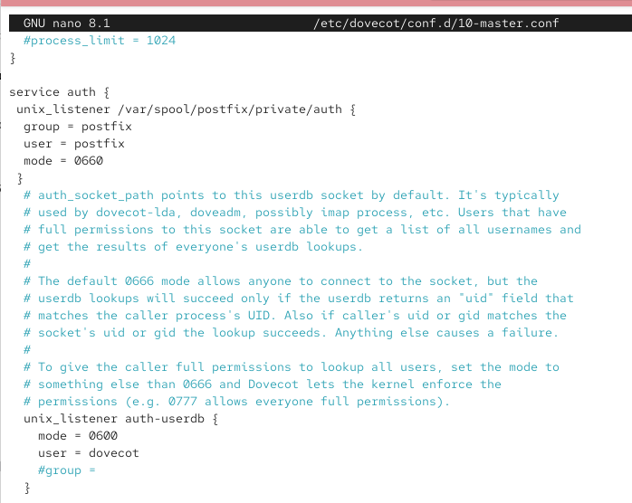{#fig-010 width=70%}

Для Postfix зададим тип аутентификации SASL для smtpd и путь к соответствующему unix-сокету. ([рис. @fig-011]).

{#fig-011 width=70%}

Настроим Postfix для приёма почты из Интернета только для обслуживаемых нашим сервером пользователей или для произвольных пользователей локальной машины (имеется в виду локальных пользователей сервера), обеспечивая тем самым запрет на использование почтового сервера в качестве SMTP relay для спам-рассылок (порядок указания опций имеет значение). Для этого используем опции:

- reject_unknown_recipient_domain — отклоняет письма, если домен получателя не существует или не может быть проверен через DNS.

- permit_mynetworks — разрешает отправку писем от хостов, входящих в доверенные сети (определённые параметром mynetworks).

- reject_non_fqdn_recipient — отклоняет письма, если адрес получателя не содержит полного доменного имени (FQDN).

- reject_unauth_destination — предотвращает пересылку почты на внешние домены (релей) без авторизации.

- reject_unverified_recipient — проверяет существование адреса получателя и отклоняет письма к несуществующим пользователям.

- permit — разрешает доставку писем, если все предыдущие проверки пройдены успешно.([рис. @fig-012]).

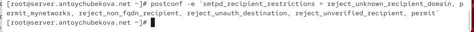{#fig-012 width=70%}

В настройках Postfix ограничим приём почты только локальным адресом SMTP-сервера сети. ([рис. @fig-013]).

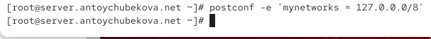{#fig-013 width=70%}

Для проверки работы аутентификации временно запустим SMTP-сервер (порт 25) с возможностью аутентификации. Для этого необходимо в файле /etc/postfix/master.cf заменить строку

smtp inet n - n - - smtpd

на строку

smtp inet n - n - - smtpd

-o smtpd_sasl_auth_enable=yes

-o smtpd_recipient_restrictions=reject_non_fqdn_recipient,reject_unknown_recipient_domain,permit_sasl_authenticated,reject. 

Эта конфигурация включает SMTP-сервер с проверкой получателей и поддержкой авторизации по SASL — то есть принимать и отправлять почту могут только проверенные (вошедшие) пользователи. ([рис. @fig-014]).

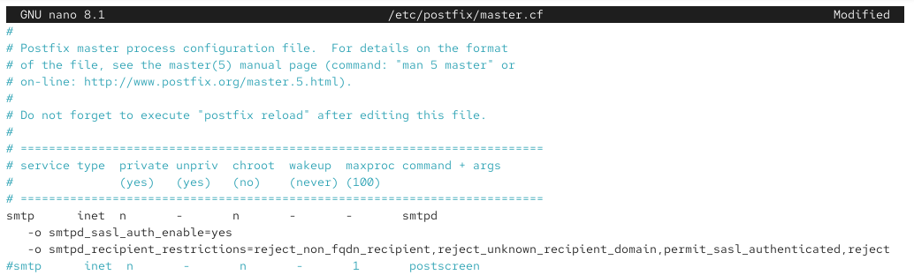{#fig-014 width=70%}

Перезапустим Postfix и Dovecot. ([рис. @fig-015]).

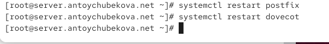{#fig-015 width=70%}

На клиенте установим telnet. ([рис. @fig-016]).

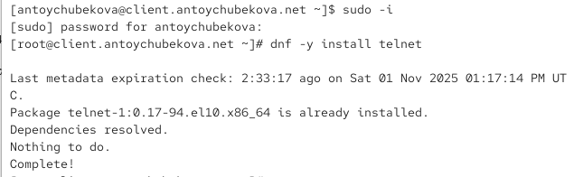{#fig-016 width=70%}

На клиенте получим строку для аутентификации. ([рис. @fig-017]).

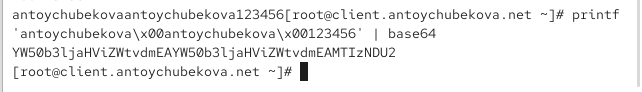{#fig-017 width=70%}

Подключимся на клиенте к SMTP-серверу посредством telnet. Протестируем соединения, введя EHLO test.  Мы видим, что все корректно отрабатывается и команда EHLO test показывает, что сервер
server.antoychubekova.net поддерживает расширенные возможности SMTP (ESMTP): шифрование, аутентификацию, уведомления о доставке, работу с большими письмами и ускоренный обмен командами.([рис. @fig-018]).

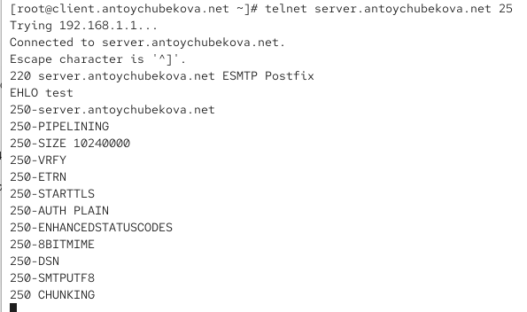{#fig-018 width=70%}

Проверьте авторизацию, задав: AUTH PLAIN <строка для аутентификации>. Мы видим, что авторизация прошла успешно. Затем заверши сессию telnet на клиенте. ([рис. @fig-019]).

{#fig-019 width=70%}

## Настройка SMTP over TLS

Настроим на сервере TLS, воспользовавшись временным сертификатом Dovecot. Предварительно скопируем необходимые файлы сертификата и ключа из каталога /etc/pki/dovecot в каталог /etc/pki/tls/ в соответствующие подкаталоги (чтобы не было проблем с SELinux). ([рис. @fig-020]).

{#fig-020 width=70%}

Сконфигурируем Postfix, указав пути к сертификату и ключу, а также к каталогу для хранения TLS-сессий и уровень безопасности. ([рис. @fig-021]).

{#fig-021 width=70%}

Для того чтобы запустить SMTP-сервер на 587-м порту, в файле /etc/postfix/master.cf заменим строки

smtp inet n - n - - smtpd

-o smtpd_sasl_auth_enable=yes

-o smtpd_recipient_restrictions=reject_non_fqdn_recipient,reject_unknown_recipient_domain,permit_sasl_authenticated,reject

на следующую запись:

smtp inet n - n - - smtpd

и добавьте следующие строки:

submission inet n - n - - smtpd

-o smtpd_tls_security_level=encrypt

-o smtpd_sasl_auth_enable=yes

-o smtpd_recipient_restrictions=reject_non_fqdn_recipient,reject_unknown_recipient_domain,permit_sasl_authenticated,reject. 

Эта запись создаёт безопасный SMTP-порт 587 (submission), через который пользователи, прошедшие SASL-аутентификацию, могут отправлять почту по зашифрованному каналу (TLS). Иными словами — порт 25 используется для приёма почты между серверами, а порт 587 — для отправки писем клиентами (почтовыми программами).([рис. @fig-022]).

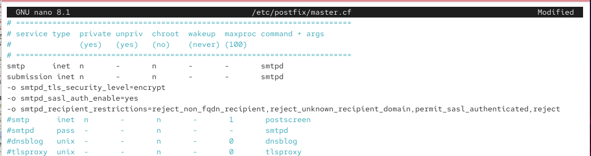{#fig-022 width=70%}

Настроим межсетевой экран, разрешив работать службе smtp-submission. ([рис. @fig-023] и [рис. @fig-024] ).

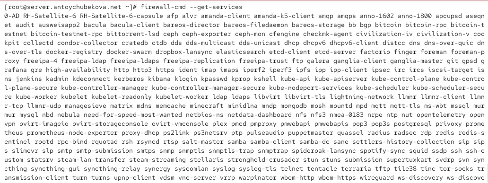{#fig-023 width=70%}

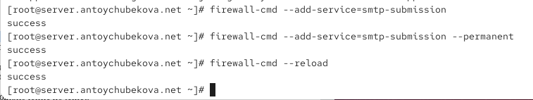{#fig-024 width=70%}

Перезапустим Postfix.  ([рис. @fig-025]).

{#fig-025 width=70%}

На клиенте подключимся к SMTP-серверу через 587-й порт посредством openssl. Протестируем подключение по telnet. Затем проверим аутентификацию. Мы видим некотрую информацию.

Сервер server.antoychubekova.net на порту 587 поддерживает шифрование STARTTLS. 

Используется самоподписанный сертификат RSA-3072, действительный 1 год.

Соединение успешно установлено и шифруется, но сертификат не проверен доверенным центром (что нормально для тестовой среды).
Аутентификация клиента по сертификату не запрашивается.([рис. @fig-026]).

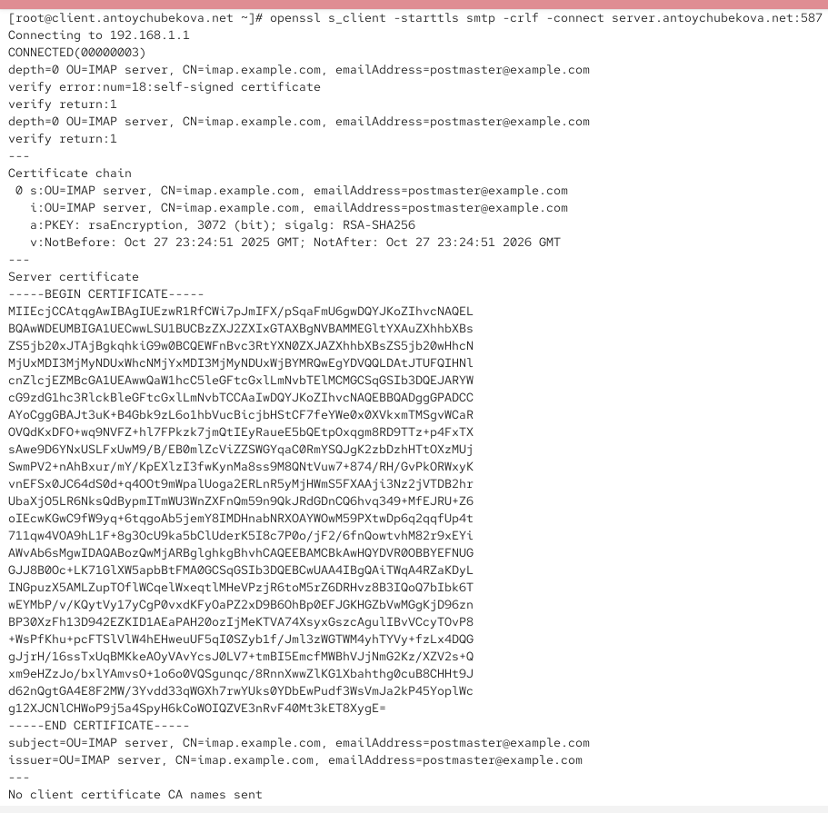{#fig-026 width=70%}

TLS соединение успешно установлено (TLS 1.3, сильный шифр, forward secrecy через X25519).

Однако сертификат — самоподписанный (Verify return code 18) → клиенты не будут доверять ему по умолчанию. В продакшне лучше использовать сертификат, подписанный доверенным CA (или добавить самоподписанный в доверенные на клиентах).

Сервер поддерживает CHUNKING и присылает session tickets (ресумпшен).

Всё в целом нормально для тестовой среды; для публичного сервера замените самоподписанный сертификат на CA-подписанный и убедитесь, что CN/SAN совпадает с именем, к которому подключаются клиенты. ([рис. @fig-027]).

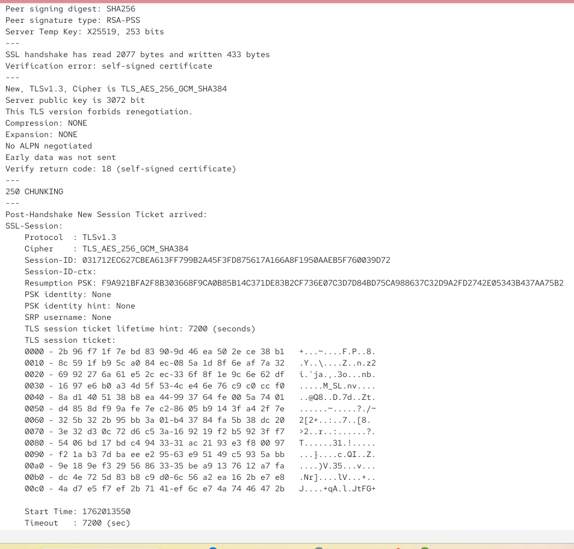{#fig-027 width=70%} 

Мы видим, что все корректно обрабатывается. ([рис. @fig-028]).

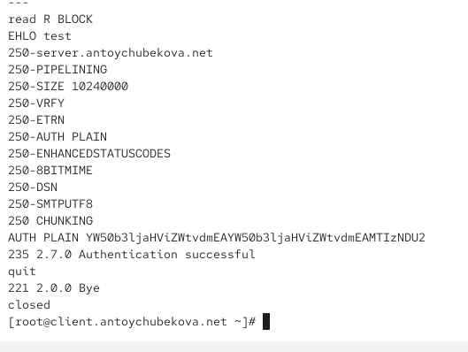{#fig-028 width=70%} 

Проверим корректность отправки почтовых сообщений с клиента посредством почтового клиента Evolution, предварительно скорректировав настройки учётной записи, а именно для SMTP-сервера укажите порт 587, STARTTLS и обычный пароль. ([рис. @fig-029]).

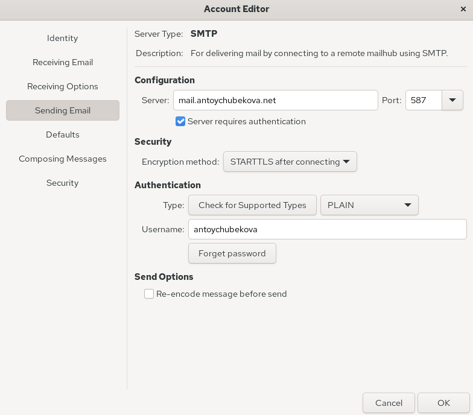{#fig-029 width=70%}

Теперь попробуем отправить письмо на адрес antoychubekova@antoychubekova.net. ([рис. @fig-030]).

{#fig-030 width=70%}

Если посмотрим на мониторинг почтовой службы ([рис. @fig-031]) и почтовый ящим ([рис. @fig-032]), мы удостоверимся, что письмо было успешно отправлено. 

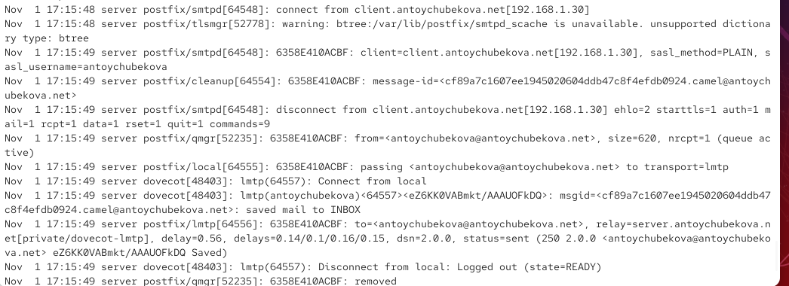{#fig-031 width=70%}

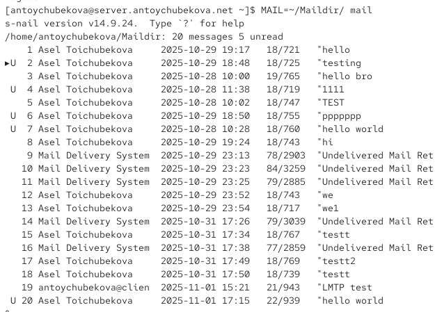{#fig-032 width=70%} 

## Внесение изменений в настройки внутреннего окружения виртуальной машины

На виртуальной машине server перейдем в каталог для внесения изменений в настройки внутреннего окружения /vagrant/provision/server/. В соответствующие подкаталоги поместим конфигурационные файлы Dovecot и Postfix. ([рис. @fig-033]).

{#fig-033 width=70%}

Внесите соответствующие изменения по расширенной конфигурации SMTP-сервера в файл /vagrant/provision/server/mail.sh. ([рис. @fig-034] и [рис. @fig-035]  ).

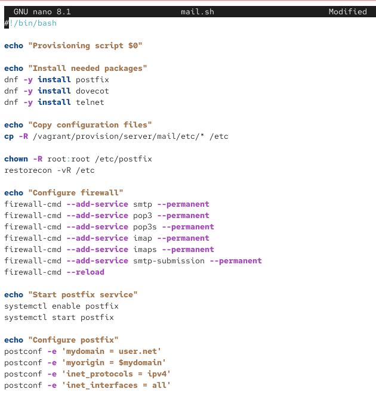{#fig-034 width=70%}

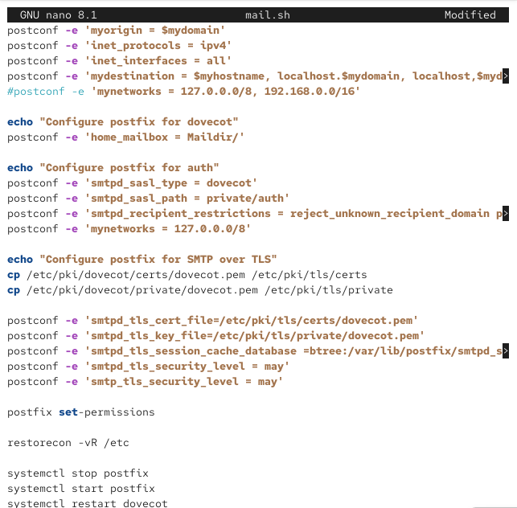{#fig-035 width=70%}

Внесем изменения в файл /vagrant/provision/client/mail.sh, добавив установку telnet. ([рис. @fig-036]).

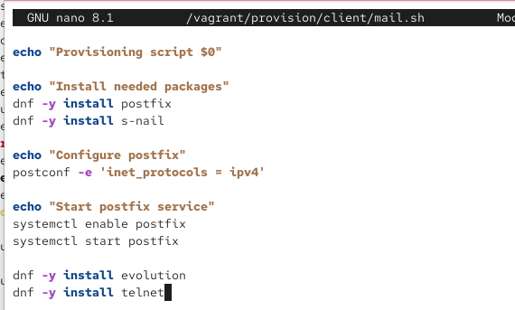{#fig-036 width=70%}

# Выводы

В ходе выполнения лабораторной работы № 10 я приобрела практические навыков по конфигурированию SMTP-сервера в части настройки аутентификации.

# Список литературы

1. Postfix SASL Howto. — URL: http : / / www . postfix . org / SASL _ README . html (visited on
09/13/2021).
