---
## Author
author:
  name: Тойчубекова Асель Нурлановна
  degrees: DSc
  orcid: 0000-0002-0877-7063
  email: kulyabov-ds@rudn.ru
  affiliation:
    - name: Российский университет дружбы народов
      country: Российская Федерация
      postal-code: 117198
      city: Москва
      address: ул. Миклухо-Маклая, д. 6
## Title
title: Администрирование сетевых подсистем
subtitle: Лабораторная работа №11
license: CC BY
date: today
date-format: "YYYY-MM-DD" # Example: 2025-09-06
---

# Информация

## Докладчик

:::::::::::::: {.columns align=center}
::: {.column width="70%"}

  * Тойчубекова Асель Нурлановна
  * Студент 3 курса
  * факультет физико-математических и естественных наук
  * Российский университет дружбы народов им. П. Лумумбы
  * [1032235033@rudn.ru](1032235033@rudn.ru)

:::
::: {.column width="30%"}

:::
::::::::::::::

# Цель работы

## Цель работы

Целью данной лабораторной работы является приобретение практических навыков по настройке удалённого доступа к серверу с помощью SSH.

# Задание

## Задание

1. Настройте запрет удалённого доступа на сервер по SSH для пользователя root.
2. Настройте разрешение удалённого доступа к серверу по SSH только для пользователей группы vagrant и вашего пользователя.
3. Настройте удалённый доступ к серверу по SSH через порт 2022.
4. Настройте удалённый доступ к серверу по SSH по ключу.

## Задание

5. Организуйте SSH-туннель с клиента на сервер, перенаправив локальное соединение с TCP-порта 80 на порт 8080.
6. Используя удалённое SSH-соединение, выполните с клиента несколько команд на сервере.
7. Используя удалённое SSH-соединение, запустите с клиента графическое приложение на сервере.
8. Напишите скрипт для Vagrant, фиксирующий действия по настройке SSH-сервера во внутреннем окружении виртуальной машины server. Соответствующим образом внесите изменения в Vagrantfile.

# Теоретическое введение

## Теоретическое введение

Протокол SSH (Secure Shell) является одним из основных средств организации защищённого удалённого доступа к сетевым узлам в средах Unix/Linux. Его применение обеспечивает безопасное управление серверами и рабочими станциями, даже если взаимодействие происходит через потенциально небезопасные каналы связи. Высокий уровень безопасности достигается благодаря использованию современных криптографических механизмов, включающих шифрование данных, аутентификацию клиента и сервера, а также контроль целостности передаваемой информации.

## Теоретическое введение

SSH-соединение строится по модели «клиент—сервер».
Серверная часть реализуется службой sshd, которая по умолчанию работает через TCP-порт 22 и управляется конфигурационным файлом /etc/ssh/sshd_config. Клиентская часть представлена утилитой ssh, позволяющей устанавливать соединение, передавать команды на удалённый сервер, выполнять туннелирование портов и управлять различными режимами подключения. Клиент предоставляет набор параметров, включая указание удалённого порта (-p), выбор пользователя (-l), вывод отладочной информации (-v), а также опции перенаправления портов (-L, -R).

## Теоретическое введение

Несмотря на высокий уровень защиты, использование SSH в системах, доступных напрямую из Интернета, сопряжено с рядом угроз. Наиболее распространёнными являются атаки по словарю, направленные на подбор пароля учётной записи, а также попытки эксплуатации стандартных портов и известных параметров конфигурации. Поскольку порт 22 является общепринятым для SSH, злоумышленники могут автоматически сканировать узлы и пытаться получить доступ к системным учётным записям, например к root.

## Теоретическое введение

Для повышения безопасности удалённого доступа рекомендуется применять следующие меры:

- запрет прямой SSH-авторизации пользователя root, снижая риск компрометации ключевой учётной записи;

- отказ от паролей и переход на использование криптографических SSH-ключей, что делает невозможным подбор пароля;

- изменение стандартного порта 22 на нестандартный, уменьшая вероятность автоматического сканирования и атак;

- ограничение списка пользователей, которым разрешено подключение по SSH, посредством директив AllowUsers в конфигурации sshd.

# Выполнение лабораторной работы

## Запрет удалённого доступа по SSH для пользователя root

Для начала лабораторной работы запускаем вм server, перейдем к нашему пользователю, откроем терминал и перейдем в режим суперпользователя. На сервере зададим пароль для пользователя root. 

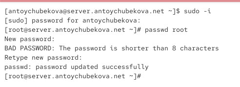{width=60%}

## Запрет удалённого доступа по SSH для пользователя root

На сервере в дополнительном терминале запустим мониторинг системных событий. Мы видим, что пока важной информации нет. 

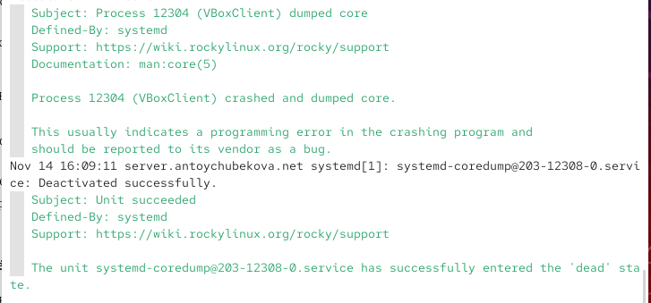{width=60%}

## Запрет удалённого доступа по SSH для пользователя root

С клиента попытаемся получить доступ к серверу посредством SSH-соединения через пользователя root. Мы видим, что нам отказано в доступе.

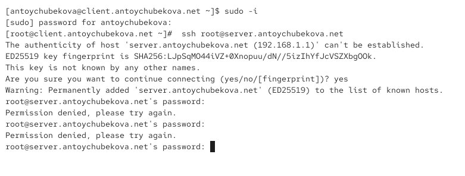{width=60%}

## Запрет удалённого доступа по SSH для пользователя root

Чтобы посмотреть почему нам было отказано в доступе посмотрим мониторинг системных событий. Мы видим, что отказ в доступе по SSH произошёл из-за того, что сервер отклонил попытку аутентификации пользователя root. В логах указано, что проверка пароля завершилась неуспешно («password check failed for user root», «Failed password for root»), после чего модуль PAM зафиксировал дополнительные ошибки аутентификации и разорвал соединение. Это означает, что либо был введён неправильный пароль, либо на сервере действует политика безопасности, запрещающая прямой SSH-вход пользователю root. В результате сервер завершил сессию до установления подключения и отказал в доступе.

## Запрет удалённого доступа по SSH для пользователя root

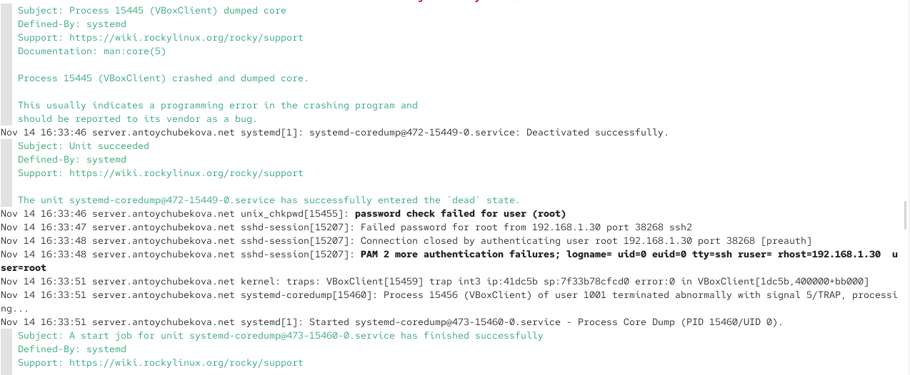{width=60%}

## Запрет удалённого доступа по SSH для пользователя root

На сервере откроем файл /etc/ssh/sshd_config конфигурации sshd для редактирования и запретите вход на сервер пользователю root, установив: PermitRootLogin no. 

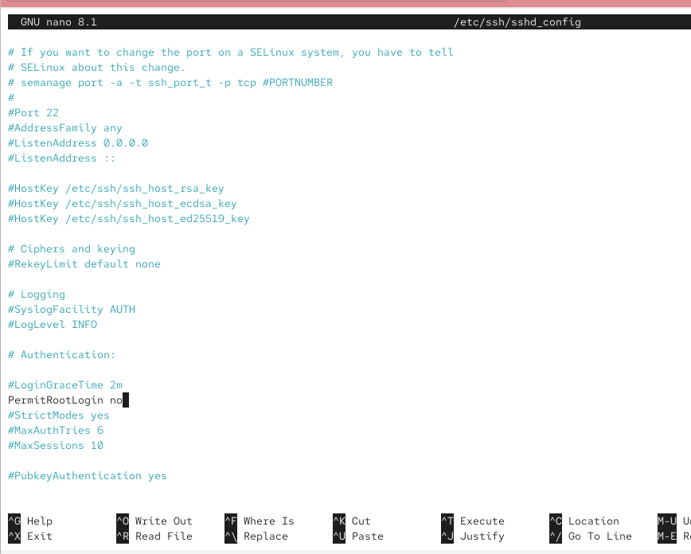{width=60%}

## Запрет удалённого доступа по SSH для пользователя root

После сохранения изменений в файле конфигурации перезапустим sshd. 

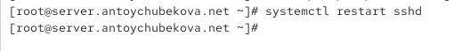{width=60%}

## Запрет удалённого доступа по SSH для пользователя root

Повторим попытку получения доступа с клиента к серверу посредством SSH-соединения через пользователя root. Мы видим, что нам также отказано в доступе. 

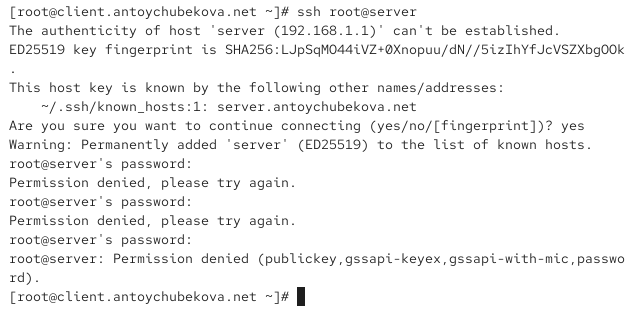{width=60%}

## Запрет удалённого доступа по SSH для пользователя root

Посмотрим мониторинг системных событий. В данном случае отказ в доступе по SSH также связан с неуспешной аутентификацией пользователя root. В журнале фиксируются сообщения «password check failed for user (root)» и «pam_unix(sshd:auth): authentication failure», что означает, что сервер получил попытку входа от root, но указанный пароль не прошёл проверку. Модуль PAM зарегистрировал ошибку аутентификации и отклонил запрос, после чего соединение было закрыто. Таким образом, доступ был запрещён из-за политики безопасности, так как мы изменили конфигурационный файл, запрещающей прямой SSH-вход для пользователя root.

## Запрет удалённого доступа по SSH для пользователя root

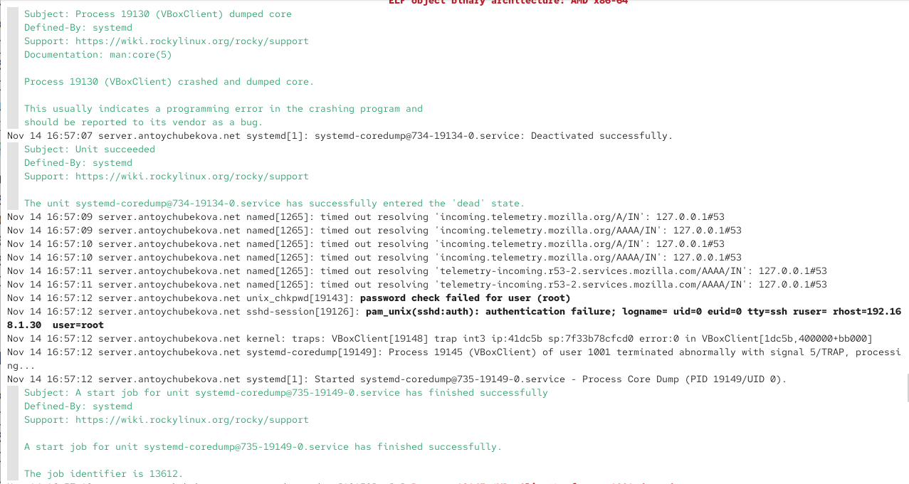{width=60%}

## Ограничение списка пользователей для удалённого доступа по SSH

С клиента попытаемся получить доступ к серверу посредством SSH-соединения через пользователя antoychubekova. У нас запросили пароль от сервера и после этого нам удалось получить доступ к серверу посредством ssh. 

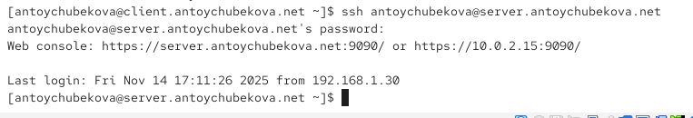{width=60%}

## Ограничение списка пользователей для удалённого доступа по SSH

Если мы посмотрим мониторинг сетевых событий то увидим, что на этом этапе подключение по SSH прошло успешно: сервер создал новую пользовательскую сессию для пользователя antoychubekova, о чём свидетельствуют сообщения «session opened for user …» и успешный запуск сопутствующих системных служб, таких как systemd-hostnamed.service. Это означает, что аутентификация прошла корректно, пользователь вошёл в систему, и среда его сессии была успешно подготовлена.  

## Ограничение списка пользователей для удалённого доступа по SSH

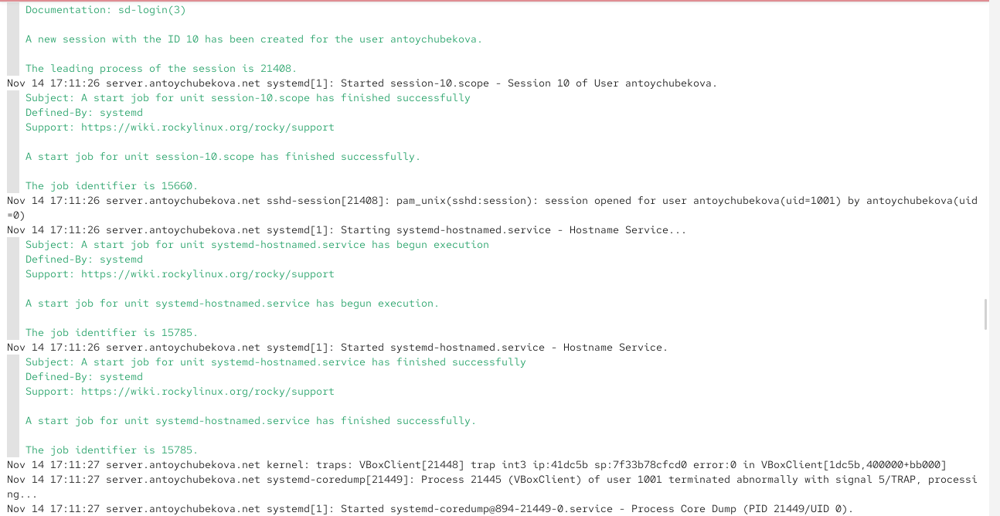{width=60%}

## Ограничение списка пользователей для удалённого доступа по SSH

На сервере откроем файл /etc/ssh/sshd_config конфигурации sshd на редактирование и добавим строку: AllowUsers vagrant, которая ограничивает доступ пользователей к серверу по ssh. То есть, только пользователь vagrant может получить доступ к серверу по ssh. 

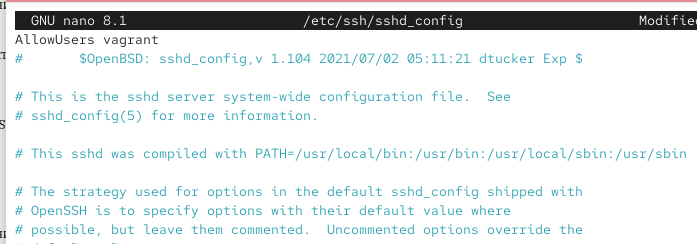{width=60%}

## Ограничение списка пользователей для удалённого доступа по SSH

После сохранения изменений в файле конфигурации перезапустим sshd.

{width=60%}

## Ограничение списка пользователей для удалённого доступа по SSH

Повторим попытку получения доступа с клиента к серверу посредством SSH-соединения через пользователя antoychubekova. Мы видим, что нам было отказано в доступе, так как мы ограничили список пользователей, которые могут получить доступ к серверу. 

## Ограничение списка пользователей для удалённого доступа по SSH

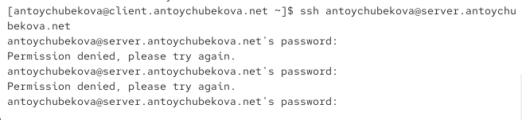{width=60%}

## Ограничение списка пользователей для удалённого доступа по SSH

Чтобы исправить это в файле /etc/ssh/sshd_config конфигурации sshd внесем следующее изменение: AllowUsers vagrant antoychubekova, то есть добавим нашего пользователя в список.  

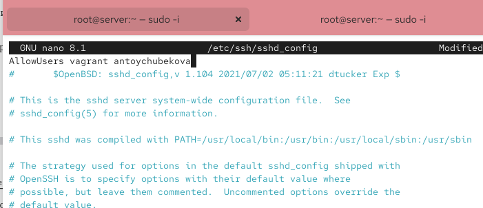{width=60%}

## Ограничение списка пользователей для удалённого доступа по SSH

После сохранения изменений в файле конфигурации перезапустим sshd и вновь попытаемся получить доступ с клиента к серверу посредством SSH-соединения через пользователя antoychubekova. Мы видим, что все корректно отработалось и доступ получен. 

{width=60%}

## Ограничение списка пользователей для удалённого доступа по SSH

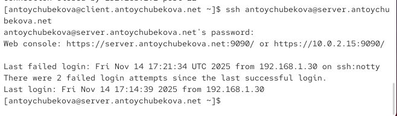{width=60%}

## Настройка дополнительных портов для удалённого доступа по SSH

На сервере в файле конфигурации sshd /etc/ssh/sshd_config найдем строку Port и ниже этой строки добавим: Port 22, Port 2022. Эта запись сообщает процессу sshd о необходимости организации соединения через два разных порта, что даёт гарантию возможности открыть сеансы SSH, даже если была сделана ошибка в конфигурации. 

## Настройка дополнительных портов для удалённого доступа по SSH

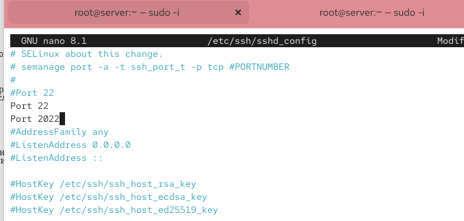{width=60%}

## Настройка дополнительных портов для удалённого доступа по SSH

После сохранения изменений в файле конфигурации перезапустим sshd.

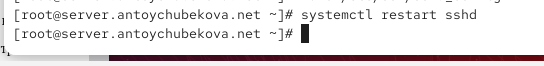{width=60%}

## Настройка дополнительных портов для удалённого доступа по SSH

Посмотрим расширенный статус работы sshd. Мы видим, что система сообщает об отказе в работе sshd через порт 2022. 

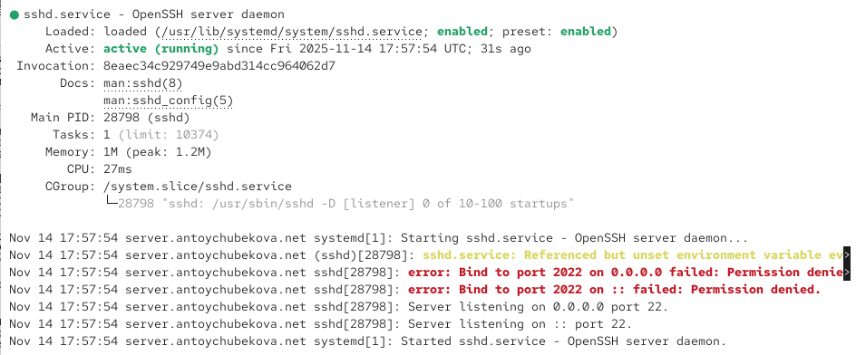{width=60%}

## Настройка дополнительных портов для удалённого доступа по SSH

Дополнительно посмотрим сообщения в терминале с мониторингом системных событий. Мы видим, что на данном этапе серверная служба SSH (sshd) была перезапущена, однако при попытке начать прослушивание дополнительного порта 2022 возникла ошибка. В логах указано: «error: Bind to port 2022 failed: Permission denied», что означает, что служба не имеет прав открыть этот порт. Причина заключается в политике SELinux или настройках firewall, которые по умолчанию запрещают sshd использовать нестандартные порты. В результате sshd запустился только на стандартном порту 22, что подтверждается сообщением «Server listening on 0.0.0.0 port 22». 

## Настройка дополнительных портов для удалённого доступа по SSH

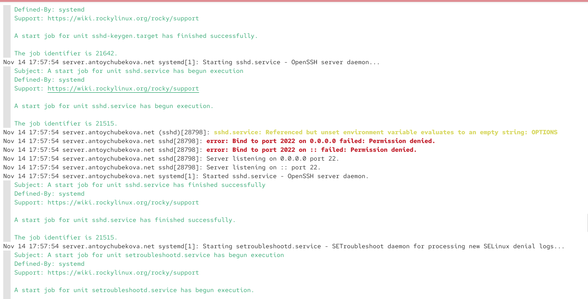{width=60%}

## Настройка дополнительных портов для удалённого доступа по SSH

Исправим на сервере метки SELinux к порту 2022. 

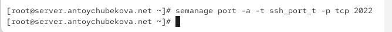{width=60%}

## Настройка дополнительных портов для удалённого доступа по SSH

 В настройках межсетевого экрана откроем порт 2022 протокола TCP. Далее вновь перезапустим sshd

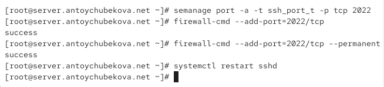{width=60%}

## Настройка дополнительных портов для удалённого доступа по SSH

Посмотрим расширенный статус его работы. Мы видим, что статус показывает, что процесс sshd теперь прослушивает два порта. 

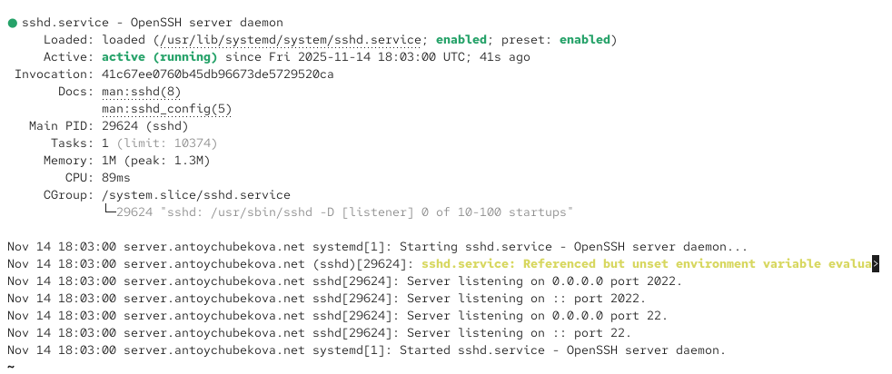{width=60%}

## Настройка дополнительных портов для удалённого доступа по SSH

Посмотрим мониторинг системных событий. Мы видим, что на данном этапе служба SSH была успешно перезапущена, и теперь она корректно слушает как стандартный порт 22, так и дополнительный порт 2022, что видно по сообщениям «Server listening on 0.0.0.0 port 2022» и «Server listening on 0.0.0.0 port 22». Это означает, что ранее возникшая проблема с невозможностью открыть порт 2022 была устранена — ему были назначены корректные SELinux-метки и он был разрешён в firewall.

## Настройка дополнительных портов для удалённого доступа по SSH

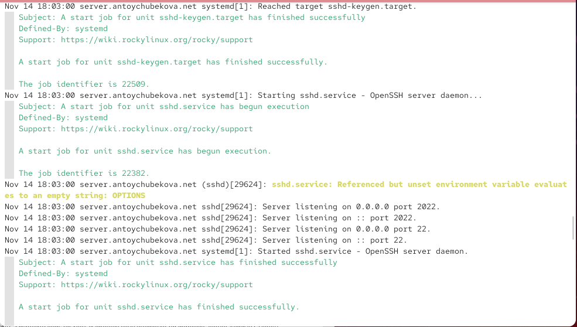{width=60%}

## Настройка дополнительных портов для удалённого доступа по SSH

С клиента попытаемся получить доступ к серверу посредством SSH-соединения через пользователя antoychubekova. После открытия оболочки пользователя введем sudo -i для получения доступа
root. Отлогинимся от root и нашего пользователя на сервере, введя дважды exit. Мы видим, что все корректно обрабатывается.

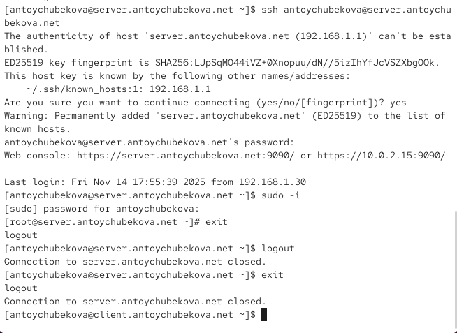{width=60%}

## Настройка дополнительных портов для удалённого доступа по SSH

Повторим попытку получения доступа с клиента к серверу посредством SSH-соединения через пользователя antoychubekova, указав порт 2022. После открытия оболочки пользователя введем sudo -i для получения доступа root. Отлогинемся от root и нашего пользователя на сервере, введя дважды exit. Мы видим, что все корректно обрабатывается.

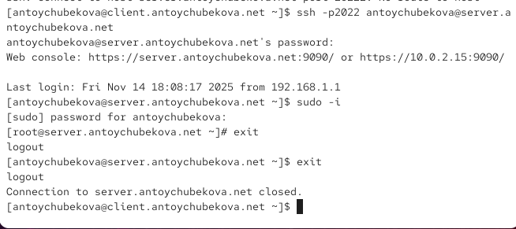{width=60%}

## Настройка удалённого доступа по SSH по ключу

В этом упражнении мы создадим пару из открытого и закрытого ключей для входа на сервер. На сервере в конфигурационном файле /etc/ssh/sshd_config зададим параметр, разрешающий аутентификацию по ключу: PubkeyAuthentication yes. 

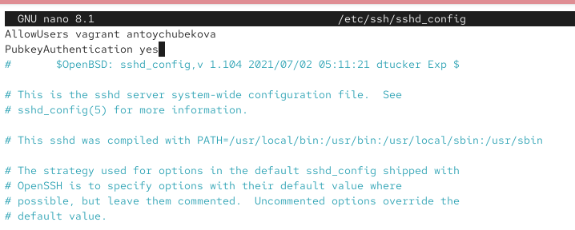{width=60%}

## Настройка удалённого доступа по SSH по ключу

После сохранения изменений в файле конфигурации перезапустим sshd. 

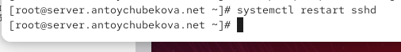{width=60%}

## Настройка удалённого доступа по SSH по ключу

На клиенте сформируем SSH-ключ, введя в терминале под пользователем antoychubekova. 

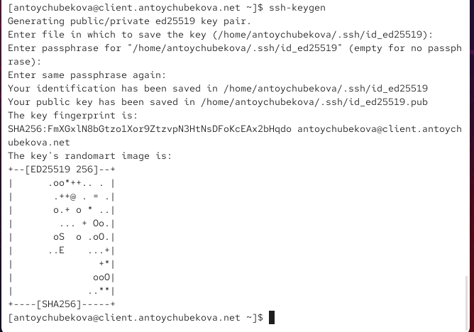{width=60%}

## Настройка удалённого доступа по SSH по ключу

Закрытый ключ записан в файл ~/.ssh/id_rsa, а открытый ключ записан в файл ~/.ssh/id_rsa.pub. Скопируем открытый ключ на сервер.

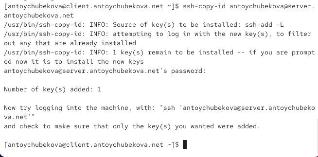{width=60%}

## Настройка удалённого доступа по SSH по ключу

Попробуем получить доступ с клиента к серверу посредством SSH-соединения. Мы видим, что аутентификация прошла без ввода пароля для учётной записи удалённого пользователя. Отлогинемся с сервера, используя exit.

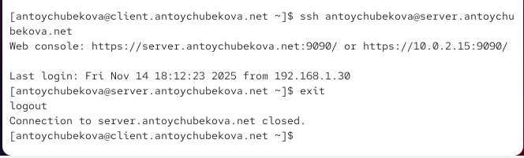{width=60%}

## Организация туннелей SSH, перенаправление TCP-портов

На клиенте посмотрим, запущены ли какие-то службы с протоколом TCP. Мы видим, что еще ничего не запущено. 

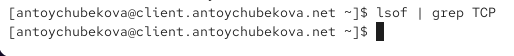{width=60%}

## Организация туннелей SSH, перенаправление TCP-портов

Перенаправим порт 80 на server.antoychubekova.net на порт 8080 на локальной машине.

{width=60%}

## Организация туннелей SSH, перенаправление TCP-портов

Вновь на клиенте посмотрим, запущены ли какие-то службы с протоколом TCP. Мы видим, что 
процесс ssh принадлежит пользователю antoychubekova и устанавливает одно активное соединение: клиентская машина подключена к серверу по SSH, о чём говорит строка с состоянием ESTABLISHED. Остальные две строки показывают, что локальная машина слушает порты webcache по протоколам IPv4 и IPv6. Эти записи свидетельствуют о том, что туннель SSH был успешно создан, и локальный порт 8080 был открыт для приёма соединений, обеспечивая перенаправление трафика на удалённый сервер в соответствии с настройками SSH-переадресации портов. 

## Организация туннелей SSH, перенаправление TCP-портов

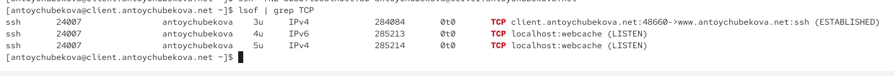{width=60%}

## Организация туннелей SSH, перенаправление TCP-портов

На клиенте запустим браузер и в адресной строке введем localhost:8080. Мы видим, что отобразилась страница с приветствием «Welcome to the server.user.net server». 

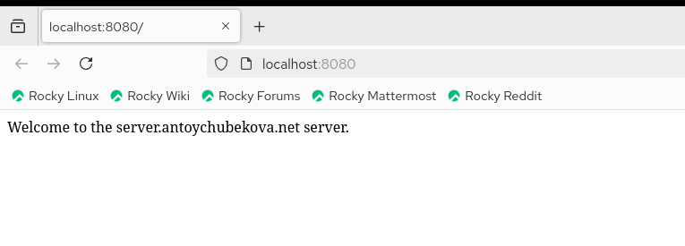{width=60%}

## Запуск консольных приложений через SSH

Посмотрим с клиента имя узла сервера. Она равна server.antoychubekova.net. 

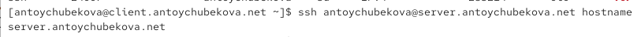{width=60%}

## Запуск консольных приложений через SSH

Посмотрим с клиента список файлов на сервере. Мы видим, что вывелся весь список файлов сервера и их права доступа, дата изменения и размер.  

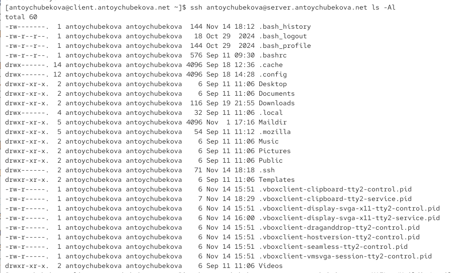{width=60%}

## Запуск консольных приложений через SSH

Посмотрим с клиента почту на сервере. Мы видим, что нам вывелась вся почта с сервера, которые мы отправляли на прошлых лабораторных работах.

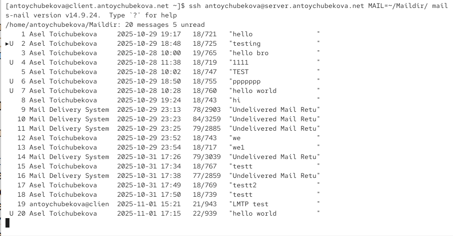{width=60%}

## Запуск графических приложений через SSH (X11Forwarding)

На сервере в конфигурационном файле /etc/ssh/sshd_config разрешим отображать на локальном клиентском компьютере графические интерфейсы X11. 

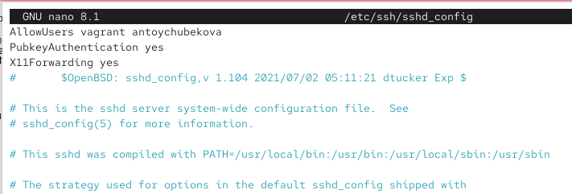{width=60%}

## Запуск графических приложений через SSH (X11Forwarding)

После сохранения изменения в конфигурационном файле перезапустим sshd. 

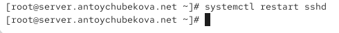{width=60%}

## Запуск графических приложений через SSH (X11Forwarding)

Попробуем с клиента удалённо подключиться к серверу и запустить графическое приложение, например firefox. Мы виим, что все успешно запустилось. 

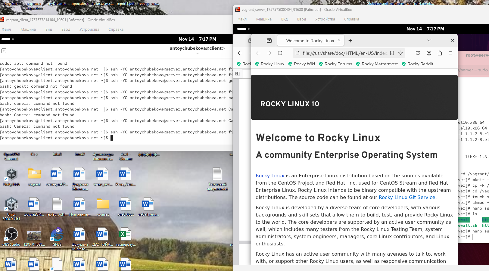{width=60%}

## Внесение изменений в настройки внутреннего окружения виртуальной машины

На виртуальной машине server перейдем в каталог для внесения изменений в настройки внутреннего окружения /vagrant/provision/server/, создадим в нём каталог ssh, в который поместим в соответствующие подкаталоги конфигурационный файл sshd_config. 

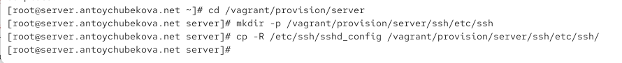{width=60%}

## Запуск графических приложений через SSH (X11Forwarding)

В каталоге /vagrant/provision/server создадим исполняемый файл ssh.sh и откроем его для редактирование, пропишем в нем скрипт, который настраивает работу с ssh. 

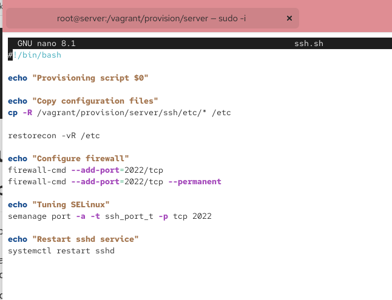{width=60%}

## Запуск графических приложений через SSH (X11Forwarding)

Для отработки созданного скрипта во время загрузки виртуальной машины server в конфигурационном файле Vagrantfile добавим в разделе конфигурации для сервера соответствующий скрипт, чтобы он запускался при включении сервера. 

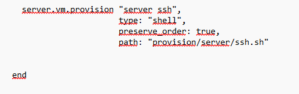{width=60%}

# Выводы

## Выводы

В ходе выполнения лабораторной работы №11 я приобрела практические навыки по настройке удалённого доступа к серверу с помощью SSH.
