---
## Author
author:
  name: Тойчубекова Асель Нурлановна
  degrees: DSc
  orcid: 0000-0002-0877-7063
  email: kulyabov-ds@rudn.ru
  affiliation:
    - name: Российский университет дружбы народов
      country: Российская Федерация
      postal-code: 117198
      city: Москва
      address: ул. Миклухо-Маклая, д. 6
## Title
title: Администрирование сетевых подсистем
subtitle: Лабораторная работа №12
license: CC BY
date: today
date-format: "YYYY-MM-DD" # Example: 2025-09-06
---

# Информация

## Докладчик

:::::::::::::: {.columns align=center}
::: {.column width="70%"}

  * Тойчубекова Асель Нурлановна
  * Студент 3 курса
  * факультет физико-математических и естественных наук
  * Российский университет дружбы народов им. П. Лумумбы
  * [1032235033@rudn.ru](1032235033@rudn.ru)

:::
::: {.column width="30%"}

:::
::::::::::::::

# Цель работы

## Цель работы

Целью данной лабораторной работы является получение навыков по управлению системным временем и настройке синхронизации времени.

# Задание

## Задание

1. Изучите команды по настройке параметров времени.
2. Настройте сервер в качестве сервера синхронизации времени для локальной сети.
3. Напишите скрипты для Vagrant, фиксирующие действия по установке и настройке NTP-сервера и клиента.

# Теоретическое введение

## Теоретическое введение

Современные операционные системы и сетевые узлы требуют точного учета времени для корректного функционирования приложений, ведения журналов событий, обеспечения безопасности и синхронизации процессов. В Unix/Linux системах различают два основных типа времени: системное и аппаратное.

## Теоретическое введение

Аппаратные часы (RTC – Real-Time Clock), встроенные в материнскую плату, поддерживают отсчет времени даже при выключенном компьютере. Управление аппаратными часами осуществляется с помощью команды hwclock, которая позволяет выводить текущее время (hwclock --show), а также синхронизировать системное время с аппаратным (hwclock --systohc).

## Теоретическое введение

Системное время предоставляется ядром операционной системы и отсчитывается как количество секунд, прошедших с 1 января 1970 года 00:00:00 UTC. Работа с системным временем возможна через команды date (для просмотра и установки времени) и timedatectl, позволяющую также управлять часовыми поясами и устанавливать синхронизацию системного времени с аппаратными часами.

## Теоретическое введение

Для обеспечения точного времени на всех устройствах сети применяется синхронизация времени через протокол NTP (Network Time Protocol). NTP использует алгоритм Марзулло для выбора наиболее точных источников времени. Источники расположены в иерархической структуре: эталонные устройства на нулевом уровне передают время первому уровню синхронизации, который, в свою очередь, распространяет его на нижестоящие устройства. Чем ниже уровень источника, тем меньше точность времени.

## Теоретическое введение

В Unix/Linux системах наиболее популярными инструментами синхронизации времени являются ntpd и chrony. chrony предоставляет возможность управления и мониторинга синхронизации через команды chronyc, которые позволяют получать информацию о текущих серверах времени, их состоянии, статистике и качестве синхронизации. Используемые обозначения (например, *, +, ?, x, ~) отражают степень точности и надежности источников времени, а дополнительные параметры указывают на интервалы опроса, состояние связи и величину смещения локальных часов относительно серверов.

# Выполнение лабораторной работы

## Настройка параметров времени

Для начала лабораторной работы №12 включим вм server, client и войдем под нашим пользователем. На сервере и клиенте посмотрим параметры настройки даты и времени через команду timedatecl. 

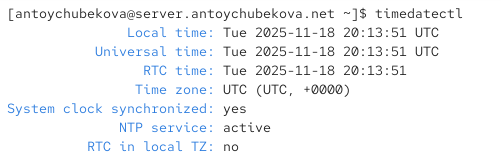{width=60%} 

## Настройка параметров времени

{width=60%} 

## Настройка параметров времени

Дальше мы можем посмотреть доступные часовые пояса для сервера и клиента. Мы видим, что у нас вывелись доступные часовые пояса в алфавитном порядке.

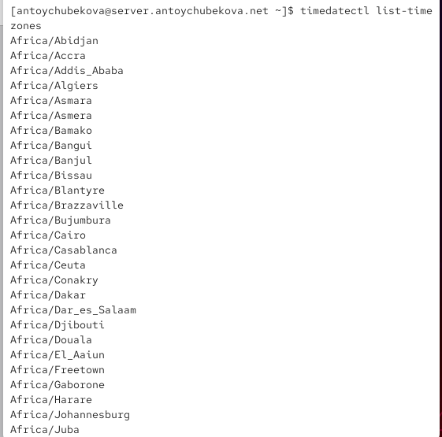{width=60%} 

## Настройка параметров времени

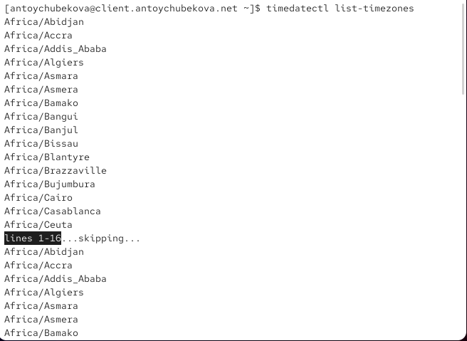{width=60%} 

## Настройка параметров времени

Теперь изменим часовой пояс на Московский, что у клиента, и что у сервера. Затем внлвь выведем информацию о параметрах настройки даты и времени у сервера и клиенте.

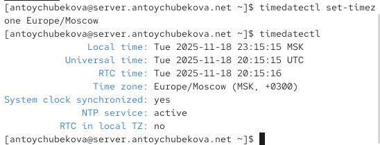{width=60%} 

## Настройка параметров времени

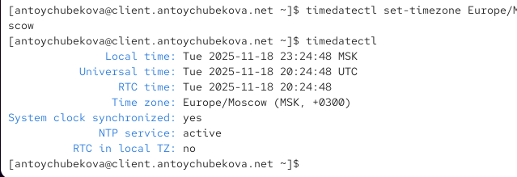{width=60%} 

## Настройка параметров времени

На сервере и клиенте посмотрим текущее системное время. Мы видим, что выводится текущая дата и время по Московскому часовому поясу. 

{width=60%} 

## Настройка параметров времени

{width=60%} 

## Настройка параметров времени

Поэкспериментируем с параметрами команды date. Сперва выведим доступные опции с помощью --help. 

{width=60%} 

## Настройка параметров времени

Что позволяет делать команда date:

- Показать текущую дату и время (по умолчанию — в формате, настроенном в системе).

- Вывести дату/время в заданном формате с помощью указания формата вручную.

- Изменить дату и время системы (при наличии прав администратора).

- Выводить дату в различных стандартах, таких как ISO 8601, RFC 3339, RFC 5322 и др.

## Настройка параметров времени

Выведем дату и время в UTC. 

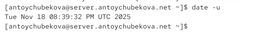{width=60%} 

## Настройка параметров времени

Далее посмотрим последнее изменения /etc/passwd.

{width=60%} 

## Настройка параметров времени

Далее перейдем на клиент и выведем дату 2025-05-19. Далее посмотрим последнее изменения /etc/postfix. И выпишем все даты с файла time. 

{width=60%} 

## Настройка параметров времени

На сервере и клиенте посмотрим аппаратное время. Мы видим, что они тоже установлены на Московский часовой пояс и от UTC отличаются на 3 часа.

{width=60%} 

## Настройка параметров времени

{width=60%} 

## Управление синхронизацией времени

Установим на сервере необходимое программное обеспечение. 

{width=60%}  

## Управление синхронизацией времени

Проверим источники времени на сервере. 

{width=60%}  

## Управление синхронизацией времени

Мы видим, что система синхронизирована с надежными источниками времени 2-го страта. Связь со всеми источниками стабильна (столбец Reach). Текущий источник (92.255.126.12) опрашивается чаще других (Poll=8), что является нормальным поведением. Источник vm2300563.firstbyte.club демонстрирует наилучшую точность.

## Управление синхронизацией времени

Проверим источники времени на клиенте. 

{width=60%} 

## Управление синхронизацией времени

Мы видим, что система синхронизирована с надежным источником mskmar-ntp02c.ntppool.ya, который опрашивается чаще других (Poll=8) и показывает хорошую точность. Три дополнительных источника обеспечивают избыточность. Все источники демонстрируют стабильную связь (столбец Reach). Источник vm2300563.firstbyte.club имеет заметно большее смещение (-12ms), но остается в допустимых пределах и может быть использован при необходимости.

## Управление синхронизацией времени

На сервере откроем на редактирование файл /etc/chrony.conf и добавим строку: allow 192.168.0.0/16. 

{width=60%} 

## Управление синхронизацией времени

На сервере перезапустим службу chronyd. И настроим межсетевой экран на сервере. 

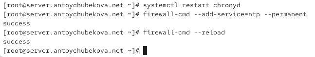{width=60%} 

## Управление синхронизацией времени

На клиенте откроем файл /etc/chrony.conf и добавим строку server server.user.net iburst. 

{width=60%} 

## Управление синхронизацией времени

На клиенте перезапустим службу chronyd. 

{width=60%} 

## Управление синхронизацией времени

Проверим источники времени на сервер.

{width=60%} 

## Управление синхронизацией времени

Мы видим, что конфигурация NTP работает эффективно. Система синхронизирована с надежным источником ntp2.mail.ru (страта 2). Все источники опрашиваются с повышенной частотой (Poll=7), что указывает на активный мониторинг времени. Связь со всеми серверами стабильна. Особенно выделяется источник telemost.zxlab.ru, показывающий минимальное смещение (-86μs). Источник 62.76.113.232 имеет более высокое страта (3) и смещение, но остается в рабочем состоянии. Общая синхронизация времени настроена корректно.

## Управление синхронизацией времени

Проверим источники времени на клиенте. 

{width=60%} 

## Управление синхронизацией времени

Мы видим, что конфигурация NTP работает нормально, но требует внимания. Система синхронизирована с локальным сервером dhcp.antoychubekova.net (страта 3), который опрашивается с максимальной частотой. Наличие источника yggno.de страты 2 повышает общую надежность конфигурации. Однако источник 89.188.118.150 показывает нестабильную связь (Reach=267) и высокую погрешность (±87ms), что может указывать на сетевые проблемы с этим сервером. Рекомендуется наблюдение за этим источником и возможное его исключение из пула, если проблемы сохранятся.

## Управление синхронизацией времени

Теперь посмотрим подробную информацию о синхронизации на сервере. Мы видим, что синхронизация времени настроена КОРРЕКТНО. Все ключевые параметры находятся в пределах нормы:

Минимальное отставание системного времени (0.25 ms)

Низкие сетевые задержки (12 ms)

Стабильные частотные характеристики

Регулярное обновление синхронизации

Система надежно синхронизирована с сервером ntp2.mail.ru и поддерживает точное время. 

## Управление синхронизацией времени

{width=60%} 

## Управление синхронизацией времени

Теперь посмотрим подробную информацию о синхронизации на клиенте. Мы видим, что синхронизация времени настроена КОРРЕКТНО. Клиент надежно синхронизирован с локальным сервером server.antoychubekova.net. Все ключевые параметры находятся в рабочих пределах:

Высокая точность времени (0.21 ms)

Минимальные сетевые задержки

Стабильные частотные характеристики

Регулярное обновление синхронизации

Система поддерживает точное время в рамках заданной конфигурации. 

## Управление синхронизацией времени

{width=60%} 

## Внесение изменений в настройки внутреннего окружения виртуальных машин

На виртуальной машине server перейдем в каталог для внесения изменений
в настройки внутреннего окружения /vagrant/provision/server/, создадим в нём
каталог ntp, в который поместите в соответствующие подкаталоги конфигурационные файлы. 

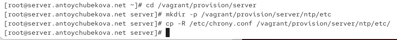{width=60%}  

## Внесение изменений в настройки внутреннего окружения виртуальных машин

В каталоге /vagrant/provision/server создадим исполняемый файл ntp.sh. Откроем его на редактирование и напишем соответствующий код.

{width=60%}  

## Внесение изменений в настройки внутреннего окружения виртуальных машин

На виртуальной машине client перейдем в каталог для внесения изменений в настройки внутреннего окружения /vagrant/provision/client/, создадим в нём каталог ntp, в который поместим в соответствующие подкаталоги конфигурационные файлы.

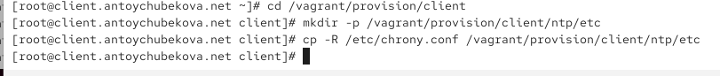{width=60%} 

## Внесение изменений в настройки внутреннего окружения виртуальных машин

В каталоге /vagrant/provision/client создадим исполняемый файл ntp.sh. Откроем его на редактирование и напишем соответствующий скрипт. 

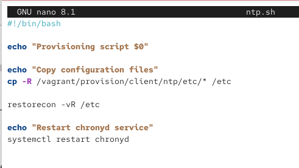{width=60%} 

## Внесение изменений в настройки внутреннего окружения виртуальных машин

Для отработки созданных скриптов во время загрузки виртуальных машин server и client в конфигурационном файле Vagrantfile добавим в соответствующих разделах конфигураций для сервера и клиента соответствующий скрипт.

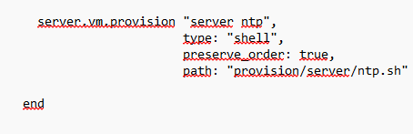{width=60%} 

## Внесение изменений в настройки внутреннего окружения виртуальных машин

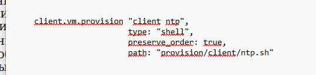{width=60%} 

# Выводы

## Выводы

В ходе выполнения лабораторной работы №12 я приобрела навыки по управлению системным временем и настройке синхронизации времени.

