---
## Author
author:
  name: Тойчубекова Асель Нурлановна
  degrees: DSc
  orcid: 0000-0002-0877-7063
  email: kulyabov-ds@rudn.ru
  affiliation:
    - name: Российский университет дружбы народов
      country: Российская Федерация
      postal-code: 117198
      city: Москва
      address: ул. Миклухо-Маклая, д. 6

## Title
title: "Администрирование сетевых подсистем"
subtitle: "Лабораторная работа №12"
license: "CC BY"
---

# Цель работы

Целью данной лабораторной работы является получение навыков по управлению системным временем и настройке синхронизации времени.

# Задание

1. Изучите команды по настройке параметров времени.
2. Настройте сервер в качестве сервера синхронизации времени для локальной сети.
3. Напишите скрипты для Vagrant, фиксирующие действия по установке и настройке NTP-сервера и клиента.

# Теоретическое введение

Современные операционные системы и сетевые узлы требуют точного учета времени для корректного функционирования приложений, ведения журналов событий, обеспечения безопасности и синхронизации процессов. В Unix/Linux системах различают два основных типа времени: системное и аппаратное.

Аппаратные часы (RTC – Real-Time Clock), встроенные в материнскую плату, поддерживают отсчет времени даже при выключенном компьютере. Управление аппаратными часами осуществляется с помощью команды hwclock, которая позволяет выводить текущее время (hwclock --show), а также синхронизировать системное время с аппаратным (hwclock --systohc).

Системное время предоставляется ядром операционной системы и отсчитывается как количество секунд, прошедших с 1 января 1970 года 00:00:00 UTC. Работа с системным временем возможна через команды date (для просмотра и установки времени) и timedatectl, позволяющую также управлять часовыми поясами и устанавливать синхронизацию системного времени с аппаратными часами.

Для обеспечения точного времени на всех устройствах сети применяется синхронизация времени через протокол NTP (Network Time Protocol). NTP использует алгоритм Марзулло для выбора наиболее точных источников времени. Источники расположены в иерархической структуре: эталонные устройства на нулевом уровне передают время первому уровню синхронизации, который, в свою очередь, распространяет его на нижестоящие устройства. Чем ниже уровень источника, тем меньше точность времени.

В Unix/Linux системах наиболее популярными инструментами синхронизации времени являются ntpd и chrony. chrony предоставляет возможность управления и мониторинга синхронизации через команды chronyc, которые позволяют получать информацию о текущих серверах времени, их состоянии, статистике и качестве синхронизации. Используемые обозначения (например, *, +, ?, x, ~) отражают степень точности и надежности источников времени, а дополнительные параметры указывают на интервалы опроса, состояние связи и величину смещения локальных часов относительно серверов.

# Выполнение лабораторной работы

## Настройка параметров времени

Для начала лабораторной работы №12 включим вм server, client и войдем под нашим пользователем. На сервере и клиенте посмотрим параметры настройки даты и времени через команду timedatecl. ([рис. @fig-001] и [рис. @fig-002]).

{#fig-001 width=70%}

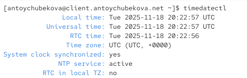{#fig-002 width=70%}

Мы видим и у клиента и у сервера, что  локальное время и универсальное время совпадают и установлены на 18 ноября 2025 года 20:13:51 по UTC. Аппаратные часы (RTC), находящиеся на материнской плате, также работают в этом же формате времени. В системе установлен часовой пояс UTC без смещения. При этом включена и активна служба синхронизации времени NTP, которая автоматически корректирует системные часы, поддерживая их точность. Отдельно отмечено, что аппаратные часы не используют локальный часовой пояс, а настроены на работу по UTC, что позволяет избежать ошибок при переходах на летнее и зимнее время. 

Дальше мы можем посмотреть доступные часовые пояса для сервера и клиента. Мы видим, что у нас вывелись доступные часовые пояса в алфавитном порядке. ([рис. @fig-003] и [рис. @fig-004]).

{#fig-003 width=70%}

{#fig-004 width=70%}

Теперь изменим часовой пояс на Московский, что у клиента, и что у сервера. Затем внлвь выведем информацию о параметрах настройки даты и времени у сервера и клиенте. ([рис. @fig-005] и [рис. @fig-006]).

{#fig-005 width=70%}

{#fig-006 width=70%}

Мы видим, что теперь локальное время отображается с учётом московского часового пояса (MSK, UTC+3). Локальное время стало 23:15:15, в то время как универсальное время (UTC) осталось 20:15:15 — разница составляет три часа. Аппаратные часы (RTC) всё ещё работают по UTC. Система по-прежнему синхронизирована и использует активную службу NTP для автоматического обновления времени.

На сервере и клиенте посмотрим текущее системное время. Мы видим, что выводится текущая дата и время по Московскому часовому поясу. ([рис. @fig-007] и [рис. @fig-008]).

{#fig-007 width=70%}

{#fig-008 width=70%}

Поэкспериментируем с параметрами команды date. Сперва выведим доступные опции с помощью --help. ([рис. @fig-009]).

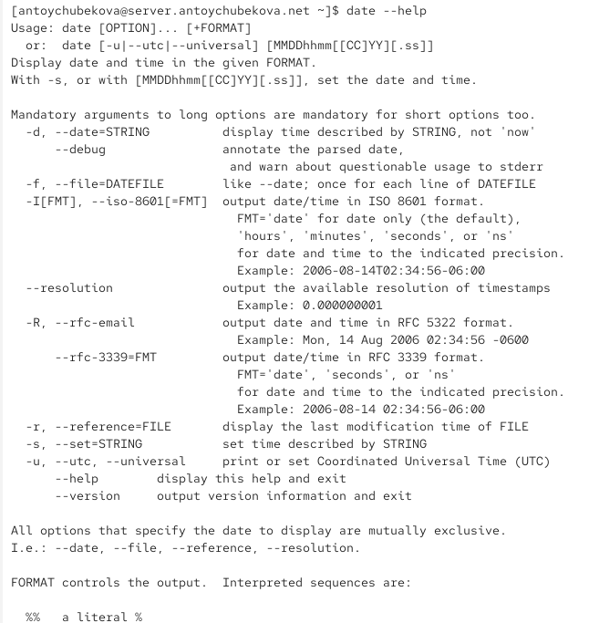{#fig-009 width=70%} 

Что позволяет делать команда date:

- Показать текущую дату и время (по умолчанию — в формате, настроенном в системе).

- Вывести дату/время в заданном формате с помощью указания формата вручную.

- Изменить дату и время системы (при наличии прав администратора).

- Выводить дату в различных стандартах, таких как ISO 8601, RFC 3339, RFC 5322 и др.

Опции команды date представлены на таблице.

| Опция                       | Значение                                                                 |
| --------------------------- | ------------------------------------------------------------------------ |
| `-d, --date=STRING`         | Показать дату, описанную строкой (например, `yesterday`, `next Monday`). |
| `-f, --file=DATEFILE`       | Взять список дат из файла и вывести каждую.                              |
| `-I[FMT], --iso-8601[=FMT]` | Показать дату/время в формате ISO 8601.                                  |
| `--resolution`              | Показать максимально возможную точность временных меток.                 |
| `-R, --rfc-email`           | Вывод в формате даты для e-mail (RFC 5322).                              |
| `--rfc-3339=FMT`            | Вывод в формате RFC 3339 (удобно для логов).                             |
| `-r, --reference=FILE`      | Показать время последней модификации файла.                              |
| `-s, --set=STRING`          | Установить дату/время, задав строку вручную.                             |
| `-u, --utc, --universal`    | Вывести или установить дату/время в UTC.                                 |
| `--version`                 | Показать версию утилиты.                                                 |

Выведем дату и время в UTC. ([рис. @fig-010]).

{#fig-010 width=70%} 

Далее посмотрим последнее изменения /etc/passwd. ([рис. @fig-011]).

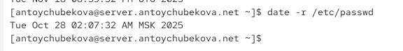{#fig-011 width=70%} 

Далее перейдем на клиент и выведем дату 2025-05-19. Далее посмотрим последнее изменения /etc/postfix. И выпишем все даты с файла time. ([рис. @fig-012]).

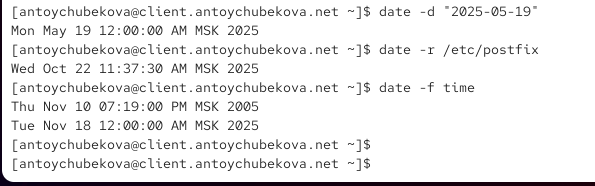{#fig-012 width=70%} 

На сервере и клиенте посмотрим аппаратное время. Мы видим, что они тоже установлены на Московский часовой пояс и от UTC отличаются на 3 часа. ([рис. @fig-013] и [рис. @fig-014]).

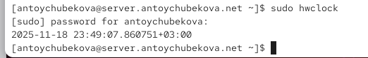{#fig-013 width=70%}

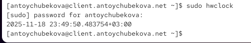{#fig-014 width=70%}

## Управление синхронизацией времени

Установим на сервере необходимое программное обеспечение. ([рис. @fig-015]).

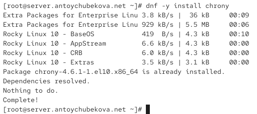{#fig-015 width=70%} 

Проверим источники времени на сервере. ([рис. @fig-016]).

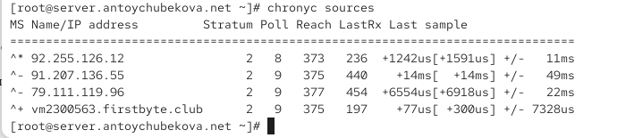{#fig-016 width=70%} 

Мы видим, что система синхронизирована с надежными источниками времени 2-го страта. Связь со всеми источниками стабильна (столбец Reach). Текущий источник (92.255.126.12) опрашивается чаще других (Poll=8), что является нормальным поведением. Источник vm2300563.firstbyte.club демонстрирует наилучшую точность.

Подробное описание источников:

92.255.126.12 - ТЕКУЩИЙ ИСТОЧНИК СИНХРОНИЗАЦИИ

Статус: ^* (активный сервер-источник)

Страта: 2 (вторичный сервер)

Poll: 8 (≈ 256 секунд)

Reach: 373 (последние 8 опросов успешны)

LastRx: 236 секунд назад

Last sample: +1242us [+1591us] +/- 11ms

Состояние: ОСНОВНОЙ - используется для синхронизации в данный момент.

91.207.136.55 - РЕЗЕРВНЫЙ ИСТОЧНИК

Статус: ^_ (приемлемый сервер)

Страта: 2

Poll: 9 (≈ 512 секунд)

Reach: 375 (последние 8 опросов успешны)

LastRx: 440 секунд назад

Last sample: +14ms [+14ms] +/- 49ms

Состояние: ДОСТУПЕН - может использоваться при необходимости. Имеет наибольшее смещение и погрешность.

79.111.119.96 - РЕЗЕРВНЫЙ ИСТОЧНИК

Статус: ^_ (приемлемый сервер)

Страта: 2

Poll: 9 (≈ 512 секунд)

Reach: 377 (377 = восьмеричное значение, все последние 8 опросов успешны - идеальная связь)

LastRx: 454 секунды назад

Last sample: +6554us [+6918us] +/- 22ms

Состояние: СТАБИЛЬНЫЙ - надежный источник с идеальной историей доступа.

vm2300563.firstbyte.club - НАИБОЛЕЕ ТОЧНЫЙ ИСТОЧНИК

Статус: ^+ (предпочтительный сервер)

Страта: 2

Poll: 9 (≈ 512 секунд)

Reach: 375 (последние 8 опросов успешны)

LastRx: 197 секунд назад

Last sample: всего +77us [+300us] +/- 7328us

Состояние: ОТЛИЧНОЕ - показывает наименьшее смещение, является кандидатом на роль основного.

Проверим источники времени на клиенте. ([рис. @fig-017]).

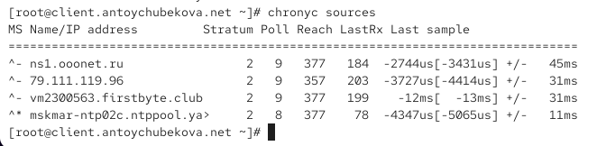{#fig-017 width=70%} 

Мы видим, что система синхронизирована с надежным источником mskmar-ntp02c.ntppool.ya, который опрашивается чаще других (Poll=8) и показывает хорошую точность. Три дополнительных источника обеспечивают избыточность. Все источники демонстрируют стабильную связь (столбец Reach). Источник vm2300563.firstbyte.club имеет заметно большее смещение (-12ms), но остается в допустимых пределах и может быть использован при необходимости.

Подробное описание источников:

mskmar-ntp02c.ntppool.ya - ТЕКУЩИЙ ИСТОЧНИК СИНХРОНИЗАЦИИ

Статус: ^* (активный сервер-источник)

Страта: 2 (вторичный сервер)

Poll: 8 (≈ 256 секунд)

Reach: 377 (все последние 8 опросов успешны - идеальная связь)

LastRx: 78 секунд назад

Last sample: -4347us [-5065us] +/- 11ms

Состояние: ОСНОВНОЙ - используется для синхронизации, имеет наименьшую погрешность.

nsl.ooonet.ru - СТАБИЛЬНЫЙ ИСТОЧНИК

Статус: ^_ (приемлемый сервер)

Страта: 2

Poll: 9 (≈ 512 секунд)

Reach: 377 (все последние 8 опросов успешны)

LastRx: 184 секунды назад

Last sample: -2744us [-3431us] +/- 45ms

Состояние: НАДЕЖНЫЙ - стабильный источник с хорошими показателями.

79.111.119.96 - РЕЗЕРВНЫЙ ИСТОЧНИК

Статус: ^_ (приемлемый сервер)

Страта: 2

Poll: 9 (≈ 512 секунд)

Reach: 357 (большинство опросов успешны)

LastRx: 203 секунды назад

Last sample: -3727us [-4414us] +/- 31ms

Состояние: ДОСТУПЕН - показывает хорошую точность.

vm2300563.firstbyte.club - ИСТОЧНИК С НАИБОЛЬШИМ СМЕЩЕНИЕМ

Статус: ^_ (приемлемый сервер)

Страта: 2

Poll: 9 (≈ 512 секунд)

Reach: 377 (все последние 8 опросов успешны)

LastRx: 199 секунд назад

Last sample: -12ms [-13ms] +/- 31ms

Состояние: РАБОЧИЙ - имеет наибольшее смещение среди всех источников.

На сервере откроем на редактирование файл /etc/chrony.conf и добавим строку: allow 192.168.0.0/16. ([рис. @fig-018]).

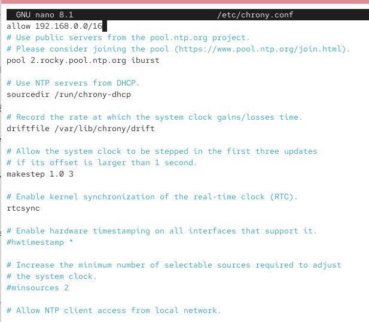{#fig-018 width=70%} 

На сервере перезапустим службу chronyd. И настроим межсетевой экран на сервере. ([рис. @fig-019]).

{#fig-019 width=70%} 

На клиенте откроем файл /etc/chrony.conf и добавим строку server server.user.net iburst. ([рис. @fig-020]).

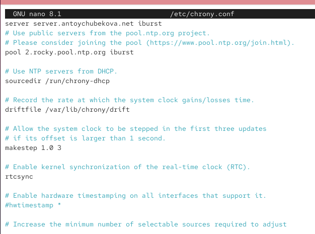{#fig-020 width=70%} 

На клиенте перезапустим службу chronyd. ([рис. @fig-021]).

{#fig-021 width=70%} 

Проверим источники времени на сервер. ([рис. @fig-022]).

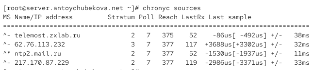{#fig-022 width=70%} 

Мы видим, что конфигурация NTP работает эффективно. Система синхронизирована с надежным источником ntp2.mail.ru (страта 2). Все источники опрашиваются с повышенной частотой (Poll=7), что указывает на активный мониторинг времени. Связь со всеми серверами стабильна. Особенно выделяется источник telemost.zxlab.ru, показывающий минимальное смещение (-86μs). Источник 62.76.113.232 имеет более высокое страта (3) и смещение, но остается в рабочем состоянии. Общая синхронизация времени настроена корректно.

Подробное описание источников:

ntp2.mail.ru - ТЕКУЩИЙ ИСТОЧНИК СИНХРОНИЗАЦИИ

Статус: ^* (активный сервер-источник)

Страта: 2 (вторичный сервер)

Poll: 7 (≈ 128 секунд)

Reach: 377 (все последние 8 опросов успешны - идеальная связь)

LastRx: 52 секунды назад

Last sample: -1530us [-1937us] +/- 11ms

Состояние: ОСНОВНОЙ - используется для синхронизации, имеет наименьшую погрешность (±11ms).

telemost.zxlab.ru - НАИБОЛЕЕ ТОЧНЫЙ ИСТОЧНИК

Статус: ^_ (приемлемый сервер)

Страта: 2

Poll: 7 (≈ 128 секунд)

Reach: 375 (последние 8 опросов успешны)

LastRx: 52 секунды назад

Last sample: всего -86us [-492us] +/- 38ms

Состояние: ОТЛИЧНЫЙ - показывает наименьшее смещение среди всех источников.

62.76.113.232 - ИСТОЧНИК С ПОВЫШЕННЫМ СМЕЩЕНИЕМ

Статус: ^_ (приемлемый сервер)

Страта: 3 (третичный сервер)

Poll: 7 (≈ 128 секунд)

Reach: 377 (все последние 8 опросов успешны)

LastRx: 117 секунд назад

Last sample: +3688us [+3302us] +/- 32ms

Состояние: СТАБИЛЬНЫЙ - имеет наибольшее положительное смещение, но остается в допустимых пределах.

217.170.87.229 - СТАБИЛЬНЫЙ ИСТОЧНИК

Статус: ^_ (приемлемый сервер)

Страта: 2

Poll: 7 (≈ 128 секунд)

Reach: 377 (все последние 8 опросов успешны)

LastRx: 119 секунд назад

Last sample: -2986us [-3371us] +/- 33ms

Состояние: НАДЕЖНЫЙ - стабильный источник с хорошими показателями.

Проверим источники времени на клиенте. ([рис. @fig-023]).

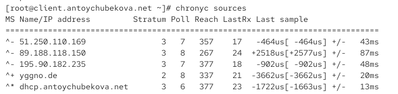{#fig-023 width=70%} 

Мы видим, что конфигурация NTP работает нормально, но требует внимания. Система синхронизирована с локальным сервером dhcp.antoychubekova.net (страта 3), который опрашивается с максимальной частотой. Наличие источника yggno.de страты 2 повышает общую надежность конфигурации. Однако источник 89.188.118.150 показывает нестабильную связь (Reach=267) и высокую погрешность (±87ms), что может указывать на сетевые проблемы с этим сервером. Рекомендуется наблюдение за этим источником и возможное его исключение из пула, если проблемы сохранятся.

Подробное описание источников:

dhcp.antoychubekova.net - ТЕКУЩИЙ ИСТОЧНИК СИНХРОНИЗАЦИИ

Статус: ^* (активный сервер-источник)

Страта: 3 (третичный сервер)

Poll: 6 (≈ 64 секунды) - самая высокая частота опроса

Reach: 377 (все последние 8 опросов успешны - идеальная связь)

LastRx: 23 секунды назад

Last sample: -1722us [-1663us] +/- 13ms

Состояние: ОСНОВНОЙ - используется для синхронизации, имеет наименьшую погрешность (±13ms).

yggno.de - ПРЕДПОЧТИТЕЛЬНЫЙ ИСТОЧНИК

Статус: ^+ (предпочтительный сервер)

Страта: 2 (вторичный сервер) - наивысшее качество среди источников

Poll: 8 (≈ 256 секунд)

Reach: 337 (большинство опросов успешны)

LastRx: 21 секунду назад

Last sample: -3662us [-3662us] +/- 20ms

Состояние: КАЧЕСТВЕННЫЙ - единственный источник страты 2, кандидат на роль основного.

51.250.110.169 - СТАБИЛЬНЫЙ ИСТОЧНИК

Статус: ^- (приемлемый сервер)

Страта: 3

Poll: 7 (≈ 128 секунд)

Reach: 357 (большинство опросов успешны)

LastRx: 17 секунд назад

Last sample: -464us [-464us] +/- 43ms

Состояние: ТОЧНЫЙ - показывает наименьшее смещение среди всех источников.

195.90.182.235 - НАДЕЖНЫЙ ИСТОЧНИК

Статус: ^- (приемлемый сервер)

Страта: 3

Poll: 7 (≈ 128 секунд)

Reach: 377 (все последние 8 опросов успешны)

LastRx: 18 секунд назад

Last sample: -902us [-902us] +/- 48ms

Состояние: СТАБИЛЬНЫЙ - идеальная история соединений.

89.188.118.150 - ИСТОЧНИК С НАИМЕНЕЕ СТАБИЛЬНОЙ СВЯЗЬЮ

Статус: ^- (приемлемый сервер)

Страта: 3

Poll: 8 (≈ 256 секунд)

Reach: 267 (не все опросы успешны)

LastRx: 24 секунды назад

Last sample: +2518us [+2577us] +/- 87ms

Состояние: ПРОБЛЕМНЫЙ - имеет наибольшую погрешность и наименее стабильную связь.

Теперь посмотрим подробную информацию о синхронизации на сервере. Мы видим, что синхронизация времени настроена КОРРЕКТНО. Все ключевые параметры находятся в пределах нормы:

Минимальное отставание системного времени (0.25 ms)

Низкие сетевые задержки (12 ms)

Стабильные частотные характеристики

Регулярное обновление синхронизации

Система надежно синхронизирована с сервером ntp2.mail.ru и поддерживает точное время. ([рис. @fig-024]).

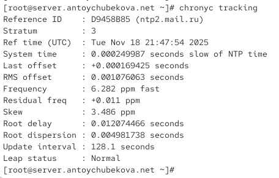{#fig-024 width=70%} 

Теперь посмотрим подробную информацию о синхронизации на клиенте. Мы видим, что синхронизация времени настроена КОРРЕКТНО. Клиент надежно синхронизирован с локальным сервером server.antoychubekova.net. Все ключевые параметры находятся в рабочих пределах:

Высокая точность времени (0.21 ms)

Минимальные сетевые задержки

Стабильные частотные характеристики

Регулярное обновление синхронизации

Система поддерживает точное время в рамках заданной конфигурации. ([рис. @fig-025]).

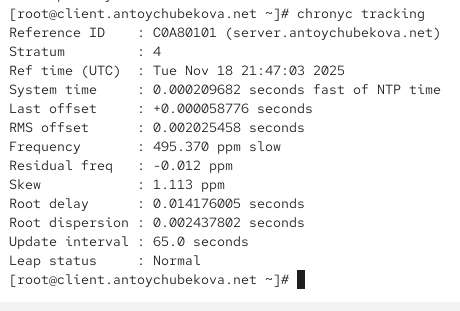{#fig-025 width=70%} 

## Внесение изменений в настройки внутреннего окружения виртуальных машин

На виртуальной машине server перейдем в каталог для внесения изменений
в настройки внутреннего окружения /vagrant/provision/server/, создадим в нём
каталог ntp, в который поместите в соответствующие подкаталоги конфигурационные файлы. ([рис. @fig-026]).

{#fig-026 width=70%} 

В каталоге /vagrant/provision/server создадим исполняемый файл ntp.sh. Откроем его на редактирование и напишем соответствующий код. ([рис. @fig-027]).

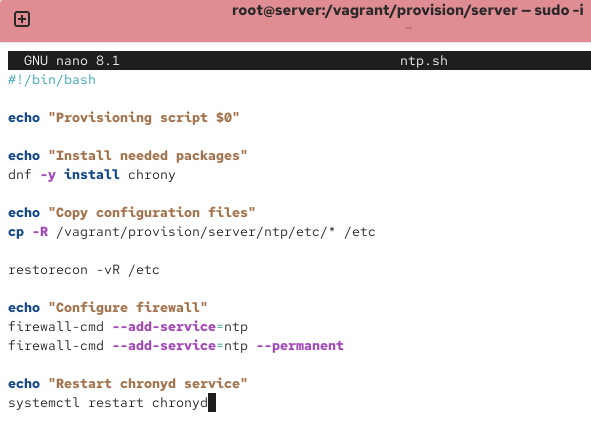{#fig-027 width=70%} 

На виртуальной машине client перейдем в каталог для внесения изменений в настройки внутреннего окружения /vagrant/provision/client/, создадим в нём каталог ntp, в который поместим в соответствующие подкаталоги конфигурационные файлы. ([рис. @fig-028]).

{#fig-028 width=70%} 

В каталоге /vagrant/provision/client создадим исполняемый файл ntp.sh. Откроем его на редактирование и напишем соответствующий скрипт. ([рис. @fig-029]).

{#fig-029 width=70%} 

Для отработки созданных скриптов во время загрузки виртуальных машин server и client в конфигурационном файле Vagrantfile добавим в соответствующих разделах конфигураций для сервера и клиента соответствующий скрипт.  ([рис. @fig-030] и [рис. @fig-031]).

{#fig-030 width=70%} 

{#fig-031 width=70%} 

# Выводы

В ходе выполнения лабораторной работы №12 я приобрела навыки по управлению системным временем и настройке синхронизации времени.

