---
## Author
author:
  name: Тойчубекова Асель Нурлановна
  degrees: DSc
  orcid: 0000-0002-0877-7063
  email: kulyabov-ds@rudn.ru
  affiliation:
    - name: Российский университет дружбы народов
      country: Российская Федерация
      postal-code: 117198
      city: Москва
      address: ул. Миклухо-Маклая, д. 6

## Title
title: "Администрирование сетевых подсистем"
subtitle: "Лабораторная работа №13"
license: "CC BY"
---

# Цель работы

Целью данной лабораторной работы является приобретение навыков настройки сервера NFS для удалённого доступа к ресурсам.

# Задание

1. Установите и настройте сервер NFSv4.

2. Подмонтируйте удалённый ресурс на клиенте.

3. Подключите каталог с контентом веб-сервера к дереву NFS.

4. Подключите каталог для удалённой работы вашего пользователя к дереву NFS.

5. Напишите скрипты для Vagrant, фиксирующие действия по установке и настройке сервера NFSv4 во внутреннем окружении виртуальных машин server и client.Соответствующим образом внесите изменения в Vagrantfile.

# Теоретическое введение

Протокол сетевого доступа к файловым системам NFS (Network File System) предназначен для организации работы с удалёнными файловыми ресурсами так, будто они находятся локально на клиентской машине. Работа NFS основана на клиент-серверной архитектуре: NFS-сервер предоставляет доступ к своим каталогам, а NFS-клиент может монтировать эти каталоги в собственное файловое пространство и взаимодействовать с ними без изменения настроек приложений.

Обмен данными между клиентом и сервером NFS осуществляется с использованием протокола RPC (Remote Procedure Call), который определяет формат всех запросов и ответов. Процесс монтирования и размонтирования NFS-ресурсов реализуется службами протокола Mount (mountd).

Для организации удалённого доступа необходимо выполнить два шага:

Экспортирование каталогов на сервере — сервер указывает, какие каталоги он делает доступными для клиентов и с какими правами. Эти параметры задаются в файле /etc/exports.

Монтирование экспортированных каталогов на клиенте — клиент подключает предоставленный сервером каталог в свою файловую систему и работает с ним как с локальным.

В конфигурации экспортирования можно задавать различные параметры доступа, такие как:

- ro/rw — права только чтения или чтения/записи;

- root_squash — понижение привилегий пользователя root клиента до пользователя nobody (включено по умолчанию);

- no_root_squash — полный доступ root-пользователя к удалённой системе (не рекомендуется);

- all_squash, anonuid, anongid — преобразование всех запросов к анонимному пользователю, что повышает безопасность.

По умолчанию пользователь root не имеет привилегированного доступа к удалённым NFS-каталогам: его UID преобразуется в UID пользователя nobody, что предотвращает риски нарушения целостности данных.

Для просмотра информации о смонтированных или экспортируемых NFS-ресурсах используется команда showmount, позволяющая просматривать удалённые монтирования и список экспортированных файловых систем.

# Выполнение лабораторной работы

## Настройка сервера NFSv4

Для начала лабораторной работы запустим вм server, зайдем под нашим пользователем откроем терминал и перейдем в режим суперпользователя. Установим необходимое программное обеспечение.([рис. @fig-001]).

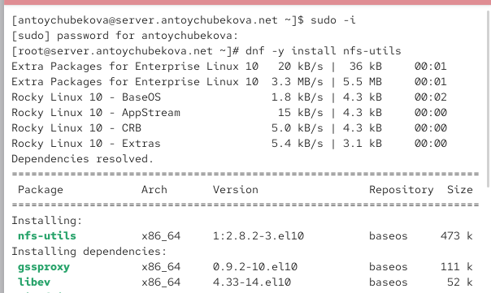{#fig-001 width=70%}

На сервере создадим каталог, который предполагается сделать доступным всем пользователям сети (корень дерева NFS). ([рис. @fig-002]).

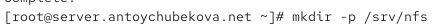{#fig-002 width=70%}

В файле /etc/exports пропишим подключаемый через NFS общий каталог с доступом только на чтение. ([рис. @fig-003]).

{#fig-003 width=70%} 

Для общего каталога зададим контекст безопасности NFS. И применим изменённую настройку SELinux к файловой системе. ([рис. @fig-004]).

{#fig-004 width=70%} 

Запустим сервер NFS. ([рис. @fig-005]).

{#fig-005 width=70%} 

Настроим межсетевой экран для работы сервера NFS. ([рис. @fig-006]).

{#fig-006 width=70%} 

На клиенте установим необходимое для работы NFS программное обеспечение. ([рис. @fig-007]).

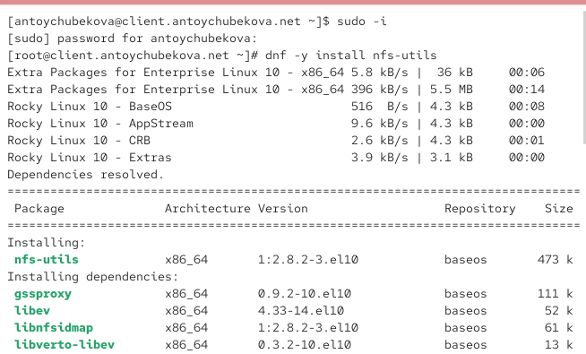{#fig-007 width=70%}

На клиенте попробуем посмотреть имеющиеся подмонтированные удалённые ресурсы. Мы видим, что пока ничего нет. Клиент не смог получить ответ по RPC. ([рис. @fig-008]).

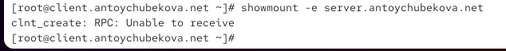{#fig-008 width=70%}

Попробуем на сервере остановить сервис межсетевого экрана. ([рис. @fig-009]).

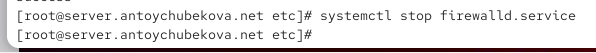{#fig-009 width=70%}

Затем на клиенте вновь попробуем подключиться к удалённо смонтированному ресурсу. Мы видим, что после того как клиент обращается к серверу, сервер отвечает списком экспортируемых директорий, в данном случае экспортируется одна директория /srv/nfs с доступом для всех клиентов.  ([рис. @fig-010]).

{#fig-010 width=70%}

На сервере запустим сервис межсетевого экрана. ([рис. @fig-011]).

{#fig-011 width=70%}

На сервере посмотрим, какие службы задействованы при удалённом монтировании. ([рис. @fig-012] и [рис. @fig-013] ). Мы видим, что задействована служба rpc.

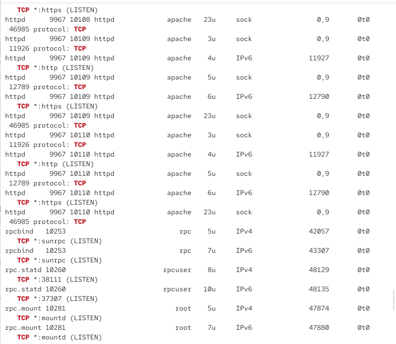{#fig-012 width=70%}

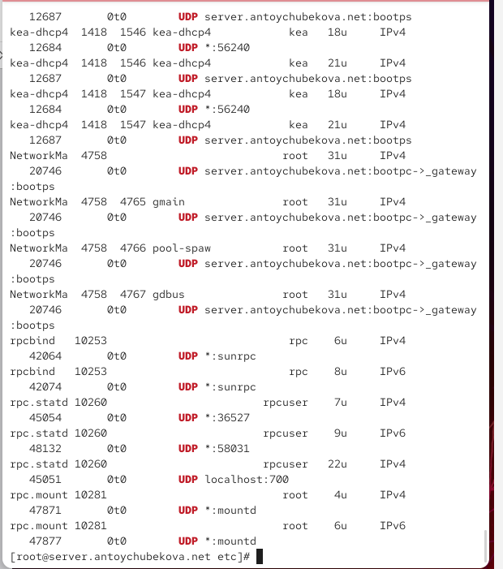{#fig-013 width=70%}

Добавим службы rpc-bind и mountd в настройки межсетевого экрана на сервере. Для начала посмотрим все службы. ([рис. @fig-014]).

{#fig-014 width=70%}

Далее добавим службу rpc-bind и mountd и перезапустим firewall. ([рис. @fig-015]).

{#fig-015 width=70%}

На клиенте проверим подключение удалённого ресурса. Мы видим, что все корректно обрабатывается. ([рис. @fig-016]).

{#fig-016 width=70%}

## Монтирование NFS на клиенте

На клиенте создадим каталог, в который будет монтироваться удалённый ресурс, и подмонтируем дерево NFS. ([рис. @fig-017]).

{#fig-017 width=70%}

Проверим, что общий ресурс NFS подключён правильно. Мы видим, что все работает правильно и общий ресурс NFS подключен. ([рис. @fig-018]).

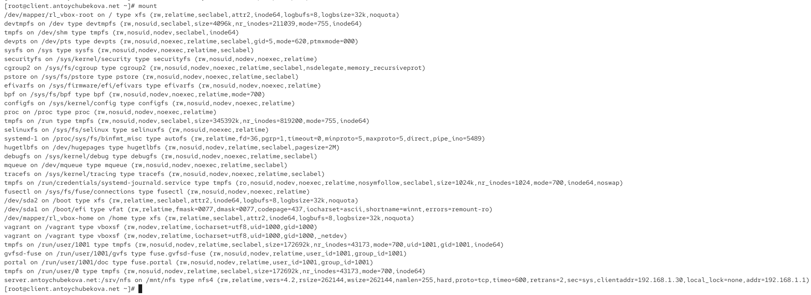{#fig-018 width=70%}

Мы видим, что выводится информация-удалённый каталог /srv/nfs с сервера server.antoychubekova.net смонтирован на локальный узел в каталог /mnt/nfs по протоколу NFS версии 4.2. Монтирование выполнено в режиме чтения-записи через TCP, с крупными размерами блоков (256 KB), стандартной UNIX-аутентификацией и «жёстким» режимом (клиент будет ждать ответа сервера при сбоях). В выводе также указаны технические параметры подключения: тайм-ауты, число повторов и IP-адреса клиента и сервера. 

На клиенте в конце файла /etc/fstab добавим следующую запись: server.user.net:/srv/nfs /mnt/nfs nfs _netdev 0 0, которая указывает системе автоматически монтировать удаленный каталог /srv/nfs с сервера server.antoychubekova.net в  локальный каталог /mnt/nfs с использованием файловой системы типа nfs. _netdev сообщает, что ресурс находится в сети, так что поднимать только после поднятия сетевых интерфейсов. Два нуля обозначают не выполнять dump-резервирование и не проверять файловую систему fsck при загрузке. ([рис. @fig-019]).

{#fig-019 width=70%}

На клиенте проверим наличие автоматического монтирования удалённых ресурсов при запуске операционной системы. Мы видим, что все корректно обрабатывается. ([рис. @fig-020]).

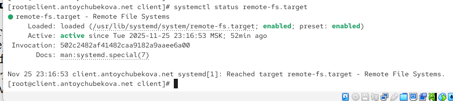{#fig-020 width=70%}

Перезапустим клиента и убедимся, что удалённый ресурс подключается автоматически. ([рис. @fig-021]).

{#fig-021 width=70%}

## Подключение каталогов к дереву NFS

На сервере создадим общий каталог, в который затем будет подмонтирован каталог с контентом веб-сервера. Подмонтируем каталог web-сервера. ([рис. @fig-022]).

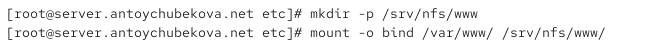{#fig-022 width=70%}

На сервере проверим, что отображается в каталоге /srv/nfs. Мы видим, что у нас тут появился каталог www. ([рис. @fig-023]).

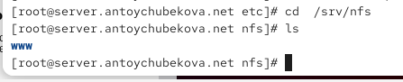{#fig-023 width=70%}

На клиенте посмотрим, что отображается в каталоге /mnt/nfs. Мы видим, что у нас тут появился каталог www. ([рис. @fig-024]).

{#fig-024 width=70%}

На сервере в файле /etc/exports добавим экспорт каталога веб-сервера с удалённого ресурса. ([рис. @fig-025]).

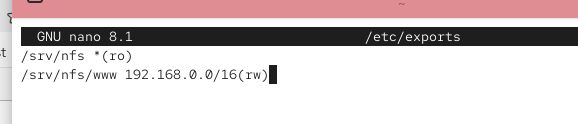{#fig-025 width=70%}

Экспортируем все каталоги, упомянутые в файле /etc/exports. ([рис. @fig-026]).

{#fig-026 width=70%}

Проверим на клиенте каталог /mnt/nfs. Мы видим, что у нас тут появился каталог www. ([рис. @fig-027]).

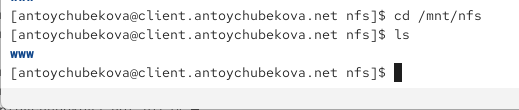{#fig-027 width=70%}

На сервере в конце файла /etc/fstab добавим следующую запись: /var/www /srv/nfs/www none bind 0 0, которая обозначает, что создается bind-монтирование: локальный каталог /var/www привязывается и отображается по пути /srv/nfs/www.([рис. @fig-028]).

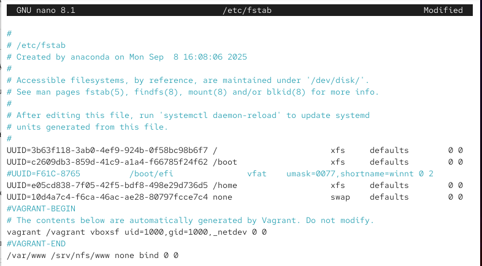{#fig-028 width=70%}

Повторно экспортируем каталоги, указанные в файле /etc/exports. ([рис. @fig-029]).

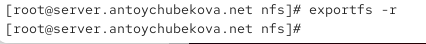{#fig-029 width=70%}

На клиенте проверим каталог /mnt/nfs. Тут также указан каталог www. ([рис. @fig-030]).

{#fig-030 width=70%}

## Подключение каталогов для работы пользователей

На сервере под пользователем antoychubekova в его домашнем каталоге создадим каталог
common с полными правами доступа только для этого пользователя, а в нём файл antoychubekova@server.txt. ([рис. @fig-031]).

{#fig-031 width=70%}

На сервере создадим общий каталог для работы пользователя antoychubekova по сети. Подмонтируем каталог common пользователя antoychubekova в NFS.  ([рис. @fig-032]).

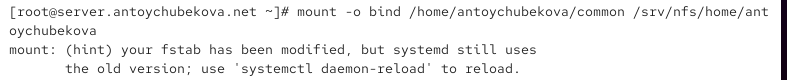{#fig-032 width=70%}

Посмотрим права доступа установленные на этот каталог, common. Мы видим, что у него полные права доступа только для пользователя. ([рис. @fig-033]).

{#fig-033 width=70%}

Подключим каталог пользователя в файле /etc/exports. ([рис. @fig-034]).

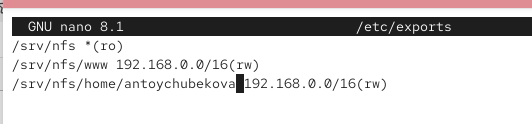{#fig-034 width=70%}

Внесем изменения в файл /etc/fstab прописав, /home/user/common /srv/nfs/home/user none bind 0 0, котрая создает bind-монтирование /home/user/common в /srv/nfs/home/user. ([рис. @fig-035]).

{#fig-035 width=70%}

Повторно экспортируем каталоги. На клиенте проверим каталог /mnt/nfs. Мы видим, что появился каталог home. ([рис. @fig-036]).

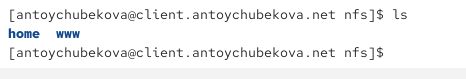{#fig-036 width=70%}

На клиенте под пользователем antoychubekova перейдем в каталог /mnt/nfs/home/antoychubekova и попробуем создать в нём файл antoychubekova@client.txt и внесем в него какие-либо изменения. ([рис. @fig-037]).

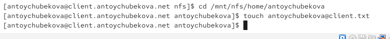{#fig-037 width=70%}

Теперь попробуем проделать это под пользователем root. Мы видим, что в переходе и создании файла нам отказано в доступе. ([рис. @fig-038]).

{#fig-038 width=70%}

На сервере посмотрим, появились ли изменения в каталоге пользователя /home/user/common. Мы видим, что появился файл который мы создали на клиенте. ([рис. @fig-039]).

{#fig-039 width=70%}

## Внесение изменений в настройки внутреннего окружения виртуальных машин

На виртуальной машине server перейдем в каталог для внесения изменений в настройки внутреннего окружения /vagrant/provision/server/, создадим в нём каталог nfs, в который поместим в соответствующие подкаталоги конфигурационные файлы. ([рис. @fig-040]).

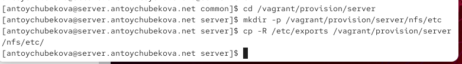{#fig-040 width=70%}

В каталоге /vagrant/provision/server создадим исполняемый файл nfs.sh и добавим права для выполнения. ([рис. @fig-041]).

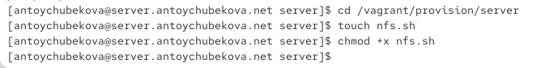{#fig-041 width=70%}

Открыв его на редактирование, пропишем в нём соответствующий скрипт. ([рис. @fig-042]).

{#fig-042 width=70%}

На виртуальной машине client перейдем в каталог для внесения изменений в настройки внутреннего окружения /vagrant/provision/client/. В нем создадим исполняемый файл nfs.sh и присвоим ей права на выполнение. ([рис. @fig-043]).

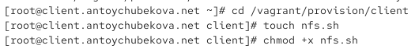{#fig-043 width=70%}

Открыв его на редактирование, пропишем в нём соответствующий скрипт. ([рис. @fig-044]).

{#fig-044 width=70%}

Для отработки созданных скриптов во время загрузки виртуальных машин server и client в конфигурационном файле Vagrantfile необходимо добавить в соответствующих разделах конфигураций для сервера и клиента. ([рис. @fig-045] и [рис. @fig-046]).

{#fig-045 width=70%}

{#fig-046 width=70%}

# Выводы

В ходе выполнения лабораторной работы №13 я приобрела навыки настройки сервера NFS для удалённого доступа к ресурсам.
