---
## Author
author:
  name: Тойчубекова Асель Нурлановна
  degrees: DSc
  orcid: 0000-0002-0877-7063
  email: kulyabov-ds@rudn.ru
  affiliation:
    - name: Российский университет дружбы народов
      country: Российская Федерация
      postal-code: 117198
      city: Москва
      address: ул. Миклухо-Маклая, д. 6

## Title
title: "Администрирование сетевых посистем"
subtitle: "Лабораторная работа №14"
license: "CC BY"
---

# Цель работы

Целью данной лабораторной работы является приобретение навыков настройки доступа групп пользователей к общим ресурсам по протоколу SMB. 

# Задание

1. Установите и настройте сервер Samba.

2. Настройте на клиенте доступ к разделяемым ресурсам.

3. Напишите скрипты для Vagrant, фиксирующие действия по установке и настройке сервера Samba для доступа к разделяемым ресурсам во внутреннем окружении виртуальных машин server и client. Соответствующим образом необходимо внести изменения в Vagrantfile.

# Теоретическое введение

Протокол Server Message Block (SMB) предназначен для организации межпроцессного взаимодействия и удалённого доступа к разделяемым сетевым ресурсам — таким как файлы, каталоги и принтеры. Он обеспечивает функции, аналогичные возможностям протокола NFS, однако более эффективно применяется в смешанных сетях, включающих Unix/Linux-узлы и компьютеры под управлением операционных систем семейства Windows. Существенные различия между SMB и NFS связаны с присутствием или отсутствием определённых компонентов: сведений о владельцах ресурсов, поддержки блокировок при различных режимах работы, а также информации о правах доступа, UID и GID.

Для обеспечения взаимодействия Unix/Linux-систем с сетями, построенными на основе Windows-технологий, существует пакет Samba — свободная реализация серверов и клиентских программ, основанных на протоколе SMB/CIFS. Samba функционирует поверх стека TCP/IP и использует файловые системы smbfs или cifs. Она предоставляет возможность как предоставления ресурсов в сеть, так и доступа к удалённым SMB-ресурсам.

Центральным компонентом конфигурации Samba является файл /etc/samba/smb.conf, определяющий параметры доступа к системным ресурсам. Этот файл структурируется в виде разделов, каждый из которых начинается с имени в квадратных скобках, например: [global], [homes], [printers]. Разделы содержат параметры вида имя = значение, причём регистр символов в именах секций и параметров не учитывается. Комментарии начинаются с символов «#», «;» или «,», а строки, заканчивающиеся обратным слэшем «\», продолжаются на следующей строке. Значения параметров могут задаваться строками или логическими значениями (yes/no, true/false, 0/1).

Пакет Samba включает в себя широкий набор утилит административного, диагностического и клиентского назначения. К административным инструментам относятся:

- net — средство администрирования Samba и удалённых CIFS-серверов;

- pdbedit — управление учётными записями пользователей;

- smbcontrol — отправка сообщений процессам smbd, nmbd и winbindd;

- smbpasswd — изменение паролей пользователей SMB;

- smbstatus — просмотр текущих подключений;

- swat — веб-инструмент для настройки smb.conf;

- tdbbackup — резервное копирование и проверка .tdb-файлов;

- testparm — проверка корректности структуры файла smb.conf.

Клиентские утилиты обеспечивают работу с ресурсами SMB/CIFS:

- smbclient — интерфейс, подобный FTP, для обмена файлами;

- mount.cifs/umount.cifs — монтирование и размонтирование CIFS-ресурсов;

- smbtree — просмотр сетевых SMB-ресурсов;

- smbtar — архивирование SMB-ресурсов;

- smbspool — отправка файлов на SMB-принтеры.

# Выполнение лабораторной работы

## Настройка сервера Samba

Для начала запустим вм server войдем по нашим пользователем, откроем терминал и перейдем в режим суперпользователя. Далее установим необходимые пакеты. ([рис. @fig-001]).

{#fig-001 width=70%}

Создадим группу sambagroup для пользователей, которые будут работать с Samba-сервером, и присвойте ей GID 1010. ([рис. @fig-002]).

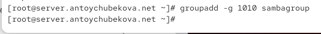{#fig-002 width=70%}

Добавим нашего пользователя antoychubeova к группе sambagroup. ([рис. @fig-003]).

{#fig-003 width=70%}

Создадим общий каталог в файловой системе Linux, в который предполагается монтировать разделяемые ресурсы.([рис. @fig-004]).

{#fig-004 width=70%}

В файле конфигурации /etc/samba/smb.conf изменим параметр рабочей группы, прописав в значении workgroup=ANTOYCHUBEKOA-NET.  ([рис. @fig-005]).

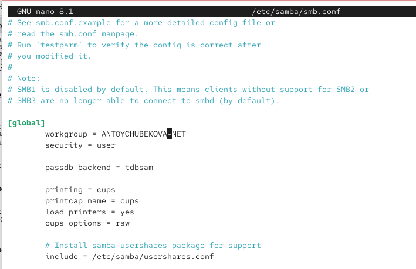{#fig-005 width=70%}

Далее в этом же файле в конце файла добавим раздел с описанием общего доступа к разделяемому ресурсу /srv/sambashare. ([рис. @fig-006]).

{#fig-006 width=70%}

Убедимся, что мы не сделали синтаксических ошибок в файле smb.conf. Мы видим, что ошибок нет и все корректно обрабатывается. ([рис. @fig-007]).

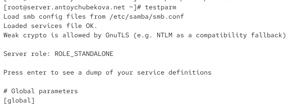{#fig-007 width=70%}

Запустим демон Samba и посмотрите его статус. Мы видим, что статус активен и Samba готова к работе. ([рис. @fig-008]).

{#fig-008 width=70%}

Для проверки наличия общего доступа попробуем подключиться к серверу с помощью smbclient. Мы видим, что происходит запрос списка общих ресурсов Samba на хосте server. После ввода пароля выполняется анонимная авторизация (Anonymous login successful). Сервер возвращает перечень доступных расшаренных ресурсов:

print$ — сетевой каталог с драйверами принтера;

sambashare — пользовательская файловая шара My Samba Share;

IPC$ — служебный ресурс для межпроцессного взаимодействия (IPC Service). ([рис. @fig-009]).

{#fig-009 width=70%}

Посмотрим файл конфигурации межсетевого экрана для Samba. В этом файле:

задаётся имя службы (Samba);

содержится описание её назначения — доступ к общим ресурсам Windows (файлам и принтерам);

подключается набор настроек из предустановленного профиля samba-client;

открываются два необходимых порта:

139/tcp — NetBIOS Session Service;

445/tcp — основной порт протокола SMB/CIFS. ([рис. @fig-010]).

{#fig-010 width=70%}

Настроем межсетевой экран. ([рис. @fig-011]).

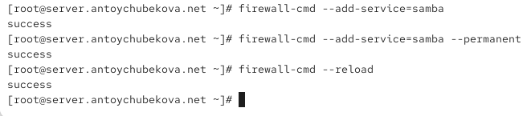{#fig-011 width=70%}

Настроим права доступа для каталога с разделяемым ресурсом. ([рис. @fig-012]).

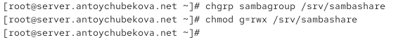{#fig-012 width=70%}

Посмотрим контекст безопасности SELinux. Вывод показывает два каталога и их SELinux-метки:

nfs — имеет контекст unconfined_u:object_r:nfs_t:s0, что означает, что каталог помечен как ресурс, предназначенный для NFS-службы.

sambashare — имеет контекст unconfined_u:object_r:var_t:s0, что соответствует обычному каталогу данных (тип var_t) и требует смены контекста на samba_share_t, если каталог планируется использовать для Samba. ([рис. @fig-013]).

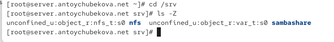{#fig-013 width=70%}

Настроим контекст безопасности SELinux для каталога с разделяемым ресурсом. ([рис. @fig-014]).

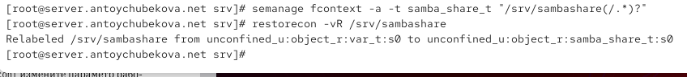{#fig-014 width=70%}

Теперь повторно посмотрим контекст безопасности SELinux. Мы видим, что раньше каталог sambashare имел тип var_t, который не подходит для совместного использования через Samba.

Теперь ему присвоен корректный контекст samba_share_t, предназначенный специально для экспортируемых SMB-ресурсов. ([рис. @fig-015]).

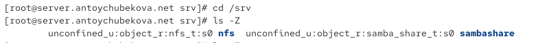{#fig-015 width=70%}

Разрешим экспортировать разделяемые ресурсы для чтения и записи. ([рис. @fig-016]).

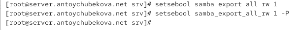{#fig-016 width=70%}

Посмотрим UID нашего пользователя и в какие группы он включён. Мы видим, что наш пользователь не состоит в группе sambagroup. ([рис. @fig-017]).

{#fig-017 width=70%}

Под нашим пользователем antoychubekova попробуем создать файл на разделяемом ресурсе. Мы видим, что нам было отказано в доступе. ([рис. @fig-018]).

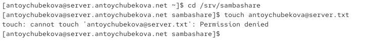{#fig-018 width=70%}

Добавим нашего пользователя antoychubekova в базу пользователей Samba. ([рис. @fig-019]).

{#fig-019 width=70%}

## Монтирование файловой системы Samba на клиенте

На клиенте установим необходимые пакеты. ([рис. @fig-020]).

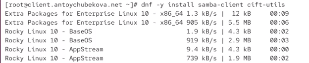{#fig-020 width=70%}

На клиенте посмотрим файл конфигурации межсетевого экрана для клиента Samba. 

В файле указано:

Название сервиса: Samba Client

Описание: позволяет подключаться к общим ресурсам Windows и Samba

include service="netbios-ns" — подключает стандартный профиль NetBIOS Name Service

порт 138/udp открывается — это NetBIOS Datagram Service, который используется Samba-клиентом для обнаружения и работы с хостами в сети. ([рис. @fig-021]).

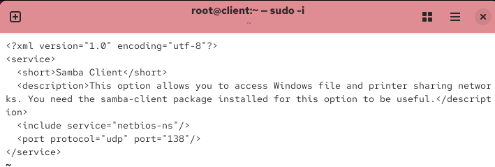{#fig-021 width=70%}

На клиенте настроим межсетевой экран. ([рис. @fig-022]).

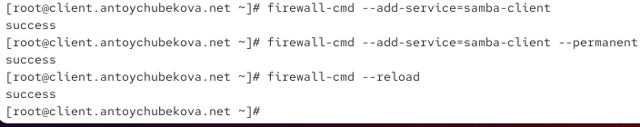{#fig-022 width=70%}

На клиенте создадим группу sambagroup и добавим в неё пользователя antoychubekova.  ([рис. @fig-023]).

{#fig-023 width=70%}

На клиенте в файле конфигурации /etc/samba/smb.conf измените параметр рабочей группы прописав workgroup = ANTOYCHUBEKOVA-NET. ([рис. @fig-024]).

{#fig-024 width=70%}

Для проверки наличия общего доступа попробуем подключиться с клиента к серверу с помощью smbclient. Мы видим, что клиент подключается к серверу. И просмотр идет под учетной записью root, анонимно. ([рис. @fig-025]).

{#fig-025 width=70%}

Подключимся с клиента к серверу с помощью smbclient под учётной записью нашего пользователя. Теперь просмотр осуществляется под нашей учетной записью antoychubekova.  ([рис. @fig-026]).

{#fig-026 width=70%}

На клиенте создадим точку монтирования. ([рис. @fig-027]).

{#fig-027 width=70%}

На клиенте получим доступ к общему ресурсу с помощью mount. 
([рис. @fig-028]).

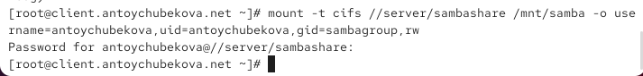{#fig-028 width=70%}

Убедимся, что antoychubekova может записывать файлы на разделяемом ресурсе. Мы видим,что все хорошо работает. ([рис. @fig-029]).

{#fig-029 width=70%}

Отмонтируем каталог /mnt/samba. ([рис. @fig-030]).

{#fig-030 width=70%}

Для настройки работы с Samba с помощью файла учётных данных на клиенте создадим файл smbusers в каталоге /etc/samba/ и присвоим ей соответствующие права. ([рис. @fig-031]).

{#fig-031 width=70%}

Откроем его на редактирование и пропишем имя пользователя и пароль. ([рис. @fig-032]).

{#fig-032 width=70%}

На клиенте в файле /etc/fstab добавим строки для монтирование разделяемого файла.([рис. @fig-033]).

{#fig-033 width=70%}

Подмонтируем общий ресурс.  ([рис. @fig-034]).

{#fig-034 width=70%}

Проверим, что после перезагрузки ресурс монтируется и у пользователя есть доступ к разделяемым ресурсам. Во первых проверим монтирование с помощью команды mount. Мы видим, что файл монтируется. Далее попробуем перейти в общий ресурс и создать там файл. Мы видим, что у нас все получилось. ([рис. @fig-035]).

{#fig-035 width=70%}

## Внесение изменений в настройки внутреннего окружения виртуальных машин

На виртуальной машине server перейдем в каталог для внесения изменений в настройки внутреннего окружения /vagrant/provision/server/, создадим в нём каталог smb, в который поместите в соответствующие подкаталоги конфигурационные файлы. ([рис. @fig-036]).

{#fig-036 width=70%}

 В каталоге /vagrant/provision/server создадим исполняемый файл smb.sh. ([рис. @fig-037]).

{#fig-037 width=70%}

Открываем этот файл для редактирование и прописываем соответствующий скрипт по настройке samba. ([рис. @fig-038]).

{#fig-038 width=70%}

На виртуальной машине client перейдем в каталог для внесения изменений в настройки внутреннего окружения /vagrant/provision/client/, создадим в нём каталог smb, в который поместим в соответствующие подкаталоги конфигурационные файлы.  ([рис. @fig-039]).

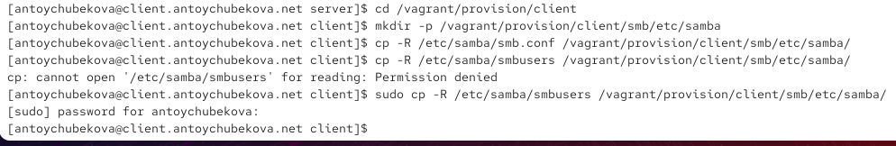{#fig-039 width=70%}

В каталоге /vagrant/provision/client создадим исполняемый файл smb.sh. ([рис. @fig-040]).

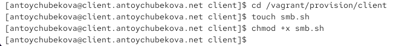{#fig-040 width=70%}

Открываем этот файл для редактирование и прописываем соответствующий скрипт по настройке samba. ([рис. @fig-041]).

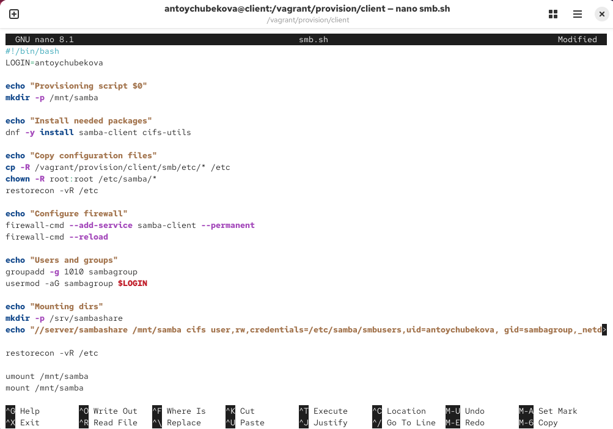{#fig-041 width=70%}

Для отработки созданных скриптов во время загрузки виртуальных машин server и client в конфигурационном файле Vagrantfile необходимо добавить в соответствующих разделах конфигураций для сервера и клиент соответствующий скрипт. ([рис. @fig-042] и [рис. @fig-043] ).

{#fig-042 width=70%}

{#fig-043 width=70%}

# Выводы

В ходе выполнения лабораторной работы №14 я приобрела навыки настройки доступа групп пользователей к общим ресурсам по протоколу SMB. 

# Список литературы

1. Всё о Samba. — URL: http://smb-conf.ru/ (дата обр. 13.09.2021)

