---
## Author
author:
  name: Тойчубекова Асель Нурановна
  degrees: DSc
  orcid: 0000-0002-0877-7063
  email: kulyabov-ds@rudn.ru
  affiliation:
    - name: Российский университет дружбы народов
      country: Российская Федерация
      postal-code: 117198
      city: Москва
      address: ул. Миклухо-Маклая, д. 6

## Title
title: "Администрирование сетевых подсистем"
subtitle: "Лабораторная работа №15"
license: "CC BY"
---

# Цель работы

Целью данной лабораторной работы является получение навыков по работе с журналами системных событий

# Задание

1. Настройте сервер сетевого журналирования событий.

2. Настройте клиент для передачи системных сообщений в сетевой журнал на сервере.

3. Просмотрите журналы системных событий с помощью нескольких программ. При наличии сообщений о некорректной работе сервисов исправьте ошибки в настройках соответствующих служб.

4. Напишите скрипты для Vagrant, фиксирующие действия по установке и настройке
сетевого сервера журналирования.

# Теоретическое введение

В процессе администрирования операционных систем семейства Unix/Linux важную роль играет мониторинг и анализ системных событий. Одним из ключевых механизмов такого контроля является журналирование — процесс регистрации сообщений о состоянии работы системы, запущенных служб и возникающих ошибках. Благодаря журналированию администратор получает возможность оперативно выявлять неисправности, анализировать причины сбоев и контролировать корректность функционирования различных компонентов системы.

Журналирование системных событий в Unix/Linux осуществляется с использованием механизма syslog, который обеспечивает передачу сообщений от системных процессов и приложений в специальные лог-файлы. Эти сообщения могут содержать информацию об ошибках, предупреждениях, служебных действиях и общем состоянии системы. Как правило, журнальные файлы хранятся в каталоге /var/log, что позволяет централизованно просматривать и анализировать информацию о работе системы.

Для управления процессом журналирования используется служба syslog или её расширенная и более функциональная версия — rsyslog. Данные службы позволяют настраивать уровень детализации логирования, определять, какие события и от каких процессов должны быть зафиксированы, а также задавать правила хранения и обработки журналов. Основные параметры конфигурации rsyslog задаются в файле /etc/rsyslog.conf, а дополнительные настройки могут подключаться из каталога /etc/rsyslog.d/, что обеспечивает гибкость и удобство администрирования.

При эксплуатации нескольких серверов или рабочих станций возникает необходимость централизованного сбора и хранения журналов. Для этого используется сервер сетевого журнала, на который передаются лог-сообщения с различных узлов сети. Такой подход позволяет повысить безопасность и целостность журналов, упростить контроль использования дискового пространства и управление сроками хранения данных, а также значительно облегчить анализ событий, поскольку все журналы доступны на одном сервере. Централизованное журналирование является важным элементом надежной и безопасной инфраструктуры информационных систем.

# Выполнение лабораторной работы

## Настройка сервера сетевого журнала

Для начала выполнения лабораторной работы запустим вм server, зайдем под нашим пользователем и перейдем в режим суперпользователя. Затем создадим файл конфигурации сетевого хранения журналов. ([рис. @fig-001]).

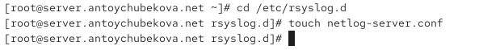{#fig-001 width=70%}

В файле конфигурации /etc/rsyslog.d/netlog-server.conf включим приём записей журнала по TCP-порту 514. ([рис. @fig-002]).

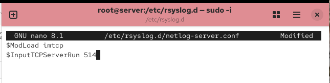{#fig-002 width=70%}

Перезапустим службу rsyslog и посмотрим, какие порты, связанные с rsyslog,прослушиваются. Мы видим, что rsyslogd слушает порт TCP:shell, что соответствует TCP:514, потому что на большинство систем порт 514 соответствует службе shell. ([рис. @fig-003] и [рис. @fig-004]).

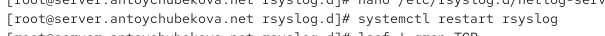{#fig-003 width=70%}

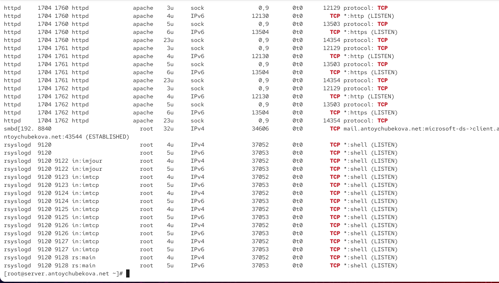{#fig-004 width=70%}

На сервере настроим межсетевой экран для приёма сообщений по TCP-порту 514. ([рис. @fig-005]).

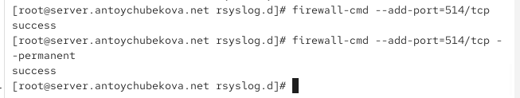{#fig-005 width=70%}

## Настройка сервера сетевого журнала

На клиенте создадим файл конфигурации сетевого хранения журналов. ([рис. @fig-006]).

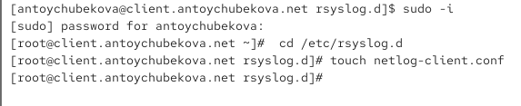{#fig-006 width=70%}

На клиенте в файле конфигурации /etc/rsyslog.d/netlog-client.conf включим перенаправление сообщений журнала на 514 TCP-порт сервера. ([рис. @fig-007]).

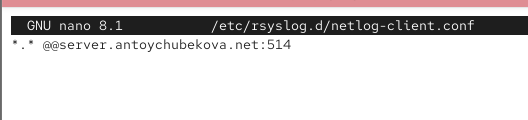{#fig-007 width=70%}

Перезапустим службу rsyslog. ([рис. @fig-008]).

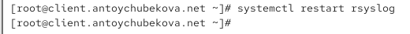{#fig-008 width=70%}

## Просмотр журнала

На сервере просмотрим один из файлов журнала. Мы видим, что среди логов сервера также выводятся логи клиента. Также видим, что rsyslog работает исправно. ([рис. @fig-009]).

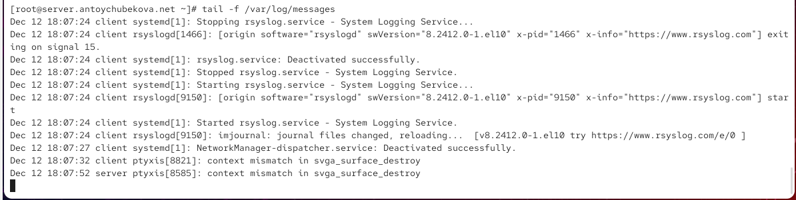{#fig-009 width=70%}

На сервере под пользователем antoychubekova запустим графическую программу для просмотра журналов.  ([рис. @fig-010]).

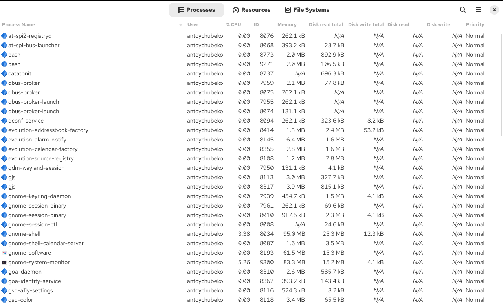{#fig-010 width=70%}

На сервере установим просмотрщик журналов системных сообщений multitail. ([рис. @fig-011]).

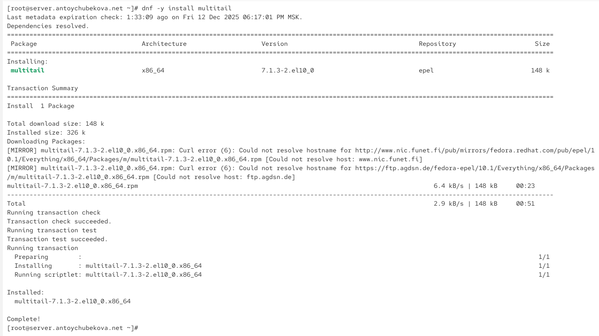{#fig-011 width=70%}

Просмотрите логи с помощью multitail на сервере. Мы тут также видим логи не только сервера, но и клиента. ([рис. @fig-012]).

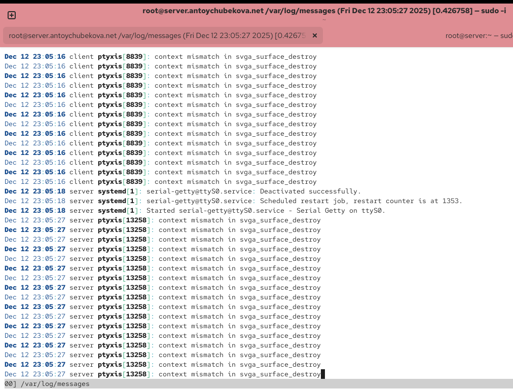{#fig-012 width=70%}

Также посмотрим логи с клиента. ([рис. @fig-013]).

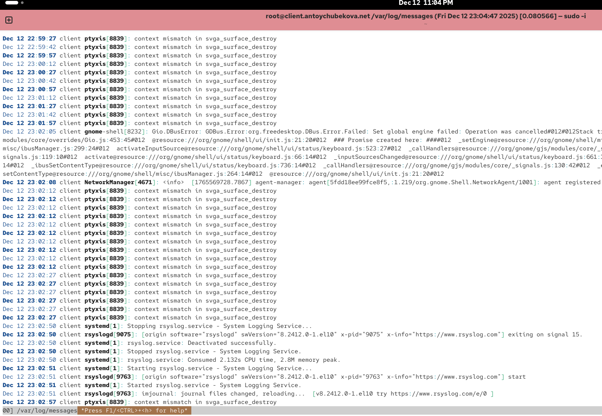{#fig-013 width=70%}

## Внесение изменений в настройки внутреннего окружения виртуальных машин

На виртуальной машине server перейдем в каталог для внесения изменений в настройки внутреннего окружения /vagrant/provision/server/, создадим в нём каталог netlog, в который поместим в соответствующие подкаталоги конфигурационные файлы. ([рис. @fig-014]).

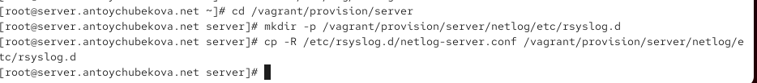{#fig-014 width=70%}

В каталоге /vagrant/provision/server создадим исполняемый файл netlog.sh. ([рис. @fig-015]).

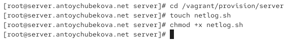{#fig-015 width=70%}

Откроем его на на редактирование и запишем соответствующий скрипт по по установке и настройке сетевого сервера журналирования. ([рис. @fig-016]).

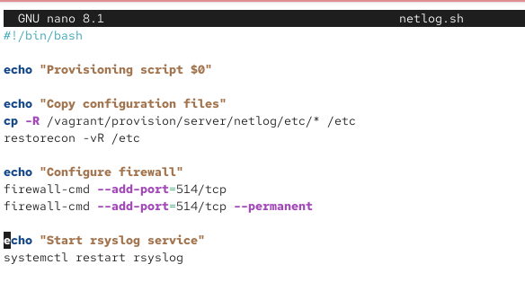{#fig-016 width=70%}

На виртуальной машине client перейдем в каталог для внесения изменений в настройки внутреннего окружения /vagrant/provision/client/, создадим в нём каталог nentlog, в который поместим в соответствующие подкаталоги конфигурационные файлы. ([рис. @fig-017]).

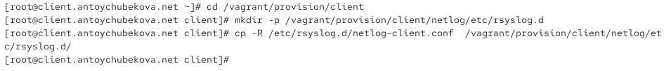{#fig-017 width=70%}

В каталоге /vagrant/provision/client создадим исполняемый файл netlog.sh. ([рис. @fig-018]).

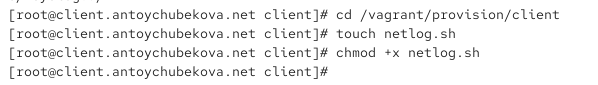{#fig-018 width=70%}

Откроем его на на редактирование и запишем соответствующий скрипт по по установке и настройке сетевого сервера журналирования. ([рис. @fig-019]).

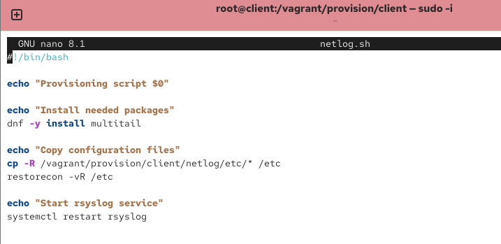{#fig-019 width=70%}

Для отработки созданных скриптов во время загрузки виртуальных машин server и client в конфигурационном файле Vagrantfile добавим в соответствующих разделах конфигураций для сервера и клиента соответствующие скрипты.  ([рис. @fig-020] и [рис. @fig-021]).

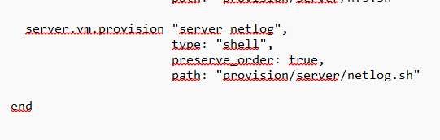{#fig-020 width=70%}

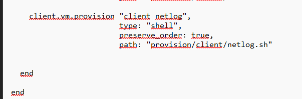{#fig-021 width=70%}

# Выводы

В ходе выполнения лабораторной работы №15 я получила навыки по работе с журналами системных событий.
