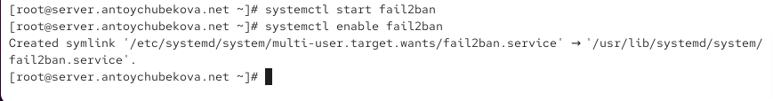
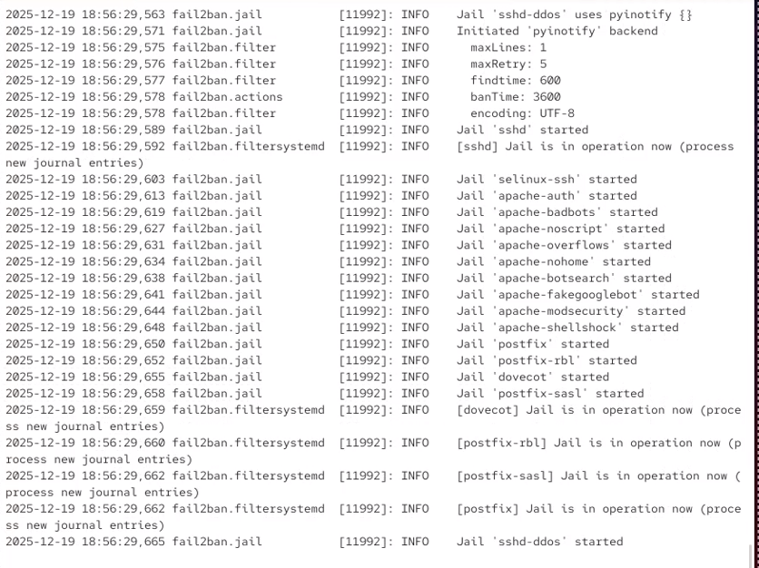
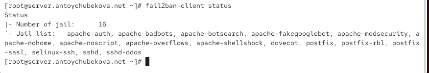
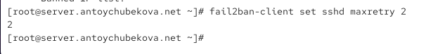
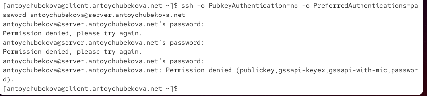
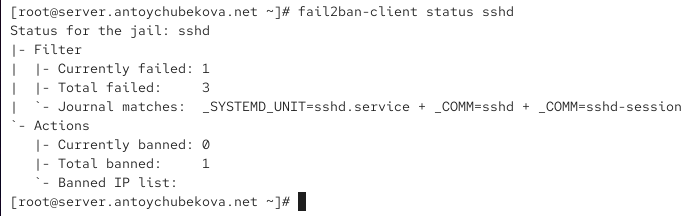
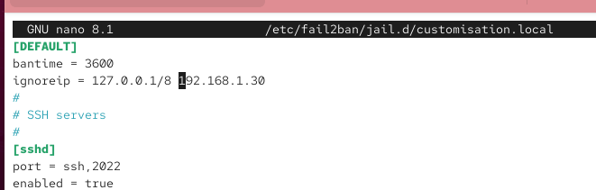
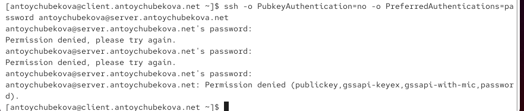
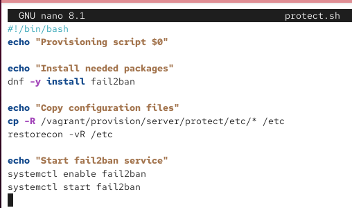

---
## Author
author:
  name: Тойчубекова Асель Нурлановна
  degrees: DSc
  orcid: 0000-0002-0877-7063
  email: 1132231842@pfur.ru
  affiliation:
    - name: Российский университет дружбы народов
      country: Российская Федерация
      postal-code: 117198
      city: Москва
      address: ул. Миклухо-Маклая, д. 6
## Title
title: "Администрирование сетевых подсистем"
subtitle: "Лабораторная работа №16"
license: CC BY
date: today
date-format: "YYYY-MM-DD" # Example: 2025-09-06
---

# Информация

## Докладчик

:::::::::::::: {.columns align=center}
::: {.column width="70%"}

  * Тойчубекова Асель Нурлановна
  * Студент 3 курса
  * факультет физико-математических и естественных наук
  * Российский университет дружбы народов им. П. Лумумбы
  * [1032235033@rudn.ru](1032235033@rudn.ru)

:::
::: {.column width="30%"}

:::
::::::::::::::

# Цель работы

## Цель работы

Целью данной лабораторной работы является получить навыки работы с программным средством Fail2ban для обеспечения базовой защиты от атак типа «brute force».

# Задание

## Задание

1. Установите и настройте Fail2ban для отслеживания работы установленных на сервере служб.

2. Проверьте работу Fail2ban посредством попыток несанкционированного доступа с клиента на сервер через SSH.

3. Напишите скрипт для Vagrant, фиксирующий действия по установке и настройке Fail2ban.

# Теоретическое введение

## Теоретическое введение

Одно из решений по защите узла сети от несанкционированного доступа и атак типа «brute force» (в частности, подбора паролей администратора методом полного перебора) -использование Fail2ban. Данное программное средство отслеживает сетевую активность на портах узла путём сканирования текстовых лог-файлов. При выявлении программой неадекватной активности какого-то узла его IP-адрес помещается в чёрный список, а все пакеты с этого адреса блокируются. Блокировка настраивается путём внесения изменений в правила межсетевого экрана.

## Теоретическое введение

Файл /etc/fail2ban/fail2ban.conf содержит настройки запуска процесса Fail2ban. Основной файл конфигурации конкретных служб в Fail2ban - /etc/fail2ban/jail.conf, настройки для локального узла должны быть размещены в файле NAMEFILE.local в каталоге /etc/fail2ban/jail.d, конфигурации для работы с различными службами размещаются в отдельных подкаталогах и файлах в каталоге /etc/fail2ban/. 

## Теоретическое введение

Каждый конфигурационный файл Fail2ban имеет секции, каждая из которых описывает определённую службу и тип атаки.

## Теоретическое введение

Базовые правила fail2ban в конфигурационном файле:

- ignoreip — не блокировать IP-адреса из этого списка; несколько IP-адресов разделяются пробелами;

- bantime — время блокировки в секундах (по умолчанию — 600, т.е. 10 минут); для
постоянного блокирования используется любое отрицательное число;

- findtime — длительность интервала времени в секундах, в течение которого
fail2ban отслеживает подозрительную активность (по умолчанию — 10 минут);

- maxretry — количество подозрительных совпадений, после которых IP-адрес блокируется (по умолчанию — 3 попытки).

# Выполнение лабораторной работы

## Защита с помощью Fail2ban

Для выполнения лабораторной работы запускаем вм server, заходим под нашим пользователем, открываем консоль, переходим в режим суперпользователя и устанавливаем fail2ban. 

{width=55%}

## Защита с помощью Fail2ban

Запустим сервер fail2ban. 

{width=55%}

## Защита с помощью Fail2ban

В дополнительном терминале запустим просмотр журнала событий fail2ban. Мы видим информацию о запуске fail2ban. 

{width=55%}

## Защита с помощью Fail2ban

Создадим файл с локальной конфигурацией fail2ban. Открываем его на редактирование и задаем время блокирования на 1 час (время задаётся в секундах), также включим защиту SSH. 

{width=55%}

## Защита с помощью Fail2ban

Перезапустим fail2ban.

{width=55%}

## Защита с помощью Fail2ban

Посмотрим журнал событий.

{width=55%}

## Защита с помощью Fail2ban

{width=55%}

## Защита с помощью Fail2ban

В файле /etc/fail2ban/jail.d/customisation.local включим защиту HTTP.

{width=55%}

## Защита с помощью Fail2ban

Перезапустим fail2ban и просмотрим журнал событий. 

{width=55%}

## Защита с помощью Fail2ban

В файле /etc/fail2ban/jail.d/customisation.local включим защиту почты.

{width=55%}

## Защита с помощью Fail2ban

Перезапустим fail2ban. 

{width=55%}

## Защита с помощью Fail2ban

Посмотрим журнал событий. 

{width=55%}

## Проверка работы Fail2ban

На сервере посмотрим статус fail2ban. 

{width=55%}

## Проверка работы Fail2ban

Посмотрим статус защиты SSH в fail2ban.

{width=55%} 

## Проверка работы Fail2ban

Установим максимальное количество ошибок для SSH, равное 2.

{width=55%} 

## Проверка работы Fail2ban

С клиента попытаемся зайти по SSH на сервер с неправильным паролем. Также я прописала опции, чтобы ssh работала с паролем, а не с ключами.

{width=55%}

## Проверка работы Fail2ban

На сервере посмотрим статус защиты SSH. 

{width=55%}

## Проверка работы Fail2ban

Разблокируем IP-адрес клиента. 

{width=55%}

## Проверка работы Fail2ban

Вновь посмотрим статус защиты SSH, мы видим, что блокировка клиента снята. 

{width=55%}

## Проверка работы Fail2ban

На сервере внесем изменение в конфигурационный файл /etc/fail2ban/jail.d customisation.local, добавив в раздел по умолчанию игнорирование адреса клиента. 

{width=55%}

## Проверка работы Fail2ban

Перезапустим fail2ban.

{width=55%}

## Проверка работы Fail2ban

Посмотрим журнал событий. Мы видим, что помимо вышеописанной информации, выводится информация, что идет игнорирование клиента.

{width=55%}

## Проверка работы Fail2ban

Вновь попытаемся войти с клиента на сервер с неправильным паролем.

{width=55%}

## Проверка работы Fail2ban

Далее посмотрим статус защиты ssh. Мы видим, что никакой подозрительной активности по SSH не обнаружено и клиент не заблокирован.

{width=55%}

## Внесение изменений в настройки внутреннего окружения виртуальных машин

На виртуальной машине server перейдем в каталог для внесения изменений в настройки внутреннего окружения /vagrant/provision/server/, создадим в нём каталог protect, в который поместим в соответствующие подкаталоги конфигурационные файлы.

{width=55%} 

## Внесение изменений в настройки внутреннего окружения виртуальных машин

В каталоге /vagrant/provision/server создадим исполняемый файл protect.sh. 

{width=55%}

## Внесение изменений в настройки внутреннего окружения виртуальных машин

Открыв его на редактирование, пропишем в нём соответствующий скрипт, фиксирующие действия по установке и настройке fail2ban.

{width=55%} 

## Внесение изменений в настройки внутреннего окружения виртуальных машин

Для отработки созданного скрипта во время загрузки виртуальной машины server в конфигурационном файле Vagrantfile добавим в соответствующем разделе конфигураций для сервера. 

{width=55%} 

# Выводы

## Выводы

В ходе выполнения лабораторной работы №16 я приобрела навыки работы с программным средством Fail2ban для обеспечения базовой защиты от атак типа «brute force».

# Список литературы

## Список литературы

1. Сайт Fail2ban. — URL: https://www.fail2ban.org (visited on 09/13/2021)
