---
## Author
author:
  name: Тойчубекова Асель Нурланона
  degrees: DSc
  orcid: 0000-0002-0877-7063
  email: kulyabov-ds@rudn.ru
  affiliation:
    - name: Российский университет дружбы народов
      country: Российская Федерация
      postal-code: 117198
      city: Москва
      address: ул. Миклухо-Маклая, д. 6

## Title
title: "Администрирование сетевых подсистем"
subtitle: "Лабораторная работа №16"
license: "CC BY"
---

# Цель работы

Целью данной лабораторной работы является получить навыки работы с программным средством Fail2ban для обеспечения базовой защиты от атак типа «brute force».

# Задание

1. Установите и настройте Fail2ban для отслеживания работы установленных на сервере служб.

2. Проверьте работу Fail2ban посредством попыток несанкционированного доступа с клиента на сервер через SSH.

3. Напишите скрипт для Vagrant, фиксирующий действия по установке и настройке Fail2ban.

# Теоретическое введение

Одно из решений по защите узла сети от несанкционированного доступа и атак типа «brute force» (в частности, подбора паролей администратора методом полного перебора) -использование Fail2ban. Данное программное средство отслеживает сетевую активность на портах узла путём сканирования текстовых лог-файлов. При выявлении программой неадекватной активности какого-то узла его IP-адрес помещается в чёрный список, а все пакеты с этого адреса блокируются. Блокировка настраивается путём внесения изменений в правила межсетевого экрана.

Файл /etc/fail2ban/fail2ban.conf содержит настройки запуска процесса Fail2ban. Основной файл конфигурации конкретных служб в Fail2ban - /etc/fail2ban/jail.conf, настройки для локального узла должны быть размещены в файле NAMEFILE.local в каталоге /etc/fail2ban/jail.d, конфигурации для работы с различными службами размещаются в отдельных подкаталогах и файлах в каталоге /etc/fail2ban/. 

Каждый конфигурационный файл Fail2ban имеет секции, каждая из которых описывает определённую службу и тип атаки.

Базовые правила fail2ban в конфигурационном файле:
- ignoreip — не блокировать IP-адреса из этого списка; несколько IP-адресов разделяются пробелами;

- bantime — время блокировки в секундах (по умолчанию — 600, т.е. 10 минут); для
постоянного блокирования используется любое отрицательное число;

- findtime — длительность интервала времени в секундах, в течение которого
fail2ban отслеживает подозрительную активность (по умолчанию — 10 минут);

- maxretry — количество подозрительных совпадений, после которых IP-адрес блокируется (по умолчанию — 3 попытки).

# Выполнение лабораторной работы

## Защита с помощью Fail2ban

Для выполнения лабораторной работы запускаем вм server, заходим под нашим пользователем, открываем консоль, переходим в режим суперпользователя и устанавливаем fail2ban. ([рис. @fig-001]).

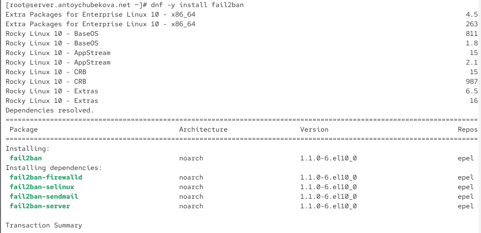{#fig-001 width=70%}

Запустим сервер fail2ban. ([рис. @fig-002]).

{#fig-002 width=70%}

В дополнительном терминале запустим просмотр журнала событий fail2ban. Мы видим информацию о запуске fail2ban. ([рис. @fig-003]).

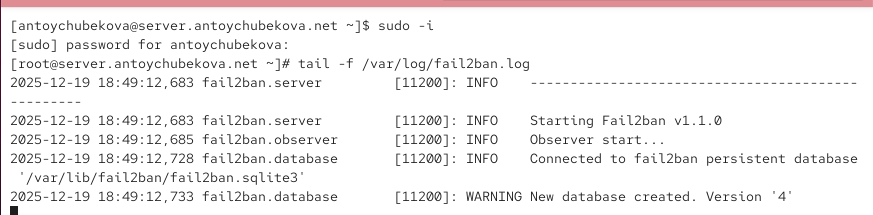{#fig-003 width=70%}

Создадим файл с локальной конфигурацией fail2ban. Открываем его на редактирование и задаем время блокирования на 1 час (время задаётся в секундах), также включим защиту SSH. ([рис. @fig-004]).

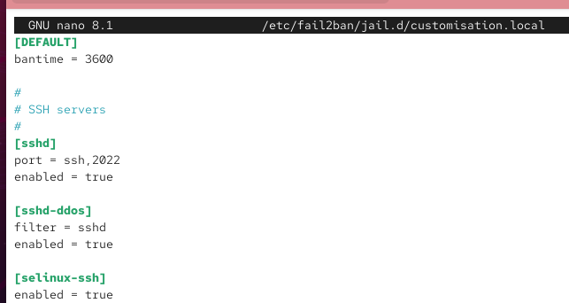{#fig-004 width=70%}

Перезапустим fail2ban. ([рис. @fig-005]).

{#fig-005 width=70%}

Посмотрим журнал событий. Мы видим, что Fail2ban успешно запустился (версия v1.1.0), подключился к своей базе /var/lib/fail2ban/fail2ban.sqlite3.

Созданы и запущены три jails:

sshd — защита SSH через systemd-журнал

selinux-ssh — мониторинг через pyinotify, журнал /var/log/audit/audit.log

sshd-ddos — защита от частых/массовых SSH-подключений

Для всех jail указаны параметры:

maxRetry: 5 — количество неудачных попыток до блокировки

findtime: 600 сек — интервал анализа

banTime: 3600 сек — время блокировки IP

Все jails успешно запущены и начали обработку журналов. ([рис. @fig-006] и [рис. @fig-007]).

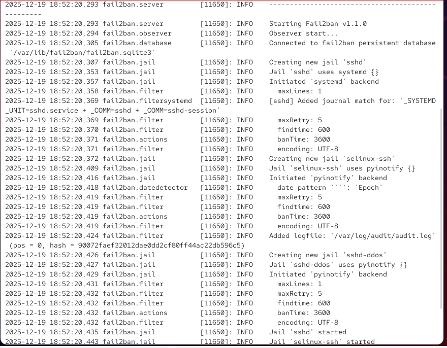{#fig-006 width=70%}

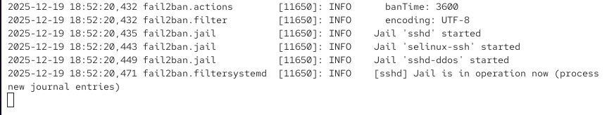{#fig-007 width=70%}

В файле /etc/fail2ban/jail.d/customisation.local включим защиту HTTP. ([рис. @fig-008]).

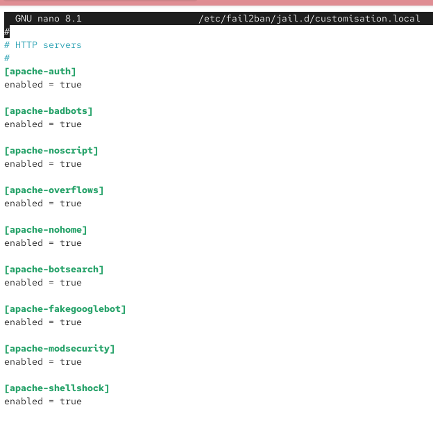{#fig-008 width=70%}

Перезапустим fail2ban и просмотрим журнал событий. Мы видим, что подключены дополнительные лог-файлы Apache:

/var/log/httpd/error_log

/var/log/httpd/ssl_error_log

логи конкретных сайтов (например, www.antoychubekova.net-error_log)

Помимо уже используемых sshd, selinux-ssh и sshd-ddos, теперь запущены новые jails:

apache-auth

apache-badbots

apache-noscript

apache-overflows

apache-nohome

apache-botsearch

apache-fakegooglebot

apache-modsecurity

apache-shellshock

Все они настроены с теми же параметрами безопасности:

findtime = 600 сек

maxRetry = 5

banTime = 3600 сек. ([рис. @fig-009]).

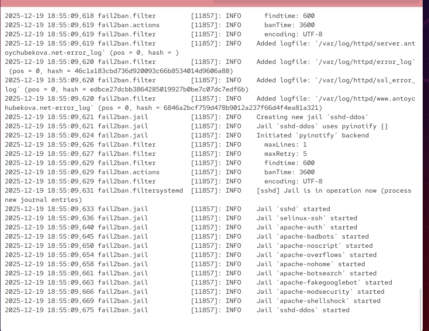{#fig-009 width=70%}

В файле /etc/fail2ban/jail.d/customisation.local включим защиту почты. ([рис. @fig-010]).

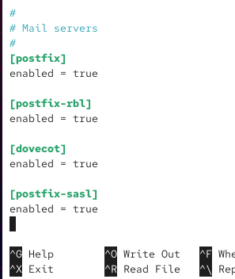{#fig-010 width=70%}

Перезапустим fail2ban. ([рис. @fig-011]).

{#fig-011 width=70%}

Посмотрим журнал событий. Мы видим, что снова создаётся и запускается sshd-ddos (защита SSH от частых запросов), с параметрами:

maxRetry = 5

findtime = 600 сек

banTime = 3600 сек

 Уже работали jails для:

SSH: sshd, selinux-ssh, sshd-ddos

Apache: apache-auth, apache-badbots, apache-noscript, apache-overflows,
apache-nohome, apache-botsearch, apache-fakegooglebot,
apache-modsecurity, apache-shellshock

 Новое в этом выводе — появились почтовые jails:

postfix

postfix-rbl

postfix-sasl

dovecot

И они тоже перешли в состояние “Jail is in operation now”, то есть активно отслеживают журналы и защищают систему. ([рис. @fig-012]).

{#fig-012 width=70%}

## Проверка работы Fail2ban

На сервере посмотрим статус fail2ban. В данном выводе видно, что система защиты активна и в настоящий момент запущено 16 jails (правил защиты). В списке перечислены все активные фильтры для служб: SSH (sshd, sshd-ddos, selinux-ssh), веб-сервера Apache (несколько профилей защиты от разных типов веб-атак), а также почтовых сервисов Postfix и Dovecot. Это означает, что Fail2ban контролирует соответствующие журналы логов и автоматически блокирует подозрительные IP-адреса.([рис. @fig-013]).

{#fig-013 width=70%}

Посмотрим статус защиты SSH в fail2ban. В выводе показано, что защита активна, ошибок авторизации сейчас нет, заблокированных IP-адресов нет (и ранее блокировок тоже не было). Также указано, что jail отслеживает журналы systemd для службы sshd. Это означает, что в данный момент подозрительной активности по SSH не обнаружено. ([рис. @fig-014]).

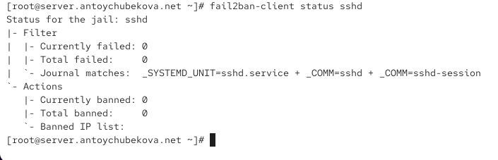{#fig-014 width=70%} 

Установим максимальное количество ошибок для SSH, равное 2.([рис. @fig-015]).

{#fig-015 width=70%} 

С клиента попытаемся зайти по SSH на сервер с неправильным паролем. Также я прописала опции, чтобы ssh работала с паролем, а не с ключами ([рис. @fig-016]).

{#fig-016 width=70%} 

На сервере посмотрим статус защиты SSH. Мы видим, что в данный момент зафиксирована 1 неудачная попытка авторизации, всего было 3 неудачные попытки за наблюдаемый период. В результате Fail2ban заблокировал 1 IP-адрес — 192.168.1.30, который сейчас находится в бане. Это подтверждает, что защита SSH функционирует корректно и автоматически реагирует на brute-force-атаки. ([рис. @fig-017]).

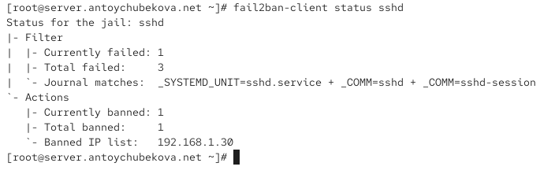{#fig-017 width=70%} 

Разблокируем IP-адрес клиента. ([рис. @fig-018]).

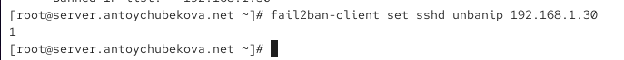{#fig-018 width=70%} 

Вновь посмотрим статус защиты SSH, мы видим, что блокировка клиента снята. ([рис. @fig-019]).

{#fig-019 width=70%} 

На сервере внесем изменение в конфигурационный файл /etc/fail2ban/jail.d/customisation.local, добавив в раздел по умолчанию игнорирование адреса клиента. ([рис. @fig-020]).

{#fig-020 width=70%} 

Перезапустим fail2ban.([рис. @fig-021]).

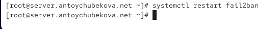{#fig-021 width=70%} 

Посмотрим журнал событий. Мы видим, что помимо вышеописанной информации, выводится информация, что идет игнорирование клиента.([рис. @fig-022]).

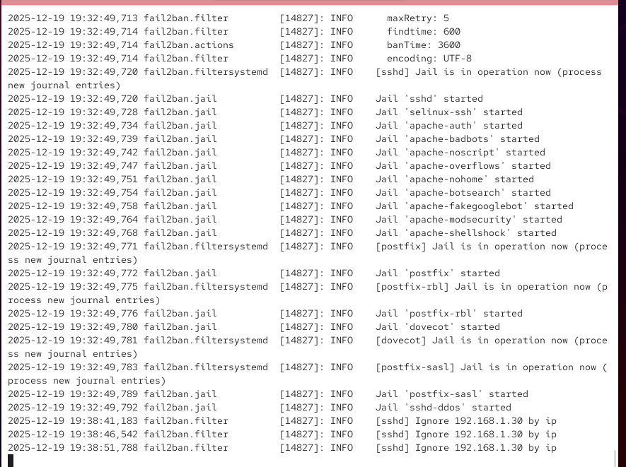{#fig-022 width=70%} 

Вновь попытаемся войти с клиента на сервер с неправильным паролем. ([рис. @fig-023]).

{#fig-023 width=70%} 

Далее посмотрим статус защиты ssh. Мы видим, что никакой подозрительной активности по SSH не обнаружено и клиент не заблокирован. ([рис. @fig-024]).

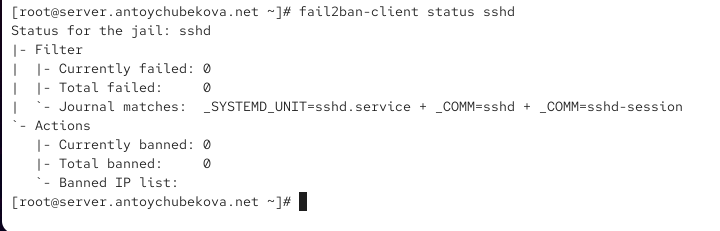{#fig-024 width=70%} 

## Внесение изменений в настройки внутреннего окружения виртуальных машин

На виртуальной машине server перейдем в каталог для внесения изменений в настройки внутреннего окружения /vagrant/provision/server/, создадим в нём каталог protect, в который поместим в соответствующие подкаталоги конфигурационные файлы. ([рис. @fig-025]).

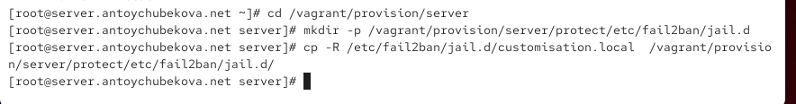{#fig-025 width=70%} 

В каталоге /vagrant/provision/server создадим исполняемый файл protect.sh. ([рис. @fig-026]).

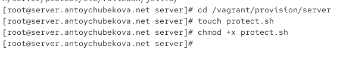{#fig-026 width=70%} 

Открыв его на редактирование, пропишем в нём соответствующий скрипт, фиксирующие действия по установке и настройке fail2ban.([рис. @fig-027]).

{#fig-027 width=70%} 

Для отработки созданного скрипта во время загрузки виртуальной машины server в конфигурационном файле Vagrantfile добавим в соответствующем разделе конфигураций для сервера. ([рис. @fig-028]).

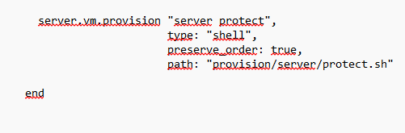{#fig-028 width=70%} 

# Выводы

В ходе выполнения лабораторной работы №16 я приобрела навыки работы с программным средством Fail2ban для обеспечения базовой защиты от атак типа «brute force».

# Список литературы

1. Сайт Fail2ban. — URL: https://www.fail2ban.org (visited on 09/13/2021)
