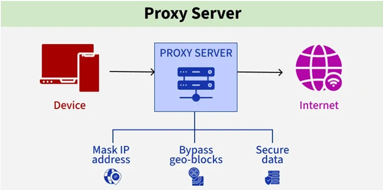
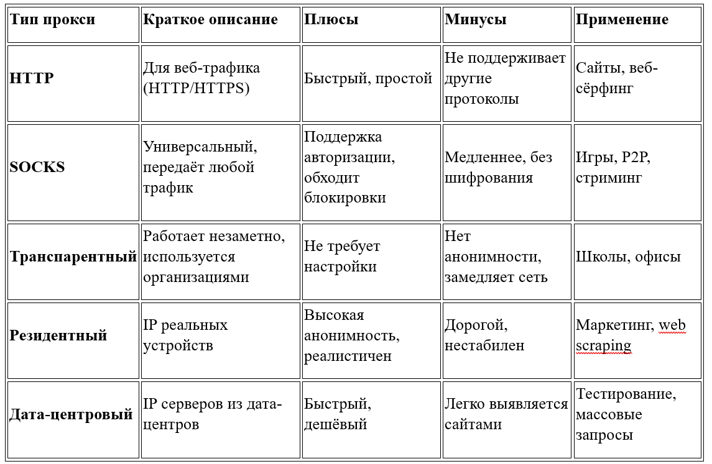
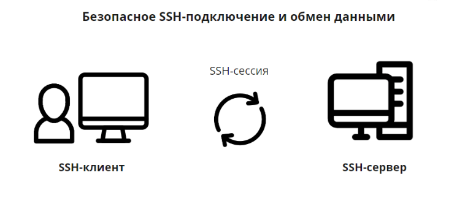
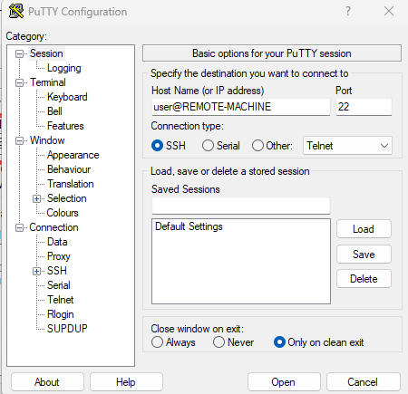
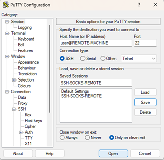
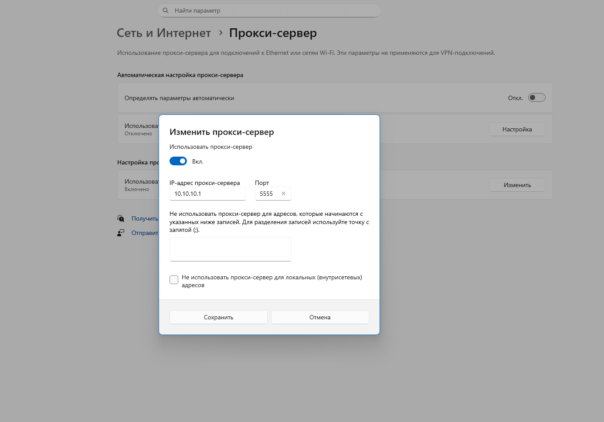
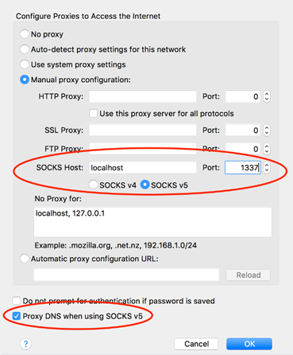

---
## Author
author:
  name: Тойчубекова Асель Нурлановна
  degrees: DSc
  orcid: 0000-0002-0877-7063
  email: kulyabov-ds@rudn.ru
  affiliation:
    - name: Российский университет дружбы народов
      country: Российская Федерация
      postal-code: 117198
      city: Москва
      address: ул. Миклухо-Маклая, д. 6
## Title
title: Доклад
subtitle: на тему "Создание proxy-сервера на основе ssh"
license: CC BY
date: today
date-format: "YYYY-MM-DD" # Example: 2025-09-06
---

# Информация

## Докладчик

:::::::::::::: {.columns align=center}
::: {.column width="70%"}

  * Тойчубекова Асель Нурлановна
  * Студент 3 курса
  * факультет физико-математических и естественных наук
  * Российский университет дружбы народов им. П. Лумумбы
  * [1032235033@rudn.ru](1032235033@rudn.ru)

:::
::: {.column width="30%"}

:::
::::::::::::::

# Цель доклада 

## Цель доклада 

Цель моего доклада— продемонстрировать, как при помощи протокола SSH можно создать прокси-сервер, использовав механизм динамического перенаправления портов в SSH.

# Proxy-сервер

## Что такое proxy-сервер  

Прокси-сервер — это посредник между пользователем и сетью.
Он принимает запросы клиента, перенаправляет их на сервер и возвращает ответы обратно.
Прокси повышает безопасность, фильтрует и кэширует данные, а также скрывает настоящий IP-адрес пользователя. 

{width=60%}

## Типы proxy-сервера

{width=70%}

# Протокол ssh

## Что такое SSH?

SSH — это безопасный сетевой протокол, который обеспечивает шифрованное соединение между клиентом и сервером.

Он позволяет управлять удалёнными системами, передавать файлы и создавать зашифрованные туннели.
Главное преимущество — полная защита передаваемых данных. 

{width=60%}

## Порт-форвардинг и туннелирование

В SSH можно перенаправлять сетевые порты — это называется порт-форвардинг. 

{width=60%}

# Создание proxy-сервера через динамическое туннелирование SSH

## Создание proxy-сервера через динамическое туннелирование SSH

Для создания SOCKS-прокси используется команда:

ssh -D [адрес_привязки:]порт пользователь@удалённый_сервер. 

При использовании флага -D SSH создаёт динамическое перенаправление портов, превращая клиент в локальный SOCKS-прокси, который направляет трафик приложений через зашифрованное SSH-соединение на удалённый сервер.

{width=60%}

## Создание proxy-сервера через динамическое туннелирование SSH

 1. SSH создаёт локальный порт с встроенным SOCKS-прокси.
 2. Приложения подключаются к этому порту.
 3. Прокси получает адрес назначения от приложения.
 4. Запрос пересылается через зашифрованный SSH-туннель.
 5. Удалённый сервер соединяется с нужным сайтом.
 6. Обмен данными идёт по защищённому каналу SSH.
 
## Создание прокси через PuTTY (Windows)

В Windows для работы с SSH удобно использовать клиент PuTTY.

Сперва настроим SSH-сервер.

{width=50%}

## Создание прокси через PuTTY (Windows)

Настроим динамическое туннелирование.

{width=50%}

## Создание прокси через PuTTY (Windows)

Сохраняем сессию и подключаемся, введя пароль или SSH-ключ. 

{width=50%}

## Использование SOCKS-прокси в Chrome

В браузере Google Chrome необходимо открыть страницу настроек chrome://settings/, перейти в раздел «Системы» → «Открыть настройки прокси-сервера на компьютере» и указать параметры подключения к локальному SOCKS-прокси.

{width=50%}

##  Использование SOCKS-прокси в Firefox

В браузере Mozilla Firefox настройки выполняются через раздел «Настройки» → «Сеть» → «Настройки соединения», где также указывается использование SOCKS-прокси по адресу, например, 127.0.0.1 и порту 1337.

##  Использование SOCKS-прокси в Firefox

{width=40%}

## Проверка работы и защита данных SSH-прокси

После настройки можно проверить работу SSH-прокси на сайте проверки IP, например whatismyipaddress.com.

Если всё работает, IP будет совпадать с адресом удалённого сервера.
SSH-прокси шифрует весь трафик, защищая данные от перехвата и анализа.

## Преимущества прокси-сервера на основе SSH

1. Шифрование трафика — защита данных от перехвата.
2. Анонимность — скрытие IP и обход ограничений.
3. Универсальность — работает с разными приложениями.
4. Простота — нужен только доступ по SSH, без отдельного сервиса.

## Недостатки прокси-сервера на основе SSH

1. Может снижать скорость из-за шифрования.
2. Требует настройки и контроля.
3. Зависит от стабильности SSH-сервера.
4. Не все приложения поддерживают SOCKS-прокси.

## Заключение

Используя динамическое туннелирование (опцию -D), SSH-клиент работает как SOCKS-прокси, передавая весь трафик по зашифрованному каналу.

Такой подход обеспечивает конфиденциальность, скрытие IP и обход ограничений, но требует базовых технических знаний и может немного снижать скорость из-за шифрования.

## Список литературы 

1. Barrett, D. J., Silverman, R. E., & Byrnes, R. G. SSH, The Secure Shell: The Definitive Guide. 2nd Edition. O’Reilly Media, 2005.
2. «Как работает SSH-туннелирование и проброс портов.» — Habr, 2024. https://habr.com/ru/articles/866406/
3. «SSH-подключение и настройка безопасного туннеля.» — Habr, 2023. https://habr.com/ru/articles/804263/
4. DigitalOcean. How To Use SSH Port Forwarding. https://www.digitalocean.com/community/tutorials/ssh-port-forwarding
5. Selectel. Что такое прокси-сервер и как он работает. https://selectel.ru/blog/what-is-proxy/
6. PhoenixNAP. SSH Port Forwarding Explained. https://phoenixnap.com/kb/ssh-port-forwarding

 

