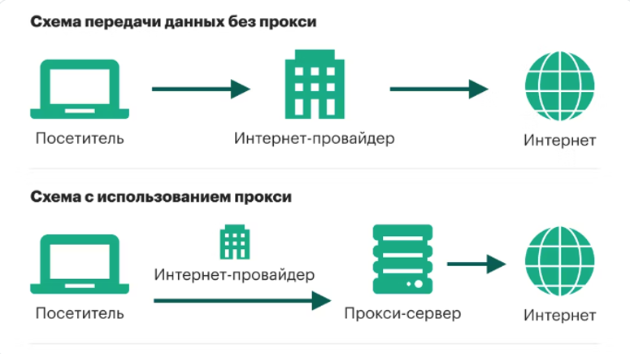
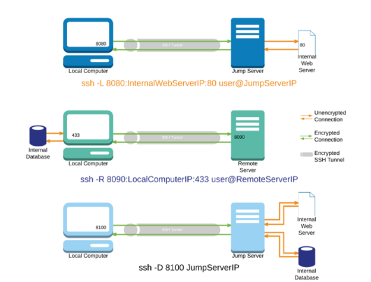
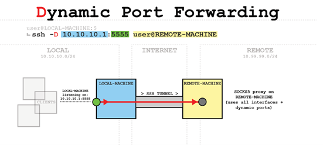
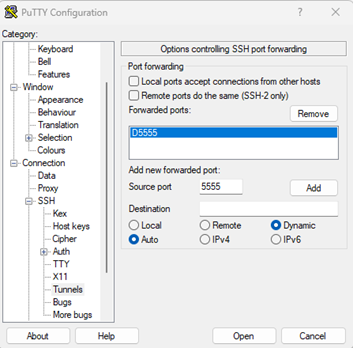

---
## Author
author:
  name: Тойчубекова Асель Нурлановна
  degrees: DSc
  orcid: 0000-0002-0877-7063
  email: kulyabov-ds@rudn.ru
  affiliation:
    - name: Российский университет дружбы народов
      country: Российская Федерация
      postal-code: 117198
      city: Москва
      address: ул. Миклухо-Маклая, д. 6

## Title
title: "Доклад"
subtitle: "на тему: Создание proxy-сервера на основе ssh"
license: "CC BY"
---

# Цель работы

Цель моего доклада— продемонстрировать, как при помощи протокола SSH можно создать прокси-сервер, использовав механизм динамического перенаправления портов в SSH.

# Proxy-сервер

## Что такое proxy-сервер?

Прокси-сервер – это промежуточный канал между оборудованием пользователя и сервером, через который происходит обмен информацией. Он получает обращения от пользователя, затем отправляет их на сервер, а ответ от сервера возвращает обратно.

Основное предназначение прокси-сервера – сделать обмен информацией и файлами анонимным, безопасным и эффективным. Кроме этого, он осуществляет фильтрацию и кэширование данных, контроль доступа и распределяет нагрузку между оборудованием.

Прокси-серверы применяются для оптимизации работы и усиления безопасности. Они позволяют повысить скорость выгрузки страниц сайтов, снизить нагрузку на серверы, скрыть настоящий IP-адрес пользователя, гарантировать защиту от зараженных программ и отражать попытки несанкционированного доступа к интернет-ресурсам. ([рис. @fig-001]).

{#fig-001 width=70%}

## Как работает proxy-сервер?

Принцип функционирования прокси-сервера заключается в изменении сетевого адреса пользователя. Когда пользователь подключается к прокси-серверу, его IP-адрес заменяется на IP-адрес прокси. В результате сайты видят только адрес прокси, информация о пользователе остается скрытой. Для большей анонимности можно использовать цепочку прокси.

В общих чертах схему работы прокси можно описать следующим образом:

1. Пользователь отправляет запрос к прокси-серверу через зашифрованный канал.

2. Прокси-сервер принимает запрос и вносит изменения, заменяя информацию о клиенте своей собственной.

3. Измененный запрос направляется нужный пользователю ресурс.

4. Ответ обрабатывается прокси-сервером, который проверяет, расшифровывает его и показывает пользователю. ([рис. @fig-002]).

{#fig-002 width=70%}

## Типы proxy-сервера

На данный момент существует множество типов прокси-серверов. Рассмотрим основные. [табл. @tbl-std-dir] 

| № | Тип прокси              | Описание                                                                 | Плюсы                                                                 | Минусы                                                                 | Подходит для                                                                 |
|---|--------------------------|---------------------------------------------------------------------------|------------------------------------------------------------------------|------------------------------------------------------------------------|------------------------------------------------------------------------------|
| 1 | **HTTP-прокси**          | Работает только с веб-трафиком (HTTP/HTTPS). Передаёт запросы браузеров через себя. | Быстрый Прост в настройке Хорошо работает для сайтов              | Не поддерживает другие протоколы (FTP, P2P, игры) Зависит от шифрования сайта | Веб-сёрфинг, просмотр сайтов, парсинг веб-страниц                            |
| 2 | **SOCKS-прокси**         | Универсальный тип. Передаёт трафик любого приложения (HTTP, FTP, игры, торренты, мессенджеры). Версия SOCKS5 поддерживает аутентификацию. | Работает с любым трафиком SOCKS5 поддерживает логин/пароль Можно использовать для обхода блокировок | Иногда медленнее HTTP Не шифрует данные по умолчанию               | Игры, P2P, мессенджеры, стриминг, обход региональных ограничений             |
| 3 | **Транспарентный прокси** | Работает незаметно для пользователя. Часто используется организациями для фильтрации и контроля. | Не требует настройки у пользователя Полезен для администрирования    | Нет анонимности Может замедлять соединение Используется для слежки/цензуры | Учебные заведения, компании, корпоративные сети                              |
| 4 | **Резидентный прокси**   | Использует IP реальных устройств (домашние, мобильные). Выглядит как трафик обычного пользователя. | Высокая анонимность Реалистичен для сайтов Обходит антифрод-системы | Дорогой Зависит от стабильности устройства                           | Маркетинг, web scraping, обход антифрод-систем                               |
| 5 | **Дата-центровый прокси** | Создаётся в дата-центрах, использует IP серверов, не связанных с реальными пользователями. | Высокая скорость Низкая цена Простое масштабирование              | Легко определяется сайтами Меньше анонимности                        | Проверка доступности сайтов, массовые запросы, парсинг, тестирование          |

: Типы proxy-сервера {#tbl-std-dir}

# Протокол ssh

## Что такое ssh? 

SSH — сетевой протокол прикладного уровня, позволяющий производить удалённое управление операционной системой и туннелирование TCP-соединений (например, для передачи файлов). Схож по функциональности с протоколами Telnet и rlogin, но, в отличие от них, шифрует весь трафик, включая и передаваемые пароли. SSH допускает выбор различных алгоритмов шифрования. SSH-клиенты и SSH-серверы доступны для большинства сетевых операционных систем.

Функции SSH

Протокол SSH предназначен для:

- передачи данных (почта, видео, изображения и другие файлы) через защищённое соединение,
- удаленного запуска программ и выполнения команд на сервере через командную строку,
- сжатия файлов для удобной передачи данных,
- переадресации портов и передачи шифрованного трафика между портами разных машин.
    
SSH-соединение состоит из 2-х компонентов: SSH-сервер и SSH-клиент. Что такое SSH-сервер? Это программа, которая устанавливает связь и производит аутентификацию с устройством пользователя. Он установлен на самом сервере. SSH-клиент используется для входа на удалённую машину и передачи ей команд. Он устанавливается на устройстве, с которого пользователь хочет подключиться к серверу. Бесплатный вариант клиента и сервера — OpenSSH. В операционных системах Unix клиент для OpenSSH установлен по умолчанию.

## SSH и порт-форвардинг (туннелирование)

Чтобы понять, как сделать прокси на основе SSH, нужно разобраться с понятием форвардинга портов (port forwarding / tunneling). ([рис. @fig-003]).
В SSH есть три основных типа перенаправления портов:
- Перенаправление локального порта. Соединение перенаправляется с клиентского хоста на SSH-сервер и впоследствии на порт хоста назначения.
- Перенаправление удаленного порта. Соединение перенаправляется с хоста сервера на клиентский хост и впоследствии на порт хоста назначения.
- Динамическое перенаправление портов. В данном случае создается прокси-сервер SOCKS, который в свою очередь обеспечивает связь через ряд портов.

## Перенаправление локального порта

Перенаправление порта SSH-клиента (на локальном компьютере), на порт SSH-сервера (удаленного компьютера) и далее на порт, расположенный на конечном компьютере. Тот в свою очередь может являться удаленным SSH-сервером или каким-либо иным компьютером.

Перенаправление локальных портов требуется для подключения к удаленной службе во внутренней сети. Это может быть, к примеру, база данных или системы удалённого доступа.

В Linux, MacOS и прочих юниксовых системах, для установки локального перенаправление портов нужно использовать следующую команду:

ssh -L [LOCAL_IP:]LOCAL_PORT:DESTINATION:DESTINATION_PORT [USER@]SSH_SERVER

[LOCAL_IP:]LOCAL_PORT – IP-адрес и номер порта локального компьютера. Если локальный IP не указан, SSH-клиент привязывается к локальному хосту.

DESTINATION: DESTINATION_PORT – IP/имя хоста и порт машины назначения.

[USER@] SERVER_IP – Удаленный пользователь и IP-адрес сервера.

## Перенаправление удаленного порта

Перенаправление удаленного порта является противоположным случаю с портом локальным. Здесь можно перенаправить порт на удаленном компьютере (ssh-сервер) на порт локального компьютера (ssh-клиент), а затем на порт конечного компьютера.

ssh -R [REMOTE:]REMOTE_PORT:DESTINATION:DESTINATION_PORT [USER@]SSH_SERVER

Понадобятся такие параметры:

[REMOTE:]REMOTE_PORT – IP-адрес и номер порта удаленного SSH-сервера. Если значение REMOTE не выставлено, удаленный SSH-сервер свяжется сразу со всеми интерфейсами.

DESTINATION:DESTINATION_PORT – IP/имя хоста и порт машины назначения.

[USER@]SERVER_IP – Удаленный пользователь SSH и IP-адрес сервера.

Удаленное перенаправление портов в основном используется, чтобы предоставить кому-то извне доступ к одной из внутренних служб.

## Динамическое перенаправление портов

Динамическое Перенаправление портов даёт возможность создать сокет на локальном компьютере (SSH-клиент), который выступает в качестве прокси-сервера SOCKS. Когда клиент подсоединяется к данному порту, соединение перенаправляется на удаленный компьютер(SSH-сервер), который далее идёт на динамический порт компьютера назначения.

Для создания перенаправление динамического порта:

ssh -D [LOCAL_IP:]LOCAL_PORT [USER@]SSH_SERVER

[LOCAL_IP:]LOCAL_PORT – IP-адрес и номер порта локального компьютера. Если LOCAL_IP не указан, SSH-клиент привязывается к localhost.

[USER@]SERVER_IP – Удаленный пользователь SSH и IP-адрес сервера.

{#fig-003 width=70%}

# Создание proxy-сервера на основе ssh

## Создание proxy-сервера на основе ssh

При использовании флага -D в команде SSH создаётся механизм так называемого динамического перенаправления портов (dynamic port forwarding).

Эта функция позволяет клиенту SSH выступать в роли локального SOCKS4/5-прокси-сервера, принимающего сетевые соединения от приложений на локальной машине и перенаправляющего их через защищённое SSH-соединение на удалённый сервер.

Команда имеет следующий вид:

ssh -D [адрес_привязки:]порт пользователь@удалённый_сервер. 

После её выполнения SSH-клиент:

1. Создаёт локальный сокет (порт), который начинает прослушиваться.
На этом порту запускается встроенный SOCKS-сервер, поддерживающий протоколы SOCKS4 и SOCKS5.
2. Принимает подключения от локальных приложений (например, веб-браузера или утилиты curl), настроенных на использование данного SOCKS-прокси.
3. Выполняет начальное взаимодействие по протоколу SOCKS, в ходе которого приложение сообщает прокси-серверу, к какому целевому IP-адресу и порту необходимо установить соединение.
4. Перенаправляет запрос через зашифрованное SSH-соединение на удалённый сервер.
5. SSH-сервер (удалённая сторона) устанавливает соединение с указанным целевым узлом (например, внешним веб-сайтом) и начинает обмен данными.
6. Передача данных между локальным приложением и удалённым ресурсом осуществляется через SSH-туннель, что обеспечивает полное шифрование трафика.

Таким образом, использование параметра -D превращает SSH-клиент в полноценный SOCKS-прокси-сервер, который:

- обеспечивает динамическое (гибкое) перенаправление соединений без необходимости указывать конкретный удалённый адрес в команде;
-  реализует шифрование всего передаваемого трафика между клиентом и сервером;
-  позволяет использовать SSH-соединение для безопасного доступа к сетевым ресурсам или обхода ограничений сети.

SSH с флагом -D создаёт локальный SOCKS-прокси, который принимает соединения от приложений и перенаправляет их через зашифрованный SSH-туннель на удалённый сервер, где они выходят в Интернет.([рис. @fig-004]).

{#fig-004 width=70%}

## Создание proxy-сервера на основе ssh с помощью PuTTY

PuTTY - это удобный SSH-клиент для Windows. Создадим  динамический SSH-туннель (SOCKS5-прокси) — локальный порт, который действует как прокси и пересылает трафик через удалённый SSH-сервер. Эквивалент в OpenSSH: ssh -D 5555 user@REMOTE-MACHINE. 

Открой PuTTY.В поле Host Name (or IP address) введи адрес сервера: user@REMOTE-MACHINE (или просто REMOTE-MACHINE и укажи логин при подключении).  В поле Port оставь 22. ([рис. @fig-005]).

{#fig-005 width=70%}

2. Используем список категорий слева, чтобы перейти к подключению> SSH> Туннели.

3.  В разделе Add new forwarded port: в поле Source port введем локальный порт, который будет слушать прокси, например 5555.  Выбем опцию Dynamic.  Нажем Add. В списке Forwarded ports появится запись D5555. ([рис. @fig-006]).

{#fig-006 width=70%}

4. Вернемся в Session. В поле Saved Sessions введем имя сессии, например SSH-SOCKS-REMOTE. Нажмем Save (чтобы не настраивать заново).Нажмем Open и выполни вход (пароль или ключ). После успешного логина туннель будет активен. ([рис. @fig-007]).

{#fig-007 width=70%}

## Использование SOCKS-прокси в Chrome/Firefox.

Данная настройка выполняется отдельно для каждого приложения, поскольку SSH-прокси не является системным.

В браузере Google Chrome необходимо открыть страницу настроек chrome://settings/, перейти в раздел «Системы» → «Открыть настройки прокси-сервера на компьютере» и указать параметры подключения к локальному SOCKS-прокси. ([рис. @fig-008]).

{#fig-008 width=70%}

В браузере Mozilla Firefox настройки выполняются через раздел «Настройки» → «Сеть» → «Настройки соединения», где также указывается использование SOCKS-прокси по адресу, например, 127.0.0.1 и порту 1337.([рис. @fig-009]).

{#fig-009 width=70%}

После применения этих параметров весь трафик браузера будет перенаправляться через локальный SOCKS-прокси, который передаёт запросы в SSH-туннель и далее на удалённый сервер. Уже удалённый сервер подключается к нужным сайтам и передаёт ответы обратно по тому же защищённому каналу.

## Проверка работы и защита данных SSH-прокси

После настройки соединения можно убедиться в правильности работы SSH-прокси, посетив любой сайт для проверки IP-адреса, например https://whatismyipaddress.com.
Если прокси функционирует корректно, отображаемый IP-адрес будет соответствовать адресу удалённого SSH-сервера.

Помимо изменения IP-адреса, SSH-прокси обеспечивает шифрование всего трафика между локальным компьютером и удалённым сервером.
Это означает, что данные, передаваемые через SSH-туннель, недоступны для перехвата или анализа со стороны провайдера или сетевых фильтров.

## Преимущества и недостатки прокси-сервера на основе SSH

Преимущества:

1. Шифрование и защита данных.
    
При использовании динамического перенаправления портов через OpenSSH (команда вида ssh -D) весь трафик между клиентом и удалённым SSH-сервером передаётся по зашифрованному каналу. Это снижает риск перехвата данных или подслушивания в открытых сетях Wi-Fi.

2. Сокрытие исходного IP-адреса и обход ограничений.
    
Пользователь выходит в Интернет через IP удалённого SSH-сервера, а не с собственного устройства. Это даёт дополнительный уровень анонимности и позволяет обойти сетевые фильтры или географические ограничения. 

3. Гибкость и универсальность.
    
Прокси на основе SSH (через SOCKS) работает с разными приложениями (браузерами, утилитами) и не требует настройки специфичных HTTP-прокси-серверов. 

4. Минимум сервисов для запуска.
    
Если у вас есть SSH-доступ к серверу, можно быстро организовать прокси без покупки отдельного прокси-сервиса. Это удобно для администраторов и технически подкованных пользователей. 

Недостатки:

1. Снижение производительности.
    
Использование SSH-туннеля и прокси приводит к дополнительной задержке и возможно более медленной скорости соединения, так как трафик проходит через удалённый сервер и шифруется. 

2. Необходимость технической настройки и контроля.
    
Настройка SSH-прокси требует знания команд (например, ssh -D), понимания принципов прокси и вручную указанных приложений, которые должны использовать прокси. Если приложение не настроено — оно будет работать напрямую и «вне» туннеля. 

3. Зависимость от удалённого сервера.
    
Надёжность, скорость и доступность прокси зависят от удалённого SSH-сервера (его загрузка, географическое расположение, IP-репутация). Если сервер нестабильный — страдает и прокси. 

4. Совместимость и ограничения.
    
Некоторые приложения не поддерживают SOCKS-прокси или требуют дополнительной настройки. Также некоторые сайты могут блокировать соединения через известные прокси/IP. 

# Заключение

Создание прокси-сервера на основе SSH представляет собой эффективный и безопасный способ организации защищённого интернет-доступа.
Используя механизм динамического перенаправления портов (опцию -D), SSH-клиент может выполнять роль локального SOCKS-прокси-сервера, через который весь сетевой трафик передаётся по зашифрованному туннелю на удалённый сервер.

Такой подход обеспечивает высокий уровень конфиденциальности, скрывает реальный IP-адрес пользователя и позволяет обходить сетевые ограничения, сохраняя при этом гибкость и универсальность в работе с различными приложениями.
Ключевым преимуществом является надёжное шифрование, которое защищает данные от перехвата, что особенно важно при работе в публичных или незащищённых сетях.

Однако, несмотря на очевидные достоинства, данное решение требует определённых технических знаний, внимательной настройки и стабильного SSH-сервера. Кроме того, из-за дополнительного шифрования скорость соединения может снижаться.

В целом, использование SSH-прокси можно рассматривать как удобный инструмент для безопасной и анонимной работы в сети Интернет, особенно в тех случаях, когда приоритетом являются защита данных и сохранение конфиденциальности пользователя.

# Список литературы

1. Barrett, D. J., Silverman, R. E., & Byrnes, R. G. SSH, The Secure Shell: The Definitive Guide. 2nd Edition. O’Reilly Media, 2005.
2. «Как работает SSH-туннелирование и проброс портов.» — Habr, 2024. https://habr.com/ru/articles/866406/
3. «SSH-подключение и настройка безопасного туннеля.» — Habr, 2023. https://habr.com/ru/articles/804263/
4. DigitalOcean. How To Use SSH Port Forwarding. https://www.digitalocean.com/community/tutorials/ssh-port-forwarding
5. Selectel. Что такое прокси-сервер и как он работает. https://selectel.ru/blog/what-is-proxy/
6. PhoenixNAP. SSH Port Forwarding Explained. https://phoenixnap.com/kb/ssh-port-forwarding

